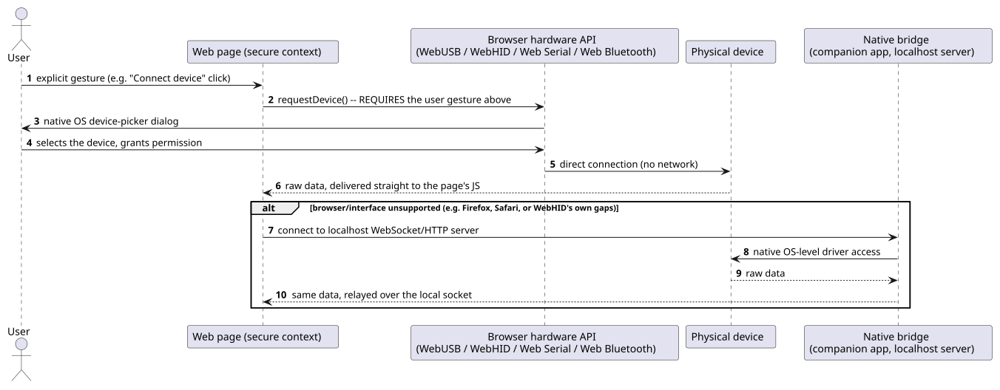
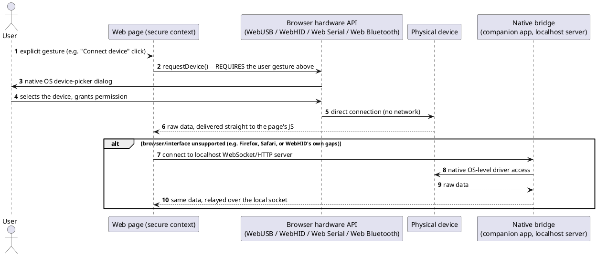

[← Pattern index](README.md)

# Device Input Integration via Web Hardware APIs

## The pattern

Let a web page talk directly to physical hardware — a USB device, an
HID-class peripheral, a serial/RS-232 instrument, a Bluetooth Low
Energy device — from JavaScript running in the browser, with no
native application, no driver installation step for the page itself,
and (crucially for offline use) no network round trip involved at
all. Each interface gets its own browser-native, permission-gated API:
**WebUSB** (raw USB, byte-level), **WebHID** (HID-class devices),
**Web Serial** (RS-232/serial-port devices), and **Web Bluetooth**
(BLE GATT devices). All four share the same access model: they only
work in a secure context (HTTPS, or `localhost`), and only after an
explicit user gesture triggers a native OS device-picker dialog — a
page can never silently enumerate or connect to hardware on its own.
These specifications are developed under the **WICG (Web Platform
Incubator Community Group)**, not on the formal W3C standards track,
as part of a broader Chromium initiative (informally called **Project
Fugu 🐡**) to close capability gaps between web and native
applications.

Where the page itself can't reach the hardware (an unsupported browser,
or a device interface none of the four APIs cover), the same problem
has a well-established fallback in the wild: a small **native bridge**
companion application that has genuine OS-level hardware access and
exposes a local WebSocket/HTTP server (typically on `localhost`) that
the web page talks to instead of the hardware directly. Real
BLE-health-device integrations already use exactly this shape to
reach Safari/iOS, where the direct browser APIs don't exist at all.

**Source:** [WICG WebUSB API specification](https://wicg.github.io/webusb/), [WICG/serial](https://github.com/WICG/serial), and the WebHID/Web Bluetooth Community Group specifications — verified directly: as of 2026 all four remain Draft Community Group Reports maintained by WICG, not W3C Recommendations and not on the W3C standards track.

## Also known as

Collectively, this family of specifications is sometimes referred to
under **Project Fugu** — the informal Chromium-project name for the
broader effort to add native-like capabilities (of which these
hardware APIs are one part) to the web platform. Each individual API
name (WebUSB, WebHID, Web Serial, Web Bluetooth) refers to one
specific hardware interface and is not interchangeable with the
others — they are siblings under one initiative, not synonyms for
each other.

## When you'd reach for it

Any offline-capable or installable web application that needs to read
from real hardware directly — a USB/serial lab instrument, an HID
medical or industrial peripheral, a BLE wearable or monitor — without
requiring a separate native application for the *primary* platform you
target, and without a server round trip standing between the page and
the device. It composes naturally with an offline-first, installable
PWA (this catalog's own [PWA offline outbox pattern](pwa-offline-outbox.md)):
the device read happens entirely client-side, so the captured data can
be queued and synced later exactly like any other offline-captured
input.

## Cost

**Browser support is genuinely, not marginally, incomplete — this is
the pattern's central cost, not a footnote.** All four specifications
ship only in Chromium-based browsers (Chrome, Edge, and other Chromium
derivatives); Firefox and Safari (both macOS and iOS) ship **none** of
Web Bluetooth, WebHID, or Web Serial — Mozilla has explicitly declined
to implement Web Bluetooth on its own standards-positions list, and
WebKit ships no Web Bluetooth code at all. WebUSB has the broadest
Chromium-only reach of the four but is still entirely absent from two
major browser engines. Because none of the four is on the W3C
standards track, there is also no formal cross-vendor commitment that
this will change — adopting this pattern for a primary user flow
means either accepting a Chromium-only capability or building and
maintaining the native-bridge fallback (a second application, with
its own install step, update path, and OS-level packaging) for every
platform the direct browser APIs don't reach. The user-gesture and
device-picker requirements are also non-negotiable friction by
design (no silent/automatic connection is possible), which is correct
for security but means device pairing can never be made fully
invisible to the user.

## How this application uses it

`ADR-070` adopts this pattern with the native-bridge fallback named
explicitly rather than treated as optional: `IDeviceInputSource`
(`docs/extensibility-points.md`) is the extensibility seam, with one
adapter per interface —
`client-web/packages/mvvm-client/src/deviceInput/WebUsbInputSource.ts`,
`WebHidInputSource.ts`, `WebSerialInputSource.ts`,
`WebBluetoothInputSource.ts` — plus `NativeBridgeInputSource.ts` for
Firefox/Safari or any device none of the four browser APIs reach,
talking to a local companion server
(`client-web/packages/reference-app/native-bridge-reference/server.mjs`).
Captured readings feed the same durable client outbox `ADR-039`/
`ADR-069` already provide (`deviceReadingOutbox.ts`) — no new
local-storage mechanism — and default to `ADR-035`'s non-authoritative
capture posture, realized concretely via `PublishService`'s
`ReviewPending` trigger (`ADR-042`) unless the device itself presents
a real self-attested identity (`ADR-036`'s DID/UCAN).
