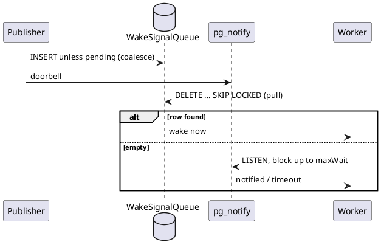

# Durable Wake Queue (doorbell + pull)

**Pattern.** A "wake sooner" hint for polling workers is made durable by writing a coalesced row to a queue table and ringing a non-durable doorbell. The reader *pulls* from the queue first and only blocks on the doorbell when the queue is empty. The doorbell can be lost without consequence, because the queue holds the signal. This is the Polling Consumer pattern with a Service-Activator-style nudge (Hohpe & Woolf, *Enterprise Integration Patterns*), and the pull-then-wait shape is the same as SQL Server Service Broker's `RECEIVE` / `WAITFOR ... TIMEOUT`.

**Applied here.** `ADR-095` (2026-10-09 revision): `PostgresWorkerWakeSignal` inserts into `"WakeSignalQueue"` unless a row is already pending for the topic (so signals coalesce), then calls `pg_notify`. `WaitForWakeAsync` drains with `DELETE ... FOR UPDATE SKIP LOCKED`, then waits on `LISTEN` until notified or `maxWait`. The worker poll loop remains the correctness backstop.

Rejected alternative: `pgmq` extension, see `docs/references.md`. Open question: whether consumed rows are deleted or marked and swept, `docs/10-open-questions.md` row 2.
