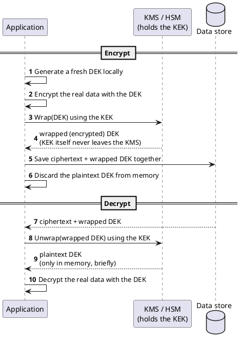

[← Pattern index](README.md)

# Envelope Encryption

## The pattern

Encrypt actual data with a **Data Encryption Key (DEK)** — a key
generated fresh, often per subject or per object, that lives only long
enough to do the encryption and is then itself encrypted ("wrapped") by a
separate, longer-lived **Key Encrypting Key (KEK)**. The KEK typically
lives in a hardware- or service-backed key-management system (a KMS or an
HSM) and never leaves it; only the wrapped (ciphertext) form of the DEK is
stored alongside the data it protects. Decryption reverses the order:
fetch the wrapped DEK, ask the KMS to unwrap it using the KEK (which
again never leaves the KMS boundary), then use the resulting plaintext
DEK locally to decrypt the actual data. The "envelope" is the wrapped
DEK plus the ciphertext it protects, traveling together.

This buys three things a single master key alone can't: the bulk
encryption workload runs locally against ordinary data-sized keys instead
of shipping potentially large payloads through the KMS's own (typically
small-message-limited) encrypt API; a compromised DEK exposes only the
data it wrapped, not every other DEK in the system; and revoking or
destroying one DEK — without ever touching the KEK — is a complete,
independent unit of key lifecycle, which is exactly the mechanism
[Crypto-shredding](crypto-shredding.md) is built on.

**Source:** both major cloud KMS providers document this exact
mechanism, by this exact name, as their own standard usage pattern:
[AWS KMS — envelope
encryption](https://docs.aws.amazon.com/kms/latest/cryptographic-details/client-side-encryption.html)
("encrypt your plaintext data with a data key, then encrypt the data key
under a KMS key... AWS KMS can directly encrypt files up to 4 KB; for
anything larger, envelope encryption is needed") and [Google Cloud KMS —
envelope
encryption](https://docs.cloud.google.com/kms/docs/envelope-encryption)
("generate a DEK locally, encrypt data with the DEK, use a KEK to wrap the
DEK, then store the encrypted data and the wrapped DEK... the KEK never
leaves Cloud KMS").

## When you'd reach for it

Whenever you need per-subject or per-object encryption keys — so that
compromising or destroying one key has a bounded blast radius — but don't
want every encrypt/decrypt call to round-trip a KMS with the actual data
(size limits, latency, cost) or to hand your master key material to
application code directly. It's also the natural mechanism once
per-subject erasure is a requirement: destroying one DEK's wrapped copy
(or asking the KMS to destroy the KEK-side unwrap capability for it)
erases exactly one subject's data, unlike a single shared key where
destruction erases everyone at once.

## Cost

The KMS/HSM holding the KEK becomes a hard dependency for every
encrypt/decrypt operation, not just an occasional administrative one — an
unavailable KMS means data already at rest becomes unreadable, not merely
inconvenient to protect further. It also multiplies key-lifecycle
surface: instead of one key to rotate/back up/audit, there are now two
tiers, with different failure and recovery stories (losing the KEK is
catastrophic for everything under it; losing one DEK's plaintext, if
generated fresh and never separately persisted, is not recoverable at all
for that one object). And a real KMS's own destroy/delete primitive often
isn't instant — see the honest AWS/GCP cost noted in [Crypto-shredding](crypto-shredding.md#cost).

## How this application uses it

`ADR-057` builds one Data-Encryption Key per `(AppId, EntityId)`, wrapped
by a master KEK held in whichever key-management backend that `AppId` is
configured to use — kept genuinely pluggable via an `IErasureKeyStore`
seam (`src/EventStore.Abstractions/IErasureKeyStore.cs`), with multiple
backends registered and active simultaneously in one deployment, selected
per `AppId`: cloud (`AzureKeyVaultErasureKeyStore`,
`AwsKmsErasureKeyStore`, `GoogleCloudKmsErasureKeyStore`), on-prem/
self-hosted (`HashiCorpVaultErasureKeyStore`), and local
(`LocalErasureKeyStore`) — all in `src/EventStore.Erasure/`. Every one of
them shares a single primitive for the actual field-value encryption,
`EnvelopeAesGcm` (`src/EventStore.Erasure/EnvelopeAesGcm.cs`) — a local
AES-256-GCM Data-Encryption Key used directly against the classified
field value, with the DEK itself wrapped once via that backend's own
KMS wrap/encrypt call — rather than each cloud KMS's own native per-value
encrypt operation, because every native cloud encrypt path checked while
building this turned out to be either size-limited, non-deterministic, or
both, either of which would break `ADR-011`'s "idempotent retry hashes
identically" requirement the same way a naive random-nonce scheme would.
`EnvelopeAesGcmTests.cs` verifies the specific property that matters here
— convergent encryption (the same plaintext under the same key always
produces the same ciphertext, since the nonce is itself derived
deterministically from `HMACSHA256(key, plaintext)`), not just that
encrypt/decrypt round-trips.

A real, backend-specific cost found while building the AWS backend
specifically: AWS KMS's own idiomatic pattern (one shared CMK per `AppId`
generating many data keys) cannot support per-entity crypto-shredding —
destroying one shared CMK to erase one entity would erase every other
entity still wrapped under it. `AwsKmsErasureKeyStore` creates one CMK
per entity instead, a real AWS-account-CMK-quota cost that Vault/Azure/
GCP's cheaper named-key-per-entity model doesn't share. AWS KMS and
Google Cloud KMS also both refuse immediate key destruction by design
(7-day and 24-hour minimum windows respectively) — irreversible, but not
instant, unlike Vault/Azure/Local.
