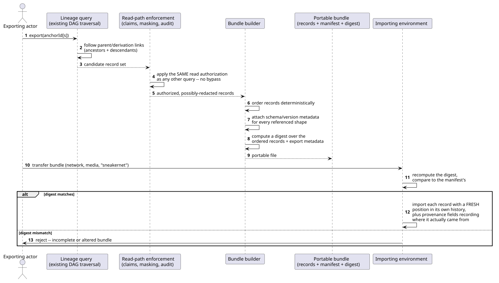
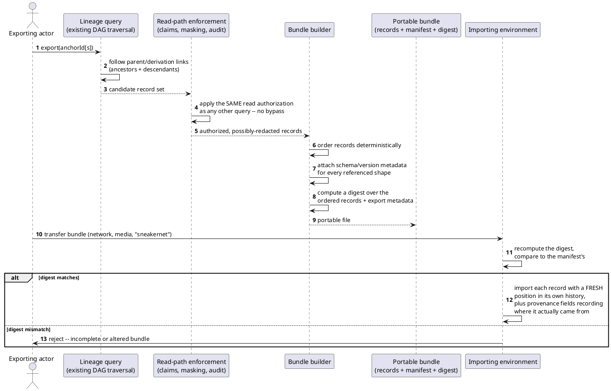

[← Pattern index](README.md)

# Event Chain / Lineage Export

## The pattern

Walk a causally-connected subgraph of a history-of-record — starting
from one or more anchor nodes and following the same derivation/parent
links the system already tracks — and serialize exactly that subgraph,
in order, into one portable, self-describing bundle: the raw records
themselves, enough schema/version metadata that a *different*
environment can make sense of them even if its own registry has never
seen that shape before, and an integrity digest over the whole bundle
so a receiving party can confirm it arrived complete and unaltered.
Importing that bundle elsewhere never pretends the copy is original —
the import records where each record actually came from (its origin
system, its original position in that system's own order) as new
metadata layered on top, distinct from the fresh position/identity it
receives in the importing system's own history. The same shape serves
two outwardly different needs identically: handing a developer a
realistic slice of production history to reproduce a bug locally, and
handing a legal or compliance reviewer a self-contained, tamper-
evident record of exactly what a system contained and when.

**Source:** [Git's `git bundle`](https://git-scm.com/docs/git-bundle) —
a single file packaging a chosen, reachability-closed subset of a
repository's commit DAG (objects plus the refs needed to make them
resolvable), portable by email or removable media, later unbundled or
fetched into a different repository entirely, with `git bundle verify`
confirming a target has every prerequisite the bundle assumes before
trusting it. The [EDRM (Electronic Discovery Reference Model)](https://edrm.net/)
"load file" convention — a metadata file that travels alongside a
production's documents specifically so a different e-discovery
platform can import them with provenance intact — is the real-world
precedent for the same shape applied to litigation-review record
transfer rather than source-control history.

## When you'd reach for it

Whenever a *subset* of a causally-linked history needs to leave the
system that produced it — reproduce a production bug against a
realistic (not synthetic) slice of real data in a dev environment,
transfer a bounded slice of history to a support engineer without
handing over the whole store, or produce a self-contained, provably-
complete record of "everything connected to this case" for a party
who cannot query the source system directly (a litigation hold, a
regulator, an air-gapped destination). It specifically earns its
keep once "just query the live system" stops being available to the
receiving party — a different environment, a different point in
time, or no live access at all.

## Cost

The bundle is a snapshot, not a live view — it's stale the moment
history moves on in the source system, and nothing keeps it in sync.
Building the traversal and manifest correctly is real, non-trivial work
(deterministic ordering, a genuinely reachability-complete subgraph,
schema metadata for every version actually referenced, not just the
current one) — get any of those wrong and the bundle silently fails to
replay correctly in the receiving environment, often only discovered
there, far from the system that produced it. And a bundle carrying
already-redacted content can only ever prove its own *structural*
integrity (each record correctly links to the one before it) to a
receiving party who wasn't there for the original write — it cannot
let them independently re-derive a hash computed once, at original
publish time, over content they were never shown.

## How this application uses it

`ADR-068` builds this on top of the existing Lineage DAG traversal
(`ADR-005`) rather than a new traversal mechanism, and sends every
candidate record through the exact same read-path enforcement
(`ADR-008` claims, `ADR-009` masking including `ADR-057`'s erasure
branch, `ADR-045` read-audit logging) any other query gets — an export
is a read, never a privileged escape hatch. The bundle itself is
NDJSON of the exported `StoredEvent`s in `SequenceNumber` order, plus a
manifest carrying every referenced `EventTypeDefinition`/`SchemaVersion`
and a SHA-256 **manifest hash** over the ordered original `ChainHash`
values and export metadata — reusing `ADR-019`'s hash primitive for a
new purpose. On import, the record gets a fresh `SequenceNumber`/
`ChainHash` in the receiving log, while `OriginalSequenceNumber`/
`OriginalChainHash`/`ImportedFrom` travel as new envelope metadata
recording provenance rather than pretending the copy was organically
published there. The concrete implementation lives in
`src/EventStore.LineageExport/` — `LineageExportService.cs` (the
traversal/build), `ExportManifest.cs` and `ManifestHash.cs` (the
manifest shape and digest), `LineageExportBundleStore.cs`, and
`LineageExportEndpoints.cs`.

`ADR-069` reuses this exact bundle format a second time for a
genuinely different transport need — a fully air-gapped client outbox
with no network path at all, carrying queued *outbound commands*
instead of historical read-side events, verified the same way before
import — rather than inventing a second bundle shape for what is
structurally the same problem. `ADR-068` also names a third real-world
precedent independently: standalone, self-executing offline evidence
viewers (MetaDiscovery, OSForensics, SANS's EZViewer) as the shape its
own self-contained litigation-review player follows for presenting an
exported bundle to a party with no access to this system at all —
distinct from, and layered on top of, the export/bundle mechanism this
doc covers.
