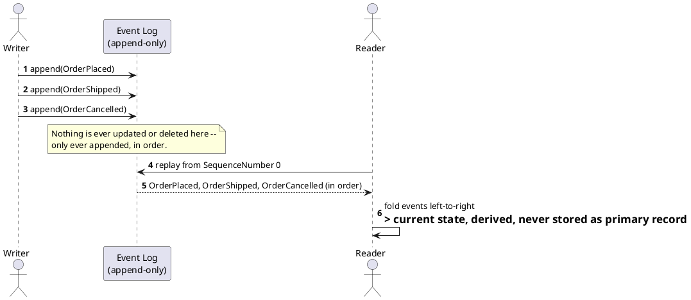

[← Pattern index](README.md)

# Event Sourcing

## The pattern

Instead of storing only an entity's current state, store every state
*change* as an immutable, append-only sequence of events, in the order
they occurred. Current state is never stored as the primary record — it's
derived by replaying the event sequence from the beginning (or from a
checkpoint). The event log is the single source of truth; anything else
(a "current state" table, a search index, a report) is a disposable,
rebuildable derivative of it.

**Source:** [Martin Fowler — Event Sourcing](https://martinfowler.com/eaaDev/EventSourcing.html).

This is deliberately different from just "having an audit log bolted onto
a mutable table" — in event sourcing, the log *is* the data model, not a
side effect of one. A system with a mutable `Orders` table plus a separate
`OrderAuditLog` for compliance is not event-sourced; a system whose only
persisted `Orders`-related fact is a sequence of `OrderPlaced`,
`OrderShipped`, `OrderCancelled` events, with no other authoritative
`Orders` table at all, is.

## When you'd reach for it

Any system where *why* something reached its current state matters as
much as the state itself, or where new read shapes will predictably be
needed later that no one can fully anticipate at write time.

- A complete, faithful history of *why* something is in its current
  state, not just *that* it is — genuinely valuable for audit, debugging
  ("why does this look like this"), and analytics no one anticipated
  needing at write time.
- New read models can be built later, from history that already exists,
  without a migration of the write side.
- Temporal queries ("what did this look like on Tuesday") fall out for
  free — replay up to that point.

## Cost

- Reading "current state" is never free — it requires either replaying
  from scratch (expensive at scale) or maintaining a materialized
  projection (see [CQRS & Materialized Views](cqrs-and-materialized-views.md)),
  which is now a second thing that can be wrong/stale/need rebuilding.
- Schema evolution is harder than with a mutable table: old events don't
  just get migrated in place, because migrating them in place would mean
  editing history — see
  [Tolerant Reader & Schema Evolution](tolerant-reader-and-schema-evolution.md).
- Deleting data is awkward by construction — "delete" has to become
  either a new event (a tombstone) or a redaction concern layered on top,
  never a row-level `DELETE`.

## Also known as

**Event-Driven State**, **append-only log architecture** (the Kafka-
world framing: "the log as source of truth"). Distinct from — not a
variant of — **Command Sourcing** (storing the *commands* that were
issued, not the events they produced; a related but different idea, since
a command can fail or be rejected while an event, by definition, already
happened).

## How this application uses it

The `Events` table (`02-data-model.md`) *is* the store of record —
`StoredEvent`, append-only, `SequenceNumber`-ordered, never updated or
deleted after insert. This is the foundational decision every other ADR
in this design sits on top of:

- `ADR-004` commits to portable text storage for `Payload`, specifically
  so the event log itself stays provider-agnostic.
- `ADR-009`'s closing note states the "never delete" consequence
  explicitly: masking is the *only* redaction mechanism, and it's a
  read-time transform, never a mutation of a stored event.
- `ADR-019` extends the log with a hash chain, turning "append-only" into
  a *verifiable* property, not just a policy nobody violates by
  convention.
- `ADR-023`'s persist-everything posture pushes this further: even
  schema-invalid or unattested submissions get an event, never a rejected
  write with nothing recorded — the log's completeness is treated as more
  important than its cleanliness.

Current-state reads never touch the event log directly at request time —
that's the Entity Store (`ADR-021`) and custom CQRS projections
(`ADR-015`/`016`), covered in the next pattern.
