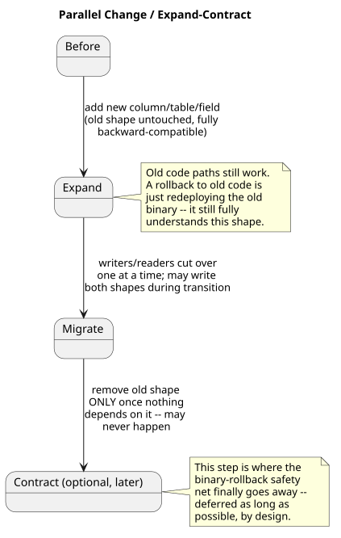
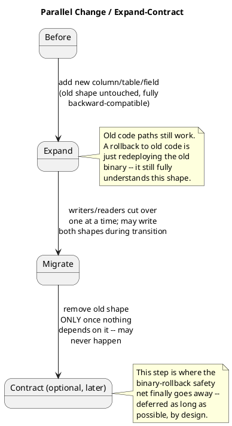

[← Pattern index](README.md)

# Expand/Contract (Parallel Change) Database Migration

## The pattern

Implement a backward-incompatible change to a shared schema or interface
in three distinct, individually reversible phases instead of one atomic
cutover. **Expand**: add the new structure (a new column, table, index,
field) alongside the old one, in a purely additive, backward-compatible
way — every existing reader/writer keeps working, completely unaware
anything changed. **Migrate**: cut writers and readers over to the new
structure one at a time, typically writing to both old and new shapes
for a transition window, then reading from the new shape once every
consumer can. **Contract**: remove the old structure only once nothing
depends on it any more — optionally, much later, or never. Because each
phase is small and independently reversible, any single step can be
undone without needing a full rollback of the whole migration; a rolling
deployment's binary rollback becomes a plain redeploy of the old
executable, because the database (or API) never stops understanding the
old shape until Contract deliberately removes it.

**Source:** Martin Fowler named and formalized this as **Parallel
Change** in a 2014 bliki entry on
[martinfowler.com](https://martinfowler.com/bliki/ParallelChange.html),
drawing together practices already informally in use for safe schema
migrations and API evolution; **Expand/Contract** is the equally common
name for the same three-phase structure, used interchangeably with
Parallel Change in most later write-ups of it.

## When you'd reach for it

Any schema or interface change that would otherwise break an
in-flight rolling deployment or an existing consumer that can't upgrade
in lockstep with the server — renaming or reshaping a database column, a
breaking API field change, splitting one table into two — anywhere the
old and new versions of the code need to coexist for some real window
(a canary rollout, a multi-region staged deploy, a client population
that upgrades on its own schedule) rather than atomically together.

## Cost

Real calendar time and code complexity during the Migrate window: two
shapes exist simultaneously, some code paths have to write (or read)
both, and the team has to remember to actually perform Contract later —
skipped indefinitely, "temporary" dual-write logic tends to calcify into
permanent complexity nobody wants to be the one to remove. It is also
strictly more upfront design work than a single atomic migration for a
change that never actually needed rolling-deployment safety in the
first place (a one-shot batch job with real downtime, for instance) —
worth paying only when binary rollback or mixed-version operation is a
real requirement, not a default applied automatically to every schema
change.

## How this application uses it

`ADR-038` adopts this by name as this design's deployment-level
discipline, layered directly on the "never lose data" posture already
established by `ADR-023`'s persist-everything ingestion: **Expand** —
add new nullable columns/tables, never alter or drop existing ones.
**Migrate** — new code writes to new structures while old code keeps
working unaffected, with `SchemaVersion`/`DeprecatedAt` metadata
(`docs/data/schema-registry.md`) marking a field superseded without
removing it. **Contract** — optional, much later, and per this design's
own stated principle may simply never happen for some structures. Paired
with `ADR-018`'s upcast chain and the N-1/N+1 compatibility window (any
server version must correctly process events tagged with the
immediately-previous and immediately-next schema version), a rolled-back
deployment never loses a newer-schema event either — it sits `received`
(`ADR-023`'s status envelope), unroutable-but-persisted, until a future
deployment reintroduces support for it. `08-build-plan.md`'s Phase 19
exit criterion is a literal rehearsal of the pattern's own promised
safety net: deploy a schema version, publish an event tagged with it,
roll back to a deployment that doesn't know that version, confirm the
event sits `received` rather than being lost, then confirm
re-forward-deploying makes it routable again with no data loss and no
database restore.
