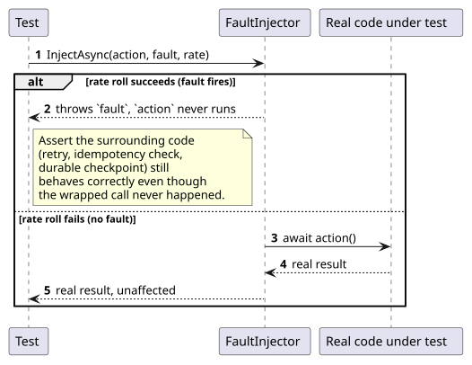
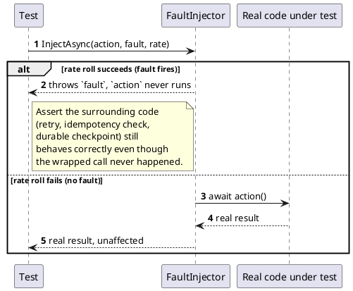

[← Pattern index](README.md)

# Fault Injection / Chaos Engineering

## The pattern

Deliberately introduce a failure into a running system — an exception, a
dropped connection, a lost response, a slow dependency — to build real
confidence the surrounding code actually survives it, rather than
inferring correctness from code review alone. The discipline this
practice implements is chaos engineering: forming a hypothesis about
steady-state behavior, then actively trying to break it under
controlled conditions, in the smallest environment that still exercises
the real failure mode.

**Source:** [principlesofchaos.org](https://principlesofchaos.org/).





## Also known as

**Chaos Engineering** is the broader discipline (Netflix's Chaos Monkey
is its best-known production-scale instance — randomly terminating live
instances to prove a fleet tolerates losing one). **Fault injection** is
the narrower, in-process technique this project actually uses: wrap one
specific call and make it fail on command, rather than randomly
destabilizing a whole running environment. The same idea appears under
different names depending on scope — "chaos testing" (broad, live-
environment), "fault injection testing" (narrow, in-process or
network-level) — this project uses the narrow form.

## When you'd reach for it

Any time a claimed resilience property — "a retry after a lost response
never duplicates," "a crashed write recovers from its own durable
checkpoint," "an exhausted retry budget dead-letters instead of hanging
forever" — is a real code path a happy-path test never actually
exercises, because the happy path never fails. If the only evidence a
failure mode is handled correctly is "I read the code and it looks
right," that's exactly the gap this pattern closes.

## Cost

A hand-rolled or library-based in-process injector only proves the code
survives a failure it was TOLD to expect, at the exact point it was told
to inject it — it says nothing about failures at a different point in
the call graph, partial/torn writes, or real network-level pathology
(packet loss, latency, partition) a live dependency can actually
produce. Escalating to a heavier tier (a real network proxy that can
actually drop/delay/corrupt traffic between real processes) costs real
infrastructure and test runtime; worth it only once the cheap, in-process
tier's own coverage is exhausted.

## How this application uses it

`ADR-063` stages this discipline rather than adopting the heaviest tier
immediately: in-process fault injection now, `Testcontainers`+`Toxiproxy`
(real network-level fault injection between real containers) named as
the next escalation if a specific failure mode ever needs it — not built
today, since nothing in this codebase's current test suite has asked for
it yet.

**The mechanism itself changed after adoption, a real, worth-recording
correction**: `ADR-063` originally adopted `Polly`+`Polly.Contrib.Simmy`
(`Polly`'s own chaos-engineering companion package) for the in-process
tier — see [`docs/libraries/dotnet/polly-simmy.md`](../libraries/dotnet/polly-simmy.md)
for the full verified package identity and original "bought, not built"
reasoning. It was **removed**, direct request, once `Polly` announced a
per-organization Open Source Maintenance Fee
([thepollyproject.org, 2026-07-14](https://thepollyproject.org/2026/07/14/polly-osmf-announcement.html))
that would apply to this reference framework's own test suite if an
adopter ever commercialized it. What this project ever actually used
`Simmy` for — inject a fake exception before a real call, at a
configurable `[0,1]` rate — turned out small enough not to need a
third-party dependency at all: a ~10-line hand-rolled
`FaultInjector` (`tests/EventStore.UnitTests/FaultInjector.cs`) replaced
it, same tests, same coverage, same rate convention:

```csharp
// tests/EventStore.UnitTests/FaultInjector.cs
internal static class FaultInjector
{
    public static async Task<T> InjectAsync<T>(Func<Task<T>> action, Exception fault, double rate = 1.0, Random? random = null)
    {
        if ((random ?? Random.Shared).NextDouble() < rate)
            throw fault;
        return await action();
    }
}
```

**What it actually proves, concretely**
(`PublishCrashRecoveryFaultInjectionTests.cs`): a real publish commits
durably first; the fault is injected on a *separate* delegate standing
in for "deliver the response to the caller," never on the write path
itself — the durable data the test already asserted committed is
completely unaffected by what happens next. Two scenarios: (1) the
caller never learns its first publish succeeded (a dropped connection,
a crash between commit and response) and retries with the same
client-supplied `EventId` — `ADR-011`'s idempotency must recognize the
retry as a replay of the *same* event, never a second write; (2) a
genuinely *different* publish reusing the same `EventId` after a
simulated crash is a real conflict, not a safe replay — the guarantee
above must not be so broad it also papers over an actual `EventId`
collision between two unrelated publishes. Both are asserted directly
against the real, durable `EventStoreContext`, not a mock.

`ADR-063` also names property-based testing (`FsCheck`, `ADR-019`'s
hash-chain and `ADR-024`'s conflict-resolution invariants) as the other
half of its own staged-adoption scope — a related but distinct
technique (checking a general property across many generated inputs,
rather than injecting one specific failure), covered by its own
catalog row, not this doc.
