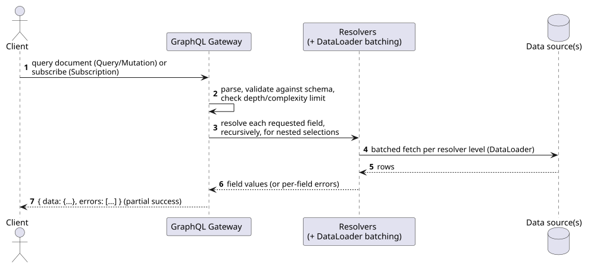
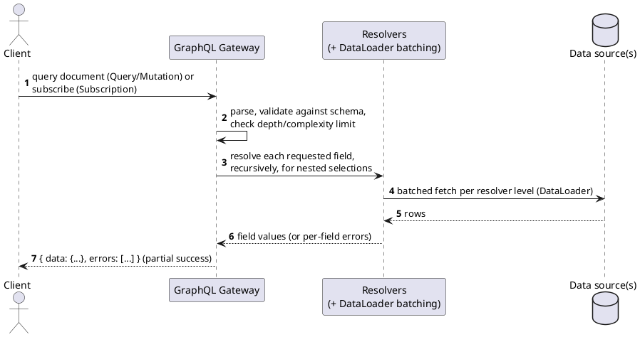

[← Pattern index](README.md)

# GraphQL Query Language

## The pattern

A client sends a single document describing exactly the shape of data it
wants — nested fields resolved recursively, one round trip regardless of
how deep the requested shape goes — instead of a fixed set of endpoints
each returning a fixed shape. Three operation kinds: **Query** (read),
**Mutation** (write), **Subscription** (an ongoing stream of updates
matching a selection, over WebSocket or another streaming transport).
Execution is partial-success by design: a response carries `data` and a
separate `errors` array, so one failing field doesn't necessarily fail
the whole request. **Source:**
[GraphQL Specification](https://spec.graphql.org/) (originally developed
at Facebook, now governed by the GraphQL Foundation/Linux Foundation).

## When you'd reach for it

Client-driven, hierarchical/graph-shaped data (the requesting side, not
the server, decides what depth/shape it needs) plus a real need for
live updates via Subscriptions — the combination is what most
distinguishes GraphQL from REST-family alternatives, not either
capability alone.

## Cost

N+1 resolver calls are the classic failure mode for naively-written
nested resolvers — needs deliberate batching (DataLoader pattern) to
avoid, not something that falls out "for free." Unbounded query
depth/complexity is a real attack surface (a small query document can
request an enormous amount of nested work) — needs an explicit
depth/cost limiter, not optional hardening. Convention is `POST`-only,
which is fine for most APIs but a real design point if query arguments
can carry sensitive data that shouldn't sit in whatever transport
convention is assumed by default.

## How this application uses it

`ADR-037` is this pattern, replacing OData entirely (not kept as a
secondary option) as the sole query surface over the Entity Store
(`ADR-021`) and event/change-history. Notable departures from the
"typical" GraphQL deployment, each with its own stated reason:

- **Travels over the HTTP `QUERY` method (`ADR-012`), never `POST`,
  never `GET`.** The specific, stated reason: a query document's
  arguments can carry PII/PHI (filtering by a patient name, an SSN,
  anything a `RequiredClaims`-gated field might hold) — `QUERY`'s
  body-carrying, still-safe-and-cacheable semantics keep that content out
  of URLs, access logs, and proxy caches the way `GET` never could, and
  out of the convention of logging full request bodies the way `POST`'s
  side-effect assumption sometimes invites. This is the one place
  GraphQL needed a deliberate assist from this design rather than
  getting a property for free — see [the API query layer
  comparison](../comparisons/api-query-layer.md) for the honest
  accounting of that trade.
- **The schema is composed per `AppId` (`ADR-030`), never one fixed
  global SDL** — generated from each application's own registered types,
  the same way `ADR-002`'s OpenAPI/AsyncAPI generation already works.
- **Depth/cost limiting and DataLoader-style batching are mandatory, not
  optional** — guarding specifically against unbounded fan-out across
  `ADR-034`'s shards and `ADR-033`'s replicas, not a generic best
  practice bolted on afterward.
- **`extensions: JSON`** on every type exposes `docs/data/
  entity-store.md`'s `Extensions` bag — this is GraphQL's own expression
  of [Tolerant Reader](tolerant-reader-and-schema-evolution.md): unknown-
  but-present data stays queryable, never invisible. Non-nullable fields
  (`String!`) are deliberately audited and reserved only for properties
  guaranteed across every schema version, since GraphQL's spec nulls out
  an entire parent object when a non-null field resolves to `null` — the
  exact failure mode this design's tolerant posture exists to avoid.
- **Upcast/downcast mapping metadata rides along as SDL directives**
  (`@renamedFrom`/`@derivedFrom`) rather than living only in a separate
  registry document — the schema and its own migration history can't
  silently drift apart (`ADR-037`, `ADR-018`).
- **Two new resolver concepts land on this same Gateway, not a separate
  API surface**: `ADR-068`'s lineage-scoped event export and bitemporal
  system-time playback (VCR-style play/rewind/fast-forward for
  litigation review) are both new *read* shapes over history, enforced
  through the identical `RequiredClaims`/masking/access-audit pipeline
  every other GraphQL query already goes through — an export or a
  playback position is a read, never a privileged bypass of this design's
  existing authorization pipeline. Not yet drawn into `01-c4-
  architecture.md`'s GraphQL Gateway component diagram — flagged there as
  remaining propagation work, not silently missing.
