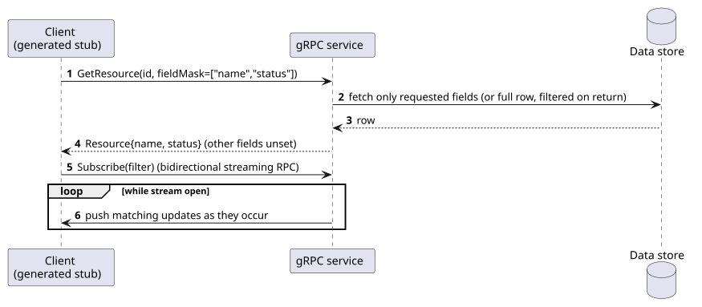
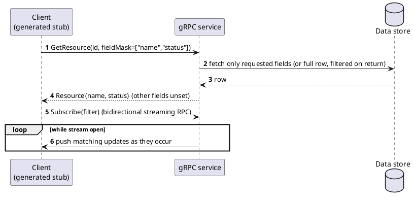

[← Pattern index](README.md)

# gRPC + Protobuf Services (FieldMask partial responses)

## The pattern

A `.proto` file declares services and message types; a code generator
produces strongly-typed client/server stubs in every supported language,
communicating over a binary wire format (Protobuf) atop HTTP/2 —
contract-first, in contrast to REST's convention-first approach. Google's
API Improvement Proposals (AIPs) layer standard conventions on top:
**`google.protobuf.FieldMask`** (AIP-161) lets a caller name exactly
which fields it wants returned or updated, and AIP-160 defines a common
filter-string convention for list operations. Native **bidirectional
streaming** RPCs give a first-class, no-bolt-on answer to "keep sending
me updates." **Sources:**
[gRPC](https://grpc.io/docs/what-is-grpc/introduction/),
[AIP-161 — Field masks](https://google.aip.dev/161),
[AIP-157 — Partial responses](https://google.aip.dev/157).

## When you'd reach for it

A same-vendor (or at least same-toolchain) internal service mesh where
every caller can run generated stubs, contract-first typing end-to-end
is worth more than universal HTTP-client compatibility, and streaming
RPCs are a first-class need — the common case for internal
service-to-service calls at companies that standardize on gRPC
throughout their backend.

## Cost

Binary wire format — not directly callable from an arbitrary HTTP
client (`curl`, a browser `fetch`) without a gRPC-Web proxy translation
layer, which reintroduces real complexity. Filtering/partial-response
conventions here are Google's own house-style AIPs, not an independently
multi-vendor-adopted spec the way OData/GraphQL/JSON:API are. Heavier
client tooling burden (codegen from `.proto`) than any REST-family
option.

## How this application uses it

**Compared, not adopted.** [The API query layer
comparison](../comparisons/api-query-layer.md) considered gRPC against
this project's stated "usable from any ordinary HTTP client" requirement
(`README.md`'s framework-for-anyone framing) — a binary protocol needing
generated stubs is a real mismatch for that goal, even though gRPC's own
`FieldMask`/streaming story is otherwise a strong, honest answer to
several of this project's other requirements (partial responses,
real-time). Recorded here for its teaching value as the internal-mesh
alternative this design deliberately isn't.
