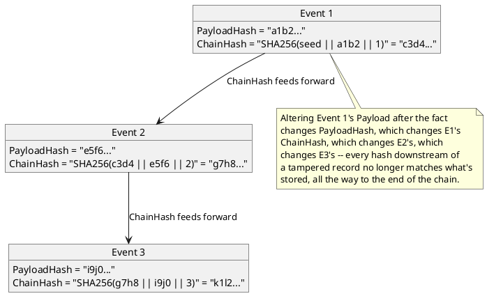

[← Pattern index](README.md)

# Hash Chain (Tamper-Evident Log)

## The pattern

Make tampering with any past record of an append-only log *detectable*,
without requiring readers to trust the store operator. The general
technique: each record's stored hash incorporates the previous record's
hash, so altering any past record changes every hash computed after it —
a reader who recomputes the chain from the beginning and compares the
final result to what's stored can tell, cheaply, whether history has been
altered anywhere along the way.

The best-known production example of this general idea is **Certificate
Transparency** (**Source:** [RFC 9162](https://datatracker.ietf.org/doc/html/rfc9162)),
which uses a full **Merkle tree** rather than a simple linear chain — a
binary hash tree gives efficient *inclusion proofs* ("this one certificate
is definitely in this log") and *consistency proofs* ("this later tree
state is a superset of this earlier one, nothing was removed") without
needing to replay the entire log, at the cost of real implementation
complexity (tree construction, proof paths). A **linear hash chain** is
the simpler special case: no per-entry proof shortcuts, but a full replay
from the seed gives the same tamper-evidence guarantee with far less
machinery — the right trade when there's no federation of independently-
operated logs needing to cross-check partial views of each other.

**What it gives you:** tamper-*evidence*, not tamper-*prevention*. Someone
with sufficient write access can still rewrite history and recompute
every downstream hash to match — what the chain actually defeats is
*undetected* tampering, since recomputing an entire chain from the seed is
a far more conspicuous act (checkable against any independently-held
earlier checkpoint) than editing one row and hoping nobody checks.

## Also known as

Sometimes called a **blockchain** in casual usage — worth actively
resisting that name here: a blockchain specifically implies decentralized
*consensus* among mutually-distrusting parties over which chain is
canonical (proof-of-work, proof-of-stake, or similar); a hash chain is
just the tamper-evidence data structure underneath that, with no
consensus mechanism at all — this design has exactly one authoritative
writer per store (`ADR-001`), so "blockchain" would overclaim what
`ADR-019` actually provides. Also called a **tamper-evident log** or
(loosely) a **verifiable log** — the latter more precisely describes a
full Merkle-tree structure like Certificate Transparency's, not the
simpler linear chain `ADR-019` chose.

## How this application uses it

`ADR-019` is a deliberately **linear** chain, not a Merkle tree — chosen
explicitly *because* this design has no federation-of-logs use case
Certificate Transparency's tree structure exists to serve; a single
store's full-replay verification cost is an acceptable trade for a much
simpler implementation. `ChainHash[n] = SHA-256(ChainHash[n-1] ||
PayloadHash[n] || SequenceNumber[n])`, computed once at insert time in
`EventAppender`, verified by replaying from `SequenceNumber = 1` via a
read-only verification endpoint.

Notably, this reuses the **same SHA-256 primitive** `ADR-011` already
introduced for a completely different purpose — `PayloadHash` answers
"is this retry identical to what I already stored" (content equality,
[Idempotent Receiver](idempotent-receiver-and-inbox.md)); `ChainHash`
answers "has anything in this store's history been altered since it was
written" (tamper evidence). Two different questions, deliberately
computed with one hash function rather than introducing a second
algorithm for no real reason — worth noticing as a small instance of this
design's general habit of reusing a primitive across unrelated concerns
rather than adding a new dependency per concern (`ADR-018`'s reuse of the
OData parser for the same reason, before that reasoning was superseded by
the GraphQL-only swap — see `references.md`).
