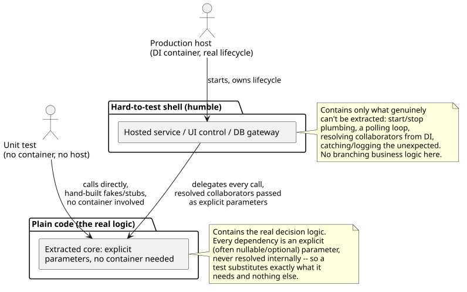
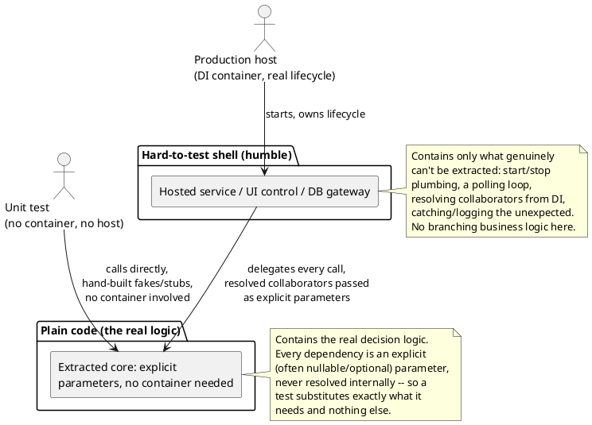

[← Pattern index](README.md)

# Humble Object (testable static core + thin hosted-service wrapper)

## The pattern

Some code is inherently hard to exercise in a unit test — not because its
logic is complex, but because the *container* it lives in is: a UI widget
tied to a real platform toolkit, a database gateway wrapping a live
connection, or (this project's own case) a `BackgroundService`/
`IHostedService` whose polling loop, cancellation handling, and DI-scope
lifecycle only really run under a live host. The Humble Object pattern
resolves this by refusing to fight the container. Instead, it moves
**almost all real logic out of the hard-to-test element** and into a
plain, ordinary piece of code that takes its collaborators as explicit
parameters — leaving the original element "humble": thin enough that the
only thing left to get wrong in it is wiring, not behavior. A test never
needs to stand up the hard-to-test shell at all; it calls the extracted
logic directly, passing in exactly the fakes/stubs/real instances it
wants.

**Source:** Gerard Meszaros, *xUnit Test Patterns: Refactoring Test Code*
(Addison-Wesley, 2007) — catalogs "Humble Object" as a named pattern (see
also the online summary at [xunitpatterns.com/Humble Object.html](http://xunitpatterns.com/Humble%20Object.html)).
Meszaros's own telling credits Michael Feathers' earlier "Humble Dialog
Box" write-up as the specific antecedent for GUI dialogs; Meszaros
generalized the same move beyond dialogs to any hard-to-test element.





## Also known as

**Humble Dialog Box** (Michael Feathers) is the specific, earlier form
this pattern generalizes from — a GUI dialog stripped down to nothing but
widget wiring, with a Presentation Model/Passive View holding the real
behavior underneath it. Meszaros's "Humble Object" is the broader name:
the same move applied to any hard-to-test container, not just a dialog —
which is the sense this project actually uses it in (a background worker
host, not a UI element).

## When you'd reach for it

Whenever the *only* way to test a piece of logic today is to stand up
something slow, flaky, or awkward to construct in a test — a real DI
container and hosted-service lifecycle, a live UI toolkit, an actual
socket or process. If a bug in that logic could only ever be caught by
running the whole host and watching what happens, that's the gap this
pattern closes: pull the logic out into something a test can call
directly, with nothing but plain parameters.

## Cost

Two things now have to stay in sync instead of one: the shell's wiring
(which collaborators it resolves and in what order) and the extracted
method's own signature. As a worker accretes dependencies over time, that
method's parameter list — especially with several optional/nullable
collaborators to accommodate callers that don't need all of them — can
get unwieldy, and nothing enforces the split going forward; a future edit
can always put real logic back into the "humble" shell, and only
convention/code review catches it if it does.

## How this application uses it

`RouterWorker`, `PeerSyncWorker`, and `WebhookOutboxPump` all follow this
shape identically, confirmed by reading the actual source: each is a
`BackgroundService` whose `ExecuteAsync` does nothing but acquire/renew a
leader-election lease (`ADR-078`), resolve that tick's scoped
collaborators from DI, and delegate to that class's own `public static
async Task RunOnceAsync(...)` — a plain, container-free method taking
`EventStoreContext` and every other collaborator as an explicit,
sometimes-nullable parameter, callable directly from a test with no host
running at all:

```csharp
// src/EventStore.Router/RouterWorker.cs
public static async Task<int> RunOnceAsync(
    EventStoreContext db, SchemaRegistryService schemaRegistry, UpcastChain upcastChain,
    ErasureKeyService? erasureKeyService = null, IPayloadMasker? payloadMasker = null,
    IWorkerWakeSignal? wakeSignal = null, CancellationToken ct = default)
```

`RouterWorker`'s own comment names the precedent directly: "the same
pattern `DerivationWorker.RunOnceAsync` already established" — and
indeed `EventStore.Derivation/DerivationWorker.cs`,
`EventStore.ExpectedResponse/ExpectedResponseWatcher.cs`, and
`EventStore.Streaming/ChannelDerivationWorker.cs` all carry their own
`RunOnceAsync` in the identical shape, applying `ADR-023` (the Router's
own persist-everything fold), `ADR-033` (peer sync), and `ADR-060`
(webhook delivery) respectively.

**A correction to this row's own "Applied in" list, found by reading
`ADR-089` and `src/EventStore.Archival/ArchivalService.cs` directly
rather than assuming the family resemblance holds**: `ArchivalService`
does **not** actually follow this shape. It has no `BackgroundService`
wrapper and no extracted static core — it's a plain, constructor-injected
instance class (`EventStoreContext db, IAttachmentContentStore
contentStore, ChainVerificationService eventLogVerifier,
AccessLogChainVerificationService accessLogVerifier`), already testable
via ordinary constructor injection with no host or lease involved. Its
own header comment explains why: `ADR-089` deliberately has no polling
worker of its own — `ADR-056` owns *when* archival runs (a
not-yet-built deployment policy) and this service only owns *how*, so
there's nothing hard-to-test to make humble in the first place. It's a
different (and, here, simpler) route to the same testability goal, not a
fourth instance of this specific pattern — the catalog description
overstated the parallel, and this file corrects it rather than
propagating it.
