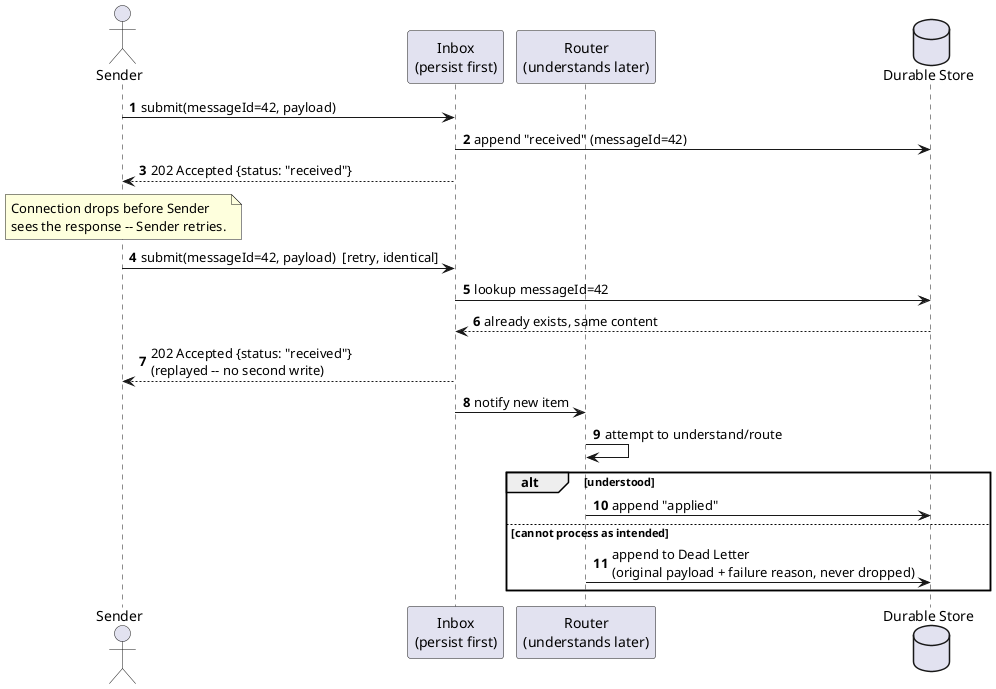

[← Pattern index](README.md)

# Idempotent Receiver & Inbox / Dead Letter Channel

## The pattern

**Idempotent Receiver** — a message may arrive more than once (a sender
retry after a dropped response, a redelivered queue message), so a
receiver must be able to process the same message twice without a
different or corrupted outcome. Two ways to get there: de-duplicate
(recognize and discard a repeat) or make the operation itself naturally
idempotent regardless of how many times it runs.
**Source:** [Hohpe & Woolf — Enterprise Integration Patterns, Idempotent Receiver](https://www.enterpriseintegrationpatterns.com/patterns/messaging/IdempotentReceiver.html).

**Inbox** (the receiving-side counterpart to a Transactional Outbox) —
persist an inbound message durably *before* doing anything else with it,
so "did we receive this" is answerable independently of "did we finish
processing it." This is what makes a slow, fallible, or asynchronous
downstream step safe — the fact of receipt survives even if routing,
validation, or folding hasn't happened yet, or fails.

**Dead Letter Channel** — a message that can't be processed as intended
gets moved somewhere durable and inspectable, rather than being silently
dropped or endlessly retried. **Source:** also
[Hohpe & Woolf](https://www.enterpriseintegrationpatterns.com/patterns/messaging/DeadLetterChannel.html) —
the standard name for this shape.

## Also known as

**Idempotent Receiver** is the mechanism behind what's often called
**exactly-once processing** or **deduplication** in casual usage — worth
noting those looser terms describe the *goal*, while Idempotent Receiver
names the *mechanism* that achieves it. **Dead Letter Channel** is
essentially always called a **Dead Letter Queue (DLQ)** in practice —
same pattern, the more common name in most messaging systems' own
documentation (Azure Service Bus, AWS SQS, RabbitMQ all say "DLQ").

## How this application uses it

**Idempotent Receiver**: `ADR-011`'s `eventId` + `PayloadHash` mechanism
is a textbook idempotent receiver — a retried publish with the same
`eventId` and identical content replays the original response with no
new write; the same `eventId` with different content is a `409`, a
caller bug surfaced rather than silently accepted. The concurrent-retry
race (two never-yet-seen `eventId`s landing at once) is handled at the
database's unique-constraint level, not assumed away
(`06-solution-structure.md`).

**Inbox**: `ADR-023`'s persist-everything posture is a genuine Inbox
pattern adoption, not just a naming coincidence — `PublishEndpoint`
splits into an always-succeeds-if-parseable append step and a separate,
asynchronous `Router` that does schema/entity/upcast validation
afterward. This is worth naming explicitly as a *change in kind*: earlier
in this design (`ADR-015`'s consequences), this system's write side was
noted as *not* needing a Transactional Outbox, because publish and append
were the same synchronous write with no second system to keep in sync.
`ADR-023` reintroduces a real inbox/router split for a different reason
— not to solve dual-write, but to make "received" durable and independent
of "understood" — worth not confusing with the outbox problem that was
correctly judged unnecessary earlier.

**Dead Letter Channel**: `ADR-020`'s `EventUpcastFailed` — a reserved,
system-owned event type that a failed upcast produces *instead of* the
originally-intended event, carrying the original payload verbatim plus
which mapping failed and why — is a dead letter channel implemented as an
ordinary, queryable event (`QUERY /follow/EventUpcastFailed`) rather than
a separate mechanism. `ADR-023` generalizes this: any schema/authority
problem becomes an advisory flag on a persisted event, the same "don't
drop it, mark it and move on" shape, just without always needing a
distinct dead-letter event type for every failure kind.
