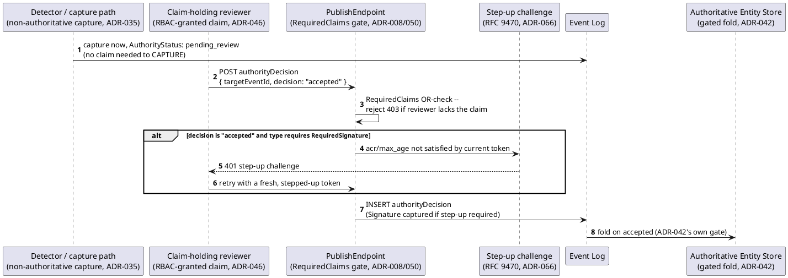

[← Pattern index](../README.md)

# Claim-gated, step-up-authenticated human sign-off on captured data

Four already-Accepted, already-documented mechanisms compose at one
specific point — none alone explains the shape both proving-ground
domains independently built the same way:

- **[Non-authoritative capture](../non-authoritative-capture.md)**
  (`ADR-035`) gets data into the system now, at an explicit trust status
  (`unattested`/`pending_review`) that never gates ingestion.
- **[Gated authoritative publish](gated-authoritative-publish.md)**
  (`ADR-042`) is the mechanism that later folds the captured record into
  the authoritative Entity Store, once, on `accepted` — this page
  composes *on top of* that one, not instead of it.
- **[Claims-based authorization](../claims-based-authz-property-masking.md)**
  (`ADR-008`/`050`) is what decides *who* may publish the decision event
  at all — an OR-matched `RequiredClaims` list, checked at publish time.
- **[Step-Up Authentication](../step-up-authentication.md)** (`ADR-066`,
  RFC 9470) adds a second, independent gate on top of the claim check for
  specifically the *accepting* decision: not just "does this caller hold
  the claim," but "did they recently, strongly authenticate for this
  specific action" — captured as a `Signature` on the accepted event.

## Why this needed its own page

Each of the four pieces above already has its own doc explaining what it
does in isolation. None of them, alone or even pairwise, explains the
*specific* shape both `adverse-event-capture-and-review.md` (Vitals) and
`periodic-screening-and-sar-escalation.md` (Meridian) independently built
— and both feature docs explicitly say they introduce zero new framework
mechanism, because this composition was already fully available from
existing, Accepted ADRs. Reading `gated-authoritative-publish.md` alone
tells you *when* something becomes authoritative, but not *who* is
allowed to make that call or how strongly they had to prove who they
are — that's this page's own subject.

## How this application uses it

Both proving-ground domains build the identical shape, confirmed
directly against the real registrations rather than assumed from the
feature docs alone:

- **Vitals** (`src/Samples.Vitals/VitalsSharedTypes.cs`): the shared
  `authoritydecision` reserved type accumulates a `RequiredClaims` entry
  per workflow that needs a decision on it — `consent:approve`
  (Workflow A), `review:ae` (Workflow B, adverse-event review),
  `review:ionm` (Workflow D) — each workflow's own registration call
  widens the same OR-matched list rather than replacing it. Workflow B's
  registration also sets `RequiredSignature` (`AcrValues: ["urn:trial:
  step-up"]`), so accepting an adverse event specifically requires the
  step-up half of this composition; other decisions on the same shared
  type don't.
- **Meridian** (`src/Samples.Meridian/MeridianSharedTypes.cs`): the same
  shared-type/claim-union convention, with `identity:review` (Workflow A)
  and `identity:aml-review` (Workflow C) added the same way. Workflow C's
  SAR-filing decision needed its own step-up requirement too — but
  because the duplicated registration helper in this file doesn't accept
  a `RequiredSignature` parameter (an asymmetry with the Vitals version,
  not a deliberate design choice), Meridian had to hand-register a
  *separate* event type (`SarFilingRecorded`) with its own step-up
  config instead of extending the shared type the way Vitals did — a
  real, observed cost of the two domains' registration helpers having
  quietly drifted apart. Flagged here, not fixed: promoting a shared,
  parameterized registration helper into `EventStore.SchemaRegistry`
  itself (rather than duplicated per-sample) is a separate, tracked
  proposal — see `TODO.md`.
- The actual fold, in both domains, runs through the same core-engine
  `AuthorityDecisionResolver` (`src/EventStore.Router/
  AuthorityDecisionResolver.cs`) — a genuinely generic reactor, resolving
  purely by `targetEventId` with zero knowledge of which domain or event
  type it's deciding on. Neither domain's sample code reimplements any
  part of the decision-resolution logic itself; only the claim
  registration (and, for Meridian's one case, the step-up config) is
  domain-specific.
