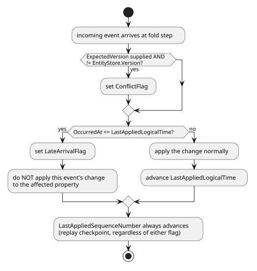
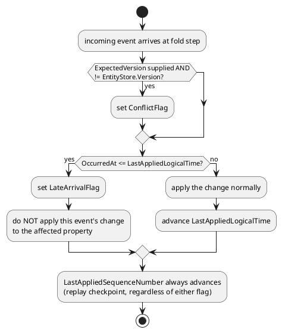

[← Pattern index](../README.md)

# Interaction: Optimistic Concurrency + Watermarks/Event-Time Ordering

Two patterns that sound like they'd compete for the same job at fold
time — [Optimistic Concurrency](../optimistic-concurrency.md) and
[Watermarks/event-time ordering](../tolerant-reader-and-schema-evolution.md)
— actually answer two genuinely different questions, and this design's
fold step (`../../02-data-model.md` → `../../data/entity-store.md`) runs
both checks, in sequence, on every event it folds.

## The two questions

1. **Optimistic Concurrency** (`ADR-024`) asks: *"was this patch based on
   a version of the entity that's still current?"* — compares the
   patch's `ExpectedVersion` against the Entity Store's actual `Version`
   at fold time. This is about **causal basis** — did the sender know
   what they were overwriting.
2. **Watermarks/event-time ordering** (`ADR-029`) asks: *"did this event
   logically happen before or after what's already been folded?"* —
   compares the event's `OccurredAt` against `LastAppliedLogicalTime`.
   This is about **temporal order** — regardless of what the sender
   *thought* they were overwriting, did this actually happen earlier or
   later than what's already there.

## Why both, not one or the other

A patch can fail *either* check independently, and the two failures mean
different things:

| `ExpectedVersion` check | `OccurredAt` check | Meaning |
|---|---|---|
| Pass | Pass | Ordinary, uncontested write — the common case |
| **Fail** | Pass | A genuine concurrent edit — two writers based their patch on the same prior version (`ADR-024`'s `ConflictFlag`) |
| Pass | **Fail** | A late arrival — the sender had an up-to-date basis (no version conflict), but the *event itself* is chronologically stale relative to something else that arrived and folded first (`ADR-029`'s `LateArrivalFlag`) |
| **Fail** | **Fail** | Both — a concurrent edit that also arrived out of order; both flags are set, both are visible in entity change history (`ADR-024` §8.4) |

A design that only checked `ExpectedVersion` would miss the second row
entirely — a late-arriving event with a *stale* `ExpectedVersion` field
(the sender genuinely didn't know about intervening writes, because it
was buffered/delayed) would look like an ordinary conflict, not a
temporal-ordering problem, and might get resolved by whatever policy
`ADR-024` applies to conflicts — the wrong policy for a problem that's
actually about *when* something happened, not *what it was based on*.
Conversely, a design that only checked `OccurredAt` would miss genuine
same-instant concurrent edits from two writers who both had a perfectly
current basis at the moment they wrote.

## Where they run, concretely

Both checks live in the same fold step, applied in this order (checking
`ExpectedVersion` first is a convention, not a hard requirement — the two
are independent enough that either order produces the same two flags):

Note the asymmetry: a `ConflictFlag` **does not** prevent the event from
being applied (stream-order LWW still wins, per `ADR-024`) — it's purely
informational. A `LateArrivalFlag`, by contrast, **does** prevent the
event's change from being applied — applying a chronologically-stale
value would actively corrupt the current state, which is exactly what
[the governing "never lose or corrupt data" principle](../../../README.md)
exists to rule out. Same "flag, don't silently resolve" posture, but one
flag is advisory-only and the other gates whether the write actually
takes effect — worth not conflating just because both are booleans set at
the same point in the code.
