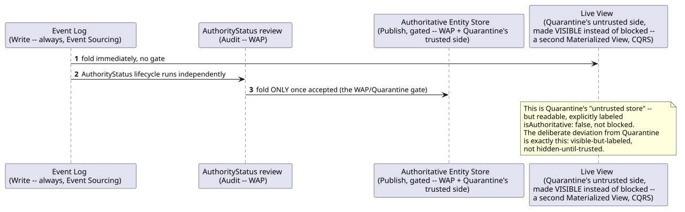
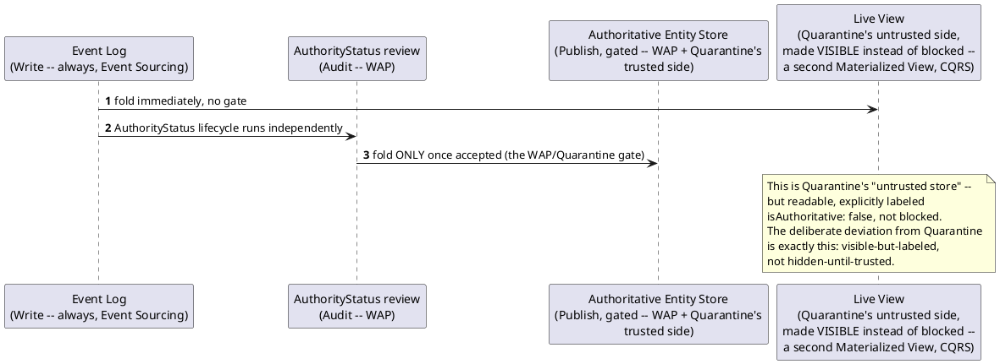

[← Pattern index](../README.md)

# Gated authoritative publish: Write-Audit-Publish + Quarantine + dual materialized views

Three patterns composing at one specific point — none of them alone
explains `ADR-042`'s full shape:

- **[Event Sourcing](../event-sourcing.md)** already gives a write-always
  log with no rejection at write time.
- **Write-Audit-Publish** (Netflix, popularized for Apache Iceberg): write
  to isolation, audit against trust rules, publish to production only
  once it passes. This is the *temporal* shape — write, then audit, then
  (maybe) publish — but on its own says nothing about what happens to
  data *during* the audit window.
- **Quarantine pattern** ([Azure Architecture Center](https://learn.microsoft.com/en-us/azure/architecture/patterns/quarantine)):
  an artifact transitions from untrusted to trusted status via
  checkpoints, and — as written — stays *unconsumed* until it does. This
  is the *trust-state* shape, but its default (block until trusted) is
  wrong for this design's actual need: unconfirmed data has real value
  for live monitoring, so hiding it entirely would throw that value away.
- **[CQRS & Materialized Views](../cqrs-and-materialized-views.md)**
  already established that multiple, differently-shaped read models can
  coexist over the same event stream — the mechanism this composition
  actually uses to resolve Quarantine's blocking default without giving
  up WAP's gate on the authoritative side.

## Why this needed its own page

Reading any *one* of these three patterns' own docs wouldn't tell you
the whole story: WAP alone doesn't say what a consumer can see during
the audit window; Quarantine alone would say "nothing, until trusted" —
the wrong answer here; CQRS alone doesn't say *why* a second view would
ever need to exist. The combination — WAP's temporal gate, applied at
the specific mechanism CQRS already provides (a second materialized
view), with Quarantine's blocking default deliberately inverted to
visible-but-labeled — is what `ADR-042` actually builds.

## How this application uses it

`ADR-042` is this composition: the Event Log is Event Sourcing's
write-always log; `AuthorityStatus`'s `unattested → pending_review →
accepted | rejected` lifecycle is WAP's audit step; the authoritative
Entity Store (`ADR-021`) only folding on `accepted` is WAP's publish
step *and* Quarantine's trusted side; `LiveEntityStoreRow`
(`docs/data/entity-store.md`) is a second CQRS materialized view playing
Quarantine's untrusted side — deliberately readable, wrapped with a
whole-view `isAuthoritative: false` marker rather than blocked from
consumption. See `ADR-042` for the full mechanics and the honest
consequences (two views to keep consistent, `ExpectedVersion` semantics
that only make sense against the authoritative side).
