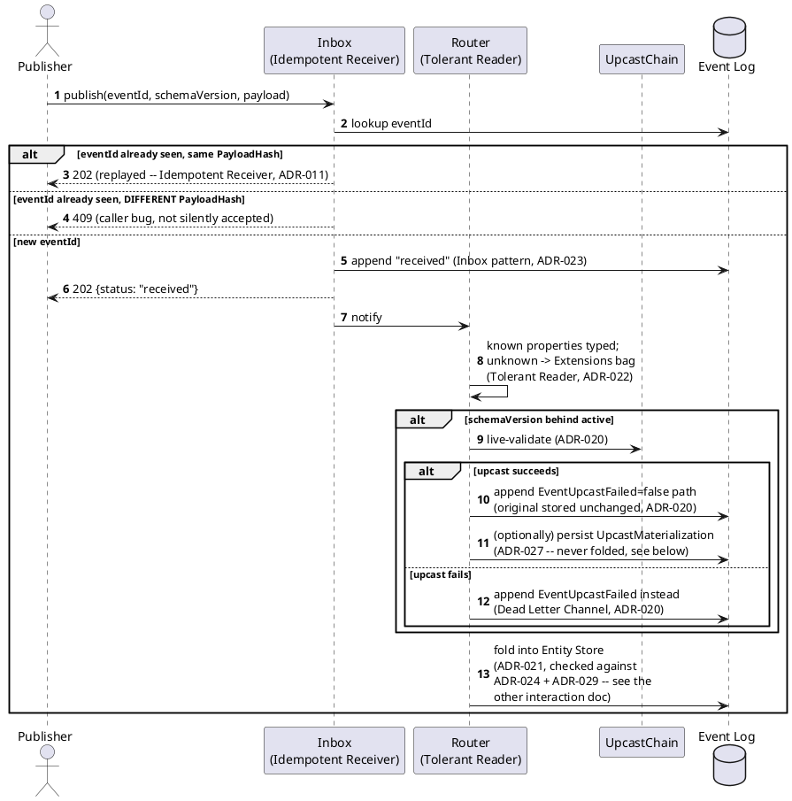

[← Pattern index](../README.md)

# Interaction: The Publish Pipeline (Idempotent Receiver + Inbox + Tolerant Reader + Dead Letter)

A single `POST /publish/{event-type}` request (`../../03-api-contracts.md`)
walks through four distinct patterns in sequence, each solving a
different failure mode. Reading `ADR-011`/`ADR-020`/`ADR-023`/`ADR-027`
individually shows *what* each does; this page is about how they actually
compose into one request's journey, since none of them alone tells the
whole story.

## What each pattern is actually responsible for

- **[Idempotent Receiver](../idempotent-receiver-and-inbox.md)** answers
  "is this a retry I've already handled?" — the very first check, before
  anything else runs. Gets a caller out of the pipeline immediately,
  cheaply, if the answer is yes.
- **[Inbox](../idempotent-receiver-and-inbox.md)** answers "is this
  durably received, independent of whether I understand it yet?" — the
  `202`/`received` response happens *before* schema/entity resolution,
  so a slow or failing downstream step never threatens the fact of
  receipt.
- **[Tolerant Reader](../tolerant-reader-and-schema-evolution.md)**
  answers "what do I do with parts of this payload I don't recognize?" —
  applied per-property during folding, never as a reason to reject the
  whole payload.
- **[Dead Letter Channel](../idempotent-receiver-and-inbox.md)** answers
  "what happens when a specific, nameable step (the upcast validation)
  fails outright?" — the one place in this pipeline a failure produces a
  *different* stored outcome (`EventUpcastFailed`) rather than a flag on
  the same event.

## Why order matters here

Idempotent Receiver has to run **before** Inbox's append — checking for a
duplicate after already appending would defeat the point (`ADR-011`'s
own concurrent-retry race handling, resolved at the database
unique-constraint level, is exactly the edge case this ordering doesn't
fully avoid on its own — two truly simultaneous first-time publishes
with the same `eventId` still need that separate mechanism). Tolerant
Reader's per-property routing has to happen **during** folding, not
before Inbox's append — the whole point of Inbox is that receipt doesn't
wait on understanding the payload at all. Dead Letter only enters the
picture **after** Inbox has already succeeded — a failed upcast never
threatens whether the *original* submission was received, only what gets
folded/materialized from it.
