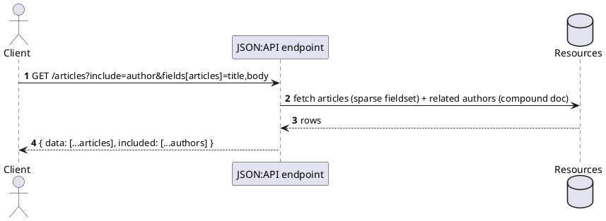

[← Pattern index](README.md)

# JSON:API

## The pattern

A versioned specification standardizing REST response conventions that
plain REST leaves ad hoc: **sparse fieldsets** (`?fields[type]=a,b` —
request only the attributes you need), **compound documents**
(`?include=relatedThing` — fetch related resources in the same response,
avoiding a second round trip), a reserved but intentionally
implementation-defined `filter` query parameter, and standard pagination/
sorting conventions. **Source:**
[JSON:API v1.1](https://jsonapi.org/format/).

## When you'd reach for it

A flat-to-shallow-relational resource API (REST-shaped, not graph-
shaped) where standardizing the *conventions* around fetching related
data and limiting response fields is the actual pain point — teams
converging on one predictable REST dialect instead of each inventing
their own `?with=`/`?expand=`/`?fields=` variant.

## Cost

The spec **deliberately leaves `filter` semantics implementation-
defined** — "the filter query parameter is reserved for filtering data...
its strategy is not defined by this specification." Real filtering still
needs its own grammar decision on top, same as plain REST. No native
subscription/real-time concept — out of scope for the spec entirely.
`include`-based compound documents help with shallow relationships but
don't generalize to arbitrary-depth graph traversal.

## How this application uses it

**Compared, not adopted.** [The API query layer
comparison](../comparisons/api-query-layer.md) considered JSON:API
against this project's actual requirements (`ADR-037`) and it lost on
two of them specifically: no defined filter grammar (this project needs
one well-specified, safe grammar any client can rely on — `ADR-003`'s
whole reason for existing) and no native subscription story (`ADR-010`'s
Follow needs one). Recorded here for its teaching value as a real,
independently-useful standard for the REST-shaped APIs it does fit well,
not as a gap in this design.
