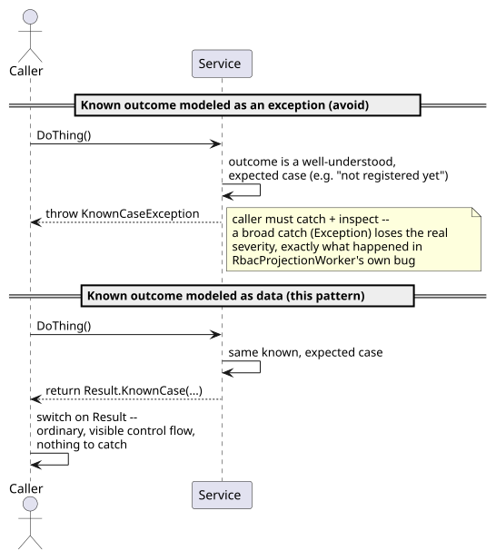
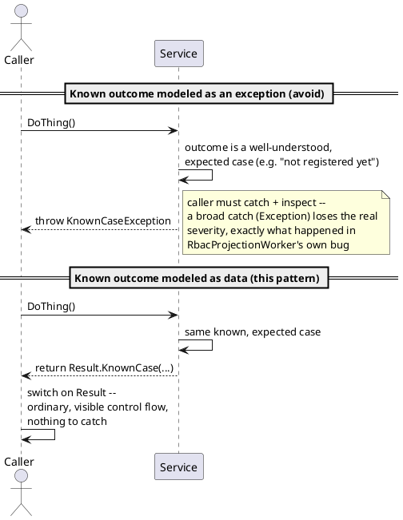

[← Pattern index](README.md)

# Known Outcomes Are Not Exceptions

## The pattern

An exception should mean *"something happened that this code did not
anticipate."* If an outcome is well-understood, named, and expected to
occur as a routine part of normal operation, it is by definition not
exceptional — modeling it as a thrown-and-caught exception is a category
error, not just a style preference. The two real costs of getting this
wrong: the outcome's own true severity gets lost (a `catch (Exception)`
can't distinguish "this is fine, keep going" from "something is actually
broken," so both end up logged/handled identically — usually at
whatever severity the *worse* case deserves), and the calling code's
real branching logic (what should happen for each known outcome) gets
buried inside exception-handling machinery instead of being visible as
ordinary control flow.

**Source:** Microsoft's own .NET Framework Design Guidelines state this
directly — ["do not use exceptions for the normal flow of
control"](https://learn.microsoft.com/en-us/dotnet/standard/design-guidelines/exceptions),
and ["you should check for [an] error condition in code if the event
happens routinely and could be considered part of normal execution, thus
avoiding the use of exceptions"](https://learn.microsoft.com/en-us/dotnet/standard/design-guidelines/exception-throwing).
The standard alternative shape — return the outcome as data instead of
throwing it — is what Scott Wlaschin's ["Railway Oriented
Programming"](https://fsharpforfunandprofit.com/rop/) names and popularized:
success and (known) failure are two tracks a function can return down,
composed explicitly, rather than one track with a side exit nobody sees
in the function's own signature.

## When you'd reach for it

Any time you can name the failure case *before it happens* and expect a
caller to routinely need to branch on it — "this record doesn't exist
yet," "this value already exists," "the caller lacks this claim," "the
input failed validation." If you're about to write a comment explaining
that a given exception is expected/benign/not really an error, that
comment is the signal: the outcome already has a name in your head, it
just isn't in the type system yet. Reserve real exceptions for what's
left after that: a violated invariant, a genuinely unexpected failure
mode (a dropped connection, an out-of-memory condition, a bug), the kind
of thing a caller *can't* reasonably be expected to plan a branch for in
advance.

## Cost

Requires actually naming every known outcome up front (a `sealed`
discriminated result type, an enum, a nullable-return-with-a-reason) —
more upfront design than "just throw and see what happens," and it does
nothing to prevent the deeper mistake of a *bad* taxonomy (lumping two
genuinely different known outcomes into one case loses the same
information a bare `catch (Exception)` does, just one level up). A
consuming API built on top of another layer that *does* throw for a
known case (an HTTP client wrapping `EnsureSuccessStatusCode()`, an ORM
throwing on a missing row) still has to translate that boundary back
into a result at the point it crosses in — the discipline has to be
re-applied at every layer, not assumed to propagate automatically.

## How this application uses it

**The established local convention, used almost everywhere already**:
this project represents a known set of possible outcomes as a `sealed`
C# record hierarchy (a discriminated union), switched on by the caller,
in nearly every mechanism that has more than one meaningful result —
`PublishResult` (`Accepted`/`Conflict`/`ValidationFailed`),
`RegisterEventTypeResult`, `RegisterDerivationResult`, and
`FollowResult` (`Connected`/`UnregisteredEventType`/`Forbidden`/
`ValidationFailed` — `EventStore.Follow.Api`'s own `FollowEndpoints.cs`
switches on it directly to choose an HTTP status code, never throwing
for any of these). This is genuinely the right shape for all of them:
every one of those cases is a routine, expected, named outcome a caller
is always going to need to branch on.

**A real, found-by-running violation of this same principle, fixed
this session** (`docs/bugs/framework/service/rbac-fold-404-logged-as-
error-forever.md`): `FollowResult.UnregisteredEventType` above is
exactly correct on the *server* side — but `FollowClient.TailAsync` (the
*client* consuming that same endpoint) calls
`response.EnsureSuccessStatusCode()`, which throws a plain
`HttpRequestException` for that exact same well-understood,
already-named case, the moment it crosses the HTTP boundary back into
C#. `RbacProjectionWorker.TailForeverAsync` then caught that exception
with a single, undifferentiated `catch (Exception ex)` and logged it at
`Error` — "this reserved event type has no schema for this AppId yet," a
condition `ADR-067`'s own design fully anticipates as routine, came out
looking identical to a genuine dropped connection, at `Error` severity,
repeating every 2 seconds, forever, in a real running deployment.

The first fix (a `catch (HttpRequestException ex) when (ex.StatusCode ==
HttpStatusCode.NotFound)` branch ahead of the generic one, logged at
`Warning` with an honest message) treated the symptom correctly at the
point it was found, but didn't fully apply this pattern — it only moved
the misclassification from `Error` to `Warning` for one caller, still via
a caught exception's `StatusCode`, not a real discriminated result.

**Closed for real (TODO.md, `docs/changes/2026-09-02.md`)**:
`FollowClient.TailAsync` is now `ConnectAsync`, returning
`Task<FollowConnectResult>` (`Connected`/`UnregisteredEventType`/
`Forbidden`/`ValidationFailed` — `EventStore.Projections.Host`) that
mirrors the server's own `FollowResult` exactly, never throwing for any of
the three routine cases; `GetChangeKindAsync` got the identical treatment
via a new `ChangeKindResult`. Every caller — `ProjectionHost<TReadModel>`
(and, transitively, every `IProjection<T>` it hosts, `Samples.Orders
.Projections` included) and `EventStore.DevIdp.RbacProjectionWorker` —
now switches on the result directly instead of filtering a caught
exception's `HttpStatusCode`.
