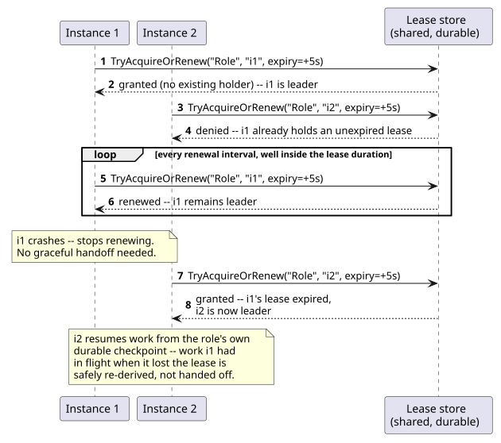
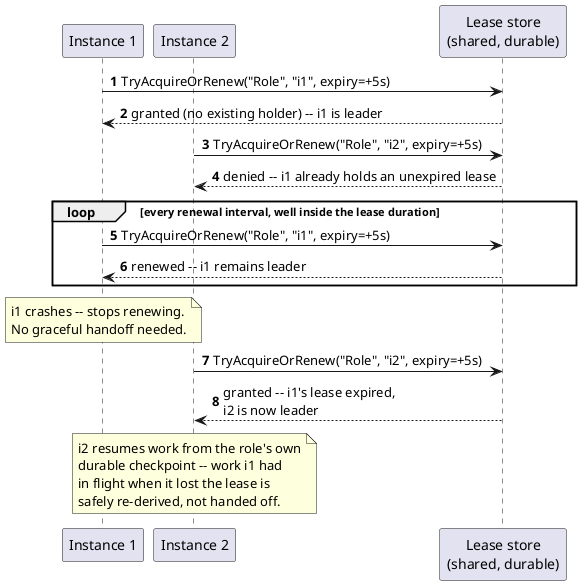

[← Pattern index](README.md)

# Leader Election (Database-Backed Lease)

## The pattern

When several interchangeable instances of the same worker role could
all run at once, but exactly one of them must actually be doing the
work at any given time (so two instances never double-process the same
job), elect one instance as leader and have every instance — leader
included — continuously re-establish who currently holds that role. The
mechanism this pattern doc covers specifically is a **lease**: an
exclusive, time-bounded claim an instance acquires, must periodically
renew before it expires to keep holding, and which becomes available to
any other instance the moment it isn't renewed in time — whether
because the leader shut down cleanly, crashed, or simply lost
connectivity to whatever is arbitrating the lease. No instance needs to
be told directly that leadership changed; each side discovers it purely
through the lease's own expiry and re-acquisition, which is what makes
the mechanism tolerant of an ungraceful leader failure, not just a
clean handoff.

**Source:** [Microsoft Learn — Leader Election pattern (Azure
Architecture Center)](https://learn.microsoft.com/en-us/azure/architecture/patterns/leader-election) —
"a single task instance should be elected to act as the leader... The
first instance to acquire the lease is elected the leader and remains
the leader until it releases the lease or isn't able to renew the
lease." The same page names the lease-race strategy as one of several
real options, contrasted explicitly against consensus *algorithms*
(the Bully Algorithm, Raft, Chang–Roberts) that solve the same problem
without a shared arbitrating store, and against reaching for a
third-party coordination service (Apache ZooKeeper) instead of
implementing a lease directly.

## When you'd reach for it

Several redundant instances of a background worker role could
plausibly run at once (for ordinary deployment/scaling reasons — more
than one process, more than one host), but the work itself isn't safe
for two instances to do concurrently (it would double-process, or race
on a resource with no natural per-item locking), and there's already
one trusted, durable, shared store every instance can reach to
arbitrate against. It's a lighter answer than standing up a dedicated
consensus service specifically when that condition holds — no shared
store, or a store that itself isn't reliable enough to trust, is the
signal to reach for a real quorum/consensus system instead.

## Cost

The lease store becomes a dependency every leadership decision runs
through — if it's unavailable, no instance can become or confirm it's
the leader, a real (if usually rare) single point of failure the
pattern's own source page states outright. Failover isn't instant: a
new leader can only take over once the old lease actually expires, so
there's an unavoidable gap (bounded by the lease duration) between a
leader failing and a replacement taking over — tuning the lease
duration trades "detect failure fast" against "don't force a
needless handoff on a transient blip." And the mechanism only prevents
*concurrent* double-processing — it says nothing about work already in
flight when a lease is lost; that safety has to come from the work
itself being idempotent/resumable from a durable checkpoint, a separate
property the pattern assumes rather than provides.

## How this application uses it

`ADR-078` adopts exactly this mechanism, adapted from Azure's own Blob
Storage lease (an exclusive lease over a blob) to a plain lease **row**
in the site's own relational database — the one piece of shared
infrastructure every deployment already has regardless of provider
(`ADR-004`'s Postgres/SQL Server/SQLite portability), rather than a
provider-specific primitive (Postgres advisory locks, SQL Server
`sp_getapplock`) or a new coordination service. `ADR-078` explicitly
rules out a quorum/consensus system (etcd, ZooKeeper, Consul, the Raft
family) on the same grounds the pattern's own source page names as the
alternative: `ADR-075`'s silo model means each site already has exactly
one trusted database backing its own Event Log, so a second consensus
layer would be new infrastructure solving a problem the existing
database already solves for free — and `ADR-026` puts production on
Docker Compose, not an orchestrator (Kubernetes, Service Fabric) with
its own built-in election primitive to lean on instead.

Each singleton worker role — the `Router`/fold step, the peer-sync
outbox pump (`ADR-033`), and the webhook outbox pump (`ADR-060`), later
joined by `ADR-094`'s `ExpectedResponseWatcher` — gets its **own**
independent lease row, not one shared lease across all of them, so
losing or holding one role's leadership never affects another's. Every
covered role is already idempotent/resumable from its own durable
checkpoint (`LastAppliedSequenceNumber` for the fold step, a
per-peer/per-endpoint cursor for each outbox pump) — a new leader
simply resumes from that checkpoint; work in flight when a lease is
lost is safe to abandon and re-derive, never something needing a clean
handoff.

Concretely,
[`LeaderElectionService.cs`](../../src/EventStore.LeaderElection/LeaderElectionService.cs)
implements `TryAcquireOrRenewAsync` as a compare-and-swap over one
role's `LeaderLease` row (`WorkerRole`, `LeaseHolderId`,
`LeaseExpiresAt`), with `DbSet<LeaderLease>` registered in
[`EventStoreContext.cs`](../../src/EventStore.Persistence/EventStoreContext.cs);
[`PeerSyncWorker.cs`](../../src/EventStore.Replication/PeerSyncWorker.cs)
shows a real caller — it acquires/renews the `"PeerSyncOutboxPump"`
lease on an interval well inside its own lease duration, and only runs
its sync tick at all while it holds it. One narrowing found only by
building this, not anticipated by `ADR-078`'s own Decision text:
`UpcastMaterializer`, originally named as a fourth independent role,
turned out to run inline from inside `RouterWorker`'s own tick rather
than as a separately-schedulable process — it has no lease of its own,
since a second lease would protect nothing that isn't already covered
by `RouterWorker`'s `"Router"` lease.
