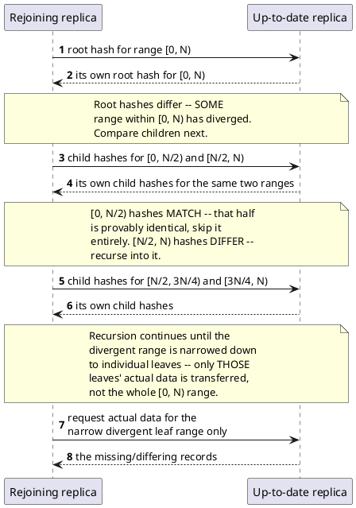

[← Pattern index](README.md)

# Merkle Tree Catch-Up

## The pattern

Compare two copies of a large ordered dataset by exchanging a small
tree of hashes instead of the data itself. Each leaf hash covers a
small range of the dataset; each parent hash is computed from its
children's hashes, all the way up to a single root hash covering the
whole range. Two replicas first compare root hashes — if they match,
that entire range is provably identical and nothing more needs to be
sent. If they differ, the replicas compare the next level down, and
only descend into the branches whose hashes actually disagree,
recursively, until the specific leaf ranges that actually differ are
isolated. Only *those* ranges are transferred — everything else was
proven identical without ever being read or sent.

The tree structure itself — a hash tree whose leaves are data (or their
hashes) and whose internal nodes are hashes of their children,
originally built for efficiently verifying pieces of a large signed
document without needing the whole thing at once — is Ralph Merkle's:
[U.S. Patent 4,309,569, "Method of Providing Digital
Signatures"](https://patents.google.com/patent/US4309569A/en), filed
1979. Using that structure specifically to make *anti-entropy
resynchronization* between replicas efficient — the application this
project's own name for the pattern refers to — is the technique Amazon
popularized for Dynamo: each node keeps a Merkle tree per key range it
hosts, and two nodes needing to resync compare tree hashes top-down,
transferring only the divergent branches.

**Source:** Ralph C. Merkle, [U.S. Patent 4,309,569](https://patents.google.com/patent/US4309569A/en)
(1979) for the hash-tree structure itself; DeCandia et al.,
["Dynamo: Amazon's Highly Available Key-value
Store"](https://www.cs.cornell.edu/courses/cs5414/2017fa/papers/dynamo.pdf),
SOSP 2007, §4.7 ("Replica Synchronization") for the specific
anti-entropy application this pattern doc describes.

## When you'd reach for it

Two replicas of a large, mostly-identical dataset need to resynchronize
after a disconnection, and re-sending or re-scanning the entire dataset
every time would be wasteful — especially when the two copies actually
agree on almost everything and only a small, unknown subset has
diverged. It's specifically valuable when you don't already know
*which* subset differs — if you already had a cheap way to know that (a
change log with a resumable cursor, say), you wouldn't need the tree
comparison at all.

## Cost

Building and maintaining the tree costs something on every write — an
insert or update touching one leaf must also recompute every hash on
the path from that leaf to the root, not just the leaf itself. The
comparison protocol also costs multiple round trips proportional to
tree depth (each level of disagreement costs one more exchange) rather
than one — worthwhile only when it saves more than it costs, i.e. when
the two datasets being compared are large and mostly identical; for a
small dataset or one that's rarely in sync at all, a full transfer can
simply be cheaper than the tree-comparison overhead.

## How this application uses it

`ADR-033` names Merkle-tree catch-up as the efficiency mechanism for a
peer rejoining after a long disconnection: exchange hash-tree summaries
of event ranges with each peer rather than replaying everything from
zero, explicitly citing this as "standard Dynamo/Cassandra-style
anti-entropy" and extending the same hashing discipline `ADR-019`'s
`ChainHash` already established for tamper evidence — a different
application here (ranges of the log for catch-up efficiency, not
tamper detection).

**Not built at this stage — an explicitly honest scope narrowing, not a
silent gap.** [`PeerSyncWorker.cs`](../../src/EventStore.Replication/PeerSyncWorker.cs)'s
own header comment states it directly: "Merkle-tree catch-up (this
ADR's own named efficiency optimization for a long disconnection) is
NOT built at this stage — every tick resends everything since the last
ack, which is correct, just not as efficient as a hash-tree range diff
would be for a long-disconnected peer." `docs/08-build-plan.md`'s
"Sharding & Replication" item's own "Built-scope note" confirms the
same thing: what ships is a plain `PeerSyncCursor`-based full
resync-since-last-ack (every event past `LastAckedSequenceNumber`,
re-pushed and re-deduped by `EventId` on arrival) — functionally
correct (it converges, and flags genuine conflicts via `ADR-024`'s
`ConflictFlag`), just not bandwidth-efficient for a peer that's been
disconnected a long time. The exit criteria that item actually commits
to only require convergence-with-conflicts-flagged, not hash-tree
diffing, so this is a deliberate scope narrowing rather than a gap
against what was promised — revisit if a later item's own scope
actually needs the efficiency (none currently do).
