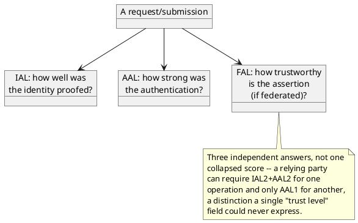

[← Pattern index](README.md)

# Multi-Axis Authority/Assurance

## The pattern

Don't collapse "how much do I trust this" into one score or one enum —
keep the genuinely independent *questions* separate, because a relying
party can need to reason about them differently and combining them
loses information. **Source:**
[NIST SP 800-63-3, Digital Identity Guidelines](https://pages.nist.gov/800-63-3/sp800-63-3.html),
which splits digital-identity trust into three independent axes rather
than one:

- **IAL (Identity Assurance Level)** — how rigorously was the claimed
  identity *proofed* (IAL1: none; IAL2: remote/in-person evidence
  checks; IAL3: supervised in-person document verification).
- **AAL (Authenticator Assurance Level)** — how strong is the
  *authentication mechanism* itself, independent of proofing (AAL1:
  single-factor; AAL2: multi-factor).
- **FAL (Federation Assurance Level)** — how trustworthy is the
  *assertion*, when a federated IdP is vouching for someone rather than
  authenticating them directly.

The generalizable point beyond NIST's specific three: whenever "trust"
in a system is actually answering more than one independent question,
name each question as its own axis rather than forcing a single field
to average them — the same discipline this design already applies to
keeping `SchemaStatus` and `AuthorityStatus` as two independent axes
(`ADR-023`/`ADR-035`) rather than one, just not yet extended further.

## When you'd reach for it

Any system where "how much do I trust this" is actually several
different questions in a trenchcoat — identity, authentication strength,
attestation/federation trust, and (for systems ingesting *claims* about
the world, not just *requests* from a person) content/confidence in the
claim itself. If a single trust field keeps needing a comment explaining
"well, actually, in this case it means X, but in that case it means Y,"
that's the sign it's really multiple axes pretending to be one.

## Cost

Every additional axis is something every consumer now has to reason
about, and every place that currently checks "is this trusted" has to
decide which axis (or combination) it actually means. More axes also
means more places two axes can disagree in a way that needs a stated
resolution rule, not an implicit one.

## How this application uses it — not yet decided

**Not adopted — tracked as an open question**
(`docs/10-open-questions.md`), not a settled design. Today this design
collapses trust into two related but singular axes: `AuthorityStatus`
(`ADR-035`/`ADR-042` — one combined "is this claim/submitter trustworthy
yet" status) and `ReaderTrustBasis` (`ADR-045` — one binary
`Authoritative`/`Attested` per reader). Splitting either into genuinely
independent axes — identity-assurance, authorization-validity, and
content/detection-confidence were named as candidates when this was
raised — is a real, live possibility, not yet designed: which axis
would gate `ADR-042`'s Entity Store fold, whether all of them need to
individually clear a bar or some computed combination does, and whether
this applies to the write side (`AuthorityStatus`), the read side
(`ReaderTrustBasis`), or both, are all genuinely open.
