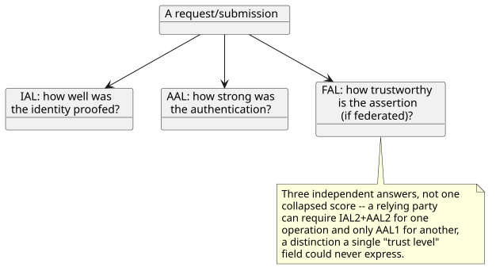
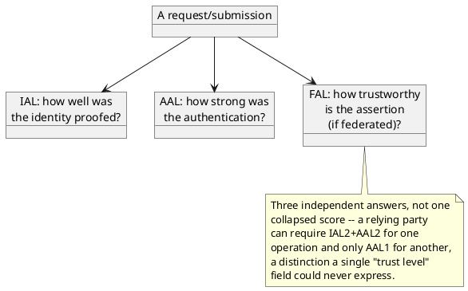

[← Pattern index](README.md)

# Multi-Axis Authority/Assurance

## The pattern

Don't collapse "how much do I trust this" into one score or one enum —
keep the genuinely independent *questions* separate, because a relying
party can need to reason about them differently and combining them
loses information. **Source:**
[NIST SP 800-63-3, Digital Identity Guidelines](https://pages.nist.gov/800-63-3/sp800-63-3.html),
which splits digital-identity trust into three independent axes rather
than one:

- **IAL (Identity Assurance Level)** — how rigorously was the claimed
  identity *proofed* (IAL1: none; IAL2: remote/in-person evidence
  checks; IAL3: supervised in-person document verification).
- **AAL (Authenticator Assurance Level)** — how strong is the
  *authentication mechanism* itself, independent of proofing (AAL1:
  single-factor; AAL2: multi-factor).
- **FAL (Federation Assurance Level)** — how trustworthy is the
  *assertion*, when a federated IdP is vouching for someone rather than
  authenticating them directly.

The generalizable point beyond NIST's specific three: whenever "trust"
in a system is actually answering more than one independent question,
name each question as its own axis rather than forcing a single field
to average them — the same discipline this design already applies to
keeping `SchemaStatus` and `AuthorityStatus` as two independent axes
(`ADR-023`/`ADR-035`) rather than one, just not yet extended further.

## When you'd reach for it

Any system where "how much do I trust this" is actually several
different questions in a trenchcoat — identity, authentication strength,
attestation/federation trust, and (for systems ingesting *claims* about
the world, not just *requests* from a person) content/confidence in the
claim itself. If a single trust field keeps needing a comment explaining
"well, actually, in this case it means X, but in that case it means Y,"
that's the sign it's really multiple axes pretending to be one.

## Cost

Every additional axis is something every consumer now has to reason
about, and every place that currently checks "is this trusted" has to
decide which axis (or combination) it actually means. More axes also
means more places two axes can disagree in a way that needs a stated
resolution rule, not an implicit one.

## How this application uses it — considered and declined, for now

**Not adopted, and no longer an open question** — formalized in
[`docs/comparisons/authority-axis-granularity.md`](../comparisons/authority-axis-granularity.md),
which checked splitting `AuthorityStatus` (`ADR-035`/`ADR-042`) and
`ReaderTrustBasis` (`ADR-045`) into independent axes (identity-assurance,
content/detection-confidence, and — for the read side — a
NIST-IAL/AAL/FAL-shaped split) against this design's actual mechanisms,
not just NIST's identity-proofing domain in the abstract. The concrete
finding: a computed AND of split identity-assurance/content-confidence
axes produces the exact same fold outcome as today's single collapsed
`AuthorityStatus` in every scenario checked, including the detector's
own identity-vs-detection-confidence tension named as the motivating
case — so splitting adds surface area (every consumer now reasons about
two fields instead of one) without changing the one thing that actually
gates `ADR-042`'s Entity Store fold. `AuthorizationValidityStatus`, the
third axis this open question originally named, doesn't hold up at all
in this design specifically, since `ADR-006`/`ADR-008`/`ADR-036` all
resolve permission synchronously before persistence — there's no
persisted "authorization pending" state for it to describe. The
comparison names concrete triggers for revisiting (a review UI that
needs to route identity-verification work separately from
detection-confirmation work; an async permission-approval mechanism that
would create a real "authorization pending" state) rather than leaving
this closed by default with no way back in.

**One real, later mechanism does elevate along the AAL axis specifically,
without reopening this decision**: [Step-Up
Authentication](step-up-authentication.md) (`ADR-066`, RFC 9470) is a
concrete, per-action *runtime* mechanism for moving a caller from a lower
to a higher Authenticator Assurance Level — the same AAL concept this
doc's NIST citation already names — triggered by a specific event type's
`RequiredSignature` configuration. This doesn't split `AuthorityStatus`
or `ReaderTrustBasis` into a separate stored AAL field the way the
declined comparison above considered; it's an on-demand, per-request
elevation check against the caller's *current* token, not a new persisted
axis on data this design stores.
