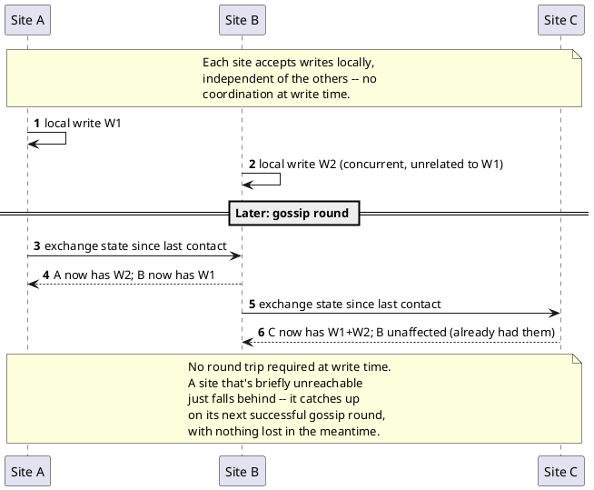

[← Pattern index](README.md)

# Multi-Origin Replication + Anti-Entropy/Gossip

## The pattern

Run more than one full, independently-writable copy of a data store,
each accepting writes locally with no coordination required at write
time, and reconcile the copies afterward through a background exchange
process rather than a synchronous protocol. Two distinct ideas compose
here, worth naming separately even though this project bundles them:

- **Multi-origin (multi-master) replication** — any replica can accept a
  write, not just one designated primary. There is no guarantee any two
  replicas agree at a given instant; the system only promises they
  *eventually* converge.
- **Anti-entropy via gossip** — the mechanism that drives convergence.
  Each node periodically exchanges state with other nodes it knows
  about (rather than everyone announcing every change to everyone else
  immediately); over repeated rounds, differences between any two nodes
  shrink toward zero ("anti-entropy" — actively working against the
  natural tendency of independently-updated copies to drift apart).
  Demers et al.'s foundational paper names this "epidemic algorithms" by
  direct analogy to infectious disease spread: a node holding an update
  it's willing to share is "infective," and gossip strategies (all
  correspond directly to epidemiology's "epidemic," "rumor-mongering,"
  and "anti-entropy" processes) converge without any single node ever
  needing global knowledge of the whole system's state.

**Source:** A. Demers, D. Greene, C. Hauser, W. Irish, J. Larson,
S. Shenker, H. Sturgis, D. Swinehart, D. Terry, ["Epidemic Algorithms
for Replicated Database Maintenance"](https://dl.acm.org/doi/10.1145/43921.43922),
ACM PODC 1987 (also Xerox PARC tech report CSL-89-1) — the paper that
coined "anti-entropy" for this class of protocol; multi-master
replication itself is older and more diffusely attributed, but this
paper is the standard citation for the gossip/anti-entropy convergence
mechanism specifically, and the one later systems (Amazon Dynamo among
them) cite directly.

## Also known as

**Multi-master replication** (the write-acceptance half). **Epidemic
protocols** (Demers et al.'s own term for the gossip half, by the
infection analogy). **Eventual consistency** is the *consequence* this
combination produces, not a separate mechanism — it's the honest name
for "no guarantee any two replicas agree right now, but they provably
converge." Distinct from **hub-and-spoke** and **leaderless-pull**
replication topologies, which reconcile the same underlying tension
(independent writers, eventual agreement) through different
communication shapes — see `docs/comparisons/peer-sync-topology.md` for
why gossip/full-mesh was chosen here over those two alternatives.

## When you'd reach for it

Multiple physically separate sites each need to keep accepting writes
even when they can't reach each other or a central coordinator —
partition tolerance and write availability matter more than every
replica agreeing at every instant. It's the right fit specifically when
"any single site going dark must not stop the others from serving reads
*and* writes" is a hard requirement, not just "the others should keep
serving reads" — a requirement a single-primary/many-replica setup
can't satisfy on its own, since only the primary can accept writes.

## Cost

Convergence is a promise about the eventual state, not the current one
— two replicas can legitimately disagree for an arbitrary window, and
any code path that assumes "what I just wrote is now what everyone
sees" is wrong by construction. Two independent writes touching the
same logical entity can genuinely conflict (not just race) and need an
explicit resolution policy, since there's no single point where the
conflict could have been prevented at write time. The gossip mechanism
itself has a real, unavoidable connection-and-bandwidth cost that grows
with the number of participating sites — full-mesh gossip specifically
costs `O(n²)` connections/redundant transfer as node count grows, a
real tradeoff against topologies (hub-and-spoke) that cost less but
reintroduce a single point of failure.

## How this application uses it

`ADR-033` decides gossip/full-mesh specifically because
`docs/comparisons/peer-sync-topology.md` found it the only one of three
topologies (gossip/full-mesh, hub-and-spoke, leaderless pull) that
delivers "any single site can go dark without losing data or
availability" without introducing a second single point of failure (a
hub that itself would need the same fault-tolerance treatment). A
minimum replication factor of 2 is stated as an explicit deployment
requirement, not assumed to fall out of the topology choice alone.
`OriginId` + `LogicalClock` (a Hybrid Logical Clock, bounded size
regardless of origin count, unlike a true vector clock) travel with
every event to make cross-origin ordering safe; genuine cross-server
divergence resolves via the same `ConflictFlag` mechanism (`ADR-024`)
same-server concurrent writes already use — no second resolution
system. `ADR-061` later reuses the same outbox as its own enforcement
point, filtering destination peers by region for tenants with a
residency constraint.

Concretely,
[`PeerSyncWorker.cs`](../../src/EventStore.Replication/PeerSyncWorker.cs)
implements the gossip tick: every known peer gets pushed whatever this
site has appended since that peer's own `PeerSyncCursor.
LastAckedSequenceNumber`; a push failure just leaves the cursor where it
was — "nothing queued is lost, sync just falls behind," per the file's
own comment — with no separate physical outbox table needed, since the
durable `Events` table plus `PeerSyncCursor` together already are the
fault/abend/restart-tolerant outbox `ADR-033` requires.

**One honest scope narrowing, found by actually building this**:
`ADR-033` also names Merkle-tree catch-up as the efficiency mechanism
for a long-disconnected peer's resync (covered by its own pattern doc,
[Merkle Tree Catch-Up](merkle-tree-catchup.md)) — not built at this
stage. What ships instead is a full resync-since-last-ack every tick,
which is functionally correct (converges, flags genuine conflicts) just
not bandwidth-efficient for a peer that's been gone a long time — a
deliberate, flagged scope narrowing (`docs/08-build-plan.md`, "Sharding
& Replication"), not a silent gap.
