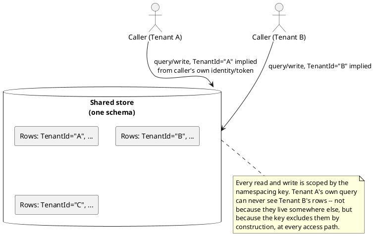

[← Pattern index](README.md)

# Multi-Tenancy via a Namespacing Key

## The pattern

Give every tenant's data a shared home — one running application, one set
of tables, one schema — but stamp each row with a tenant-identifying key
so it can never be read, written, or aggregated across a tenant boundary
by accident. The key becomes the first, implicit predicate on every query:
"which tenant" is answered by a column value, not by which physical
database or schema the query happened to run against. This is the
**pool model** of multi-tenancy (Azure calls the fully-shared end of the
spectrum this) — the alternative to giving each tenant a fully separate
database (silo) or a separate schema-within-a-shared-instance (bridge).
The narrower mechanism — the column itself — is independently named the
**tenant discriminator column** in ORM literature (EclipseLink's JPA
extension formalizes it as `@TenantDiscriminatorColumn`): a value that
discriminates which tenant's rows these are, applied automatically to
every query issued through that persistence context.

**Source:** [Microsoft Learn — Multitenant SaaS Patterns (Azure SQL
Database)](https://learn.microsoft.com/en-us/azure/azure-sql/database/saas-tenancy-app-design-patterns?view=azuresql)
("the schema of a multitenant database must have one or more tenant
identifier columns so that the data from any given tenant can be
selectively retrieved"); [EclipseLink `@TenantDiscriminatorColumn`
reference](https://eclipse.dev/eclipselink/documentation/2.5/jpa/extensions/a_tenantdiscriminatorcolumn.htm)
for the discriminator-column naming specifically.

## Also known as

**Tenant discriminator column** (EclipseLink/Hibernate ORM terminology,
narrower — the column mechanism itself, not the whole deployment model).
**Pool model** or **shared multi-tenant database** (Azure Architecture
Center/Azure SQL terminology — the deployment-shape framing this key
makes possible). Distinct from **row-level security**, which is the
*enforcement* mechanism a database can use to guarantee the key is
actually respected on every query rather than trusting application code
to remember the filter — namespacing is the data-shape decision;
row-level security (or its portable equivalent) is one way to make that
shape's isolation promise airtight rather than merely conventional.

## When you'd reach for it

Many independent, mutually-untrusting or mutually-uninterested tenants
need to run against the same application logic, and giving each one a
fully separate deployment isn't worth the operational/cost multiplier —
you want one schema, one running set of workers, one place to patch a
bug once instead of once per tenant. It's the natural default whenever
tenants are numerous, small, and homogeneous (the same shape of data,
just different owners), and a single noisy or hostile tenant can be
bounded by other means (quota, rate limiting) rather than by physical
separation.

## Cost

Isolation becomes a *code correctness* property instead of a physical
one — every query, every projection, every background worker must
remember to filter (or be filtered for it) by the key, forever, with no
structural backstop if one code path forgets. A missed filter is a
cross-tenant data leak, not a crash. It also means tenants share fate on
shared infrastructure: one tenant's runaway write volume, corrupted
migration, or extreme load is a blast-radius risk to every other tenant
sharing that same schema and compute, unless a separate mechanism (rate
limiting, quotas) is layered on top specifically to bound it.

## How this application uses it

`ADR-030` makes `AppId` a first-class scoping key, not just a naming
convention: `EntityId` is literally `{appId}:{entityType}:{uniqueId}`
(`docs/data/entity-store.md`), and `EventTypeDefinition`'s registry key
becomes `(AppId, Name, Version)` rather than `(Name, Version)` — two
applications can register an `OrderPlaced` type with completely
different shapes and zero collision, because they're different rows
entirely. The same key is then reused, not reinvented, as the partition
key for two later, independent concerns: rate limiting (`ADR-058`) and
data-residency region-pinning (`ADR-061`). Concretely,
[`TenantPartitionKey.cs`](../../src/EventStore.Gateway/TenantPartitionKey.cs)
resolves the `AppId` for a request (from the authenticated caller's own
claim, or — for `/publish`/`/follow`, where the target `AppId` lives in
the JSON body rather than a claim — via
[`AppIdBufferingMiddleware.cs`](../../src/EventStore.Gateway/AppIdBufferingMiddleware.cs))
and hands it to ASP.NET Core's rate limiter as the partition key in
[`RateLimiterPolicies.cs`](../../src/EventStore.Gateway/RateLimiterPolicies.cs),
so one tenant's burst never starves another's share of the same running
Gateway.

**`ADR-075` layers a boundary underneath this key, not a replacement for
it**: different *customers* now each get their own fully separate,
dedicated deployment (the silo model — see
`docs/comparisons/multi-tenant-isolation-model.md` for the full
pool-vs-silo-vs-bridge comparison and why silo won for cross-*customer*
isolation specifically). `AppId`'s namespacing job doesn't go away — it
narrows to scoping multiple applications *within one customer's own*
deployment, the same mechanism this doc describes, just no longer
carrying the cross-customer isolation burden alone.
