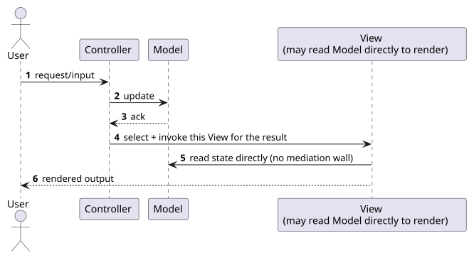
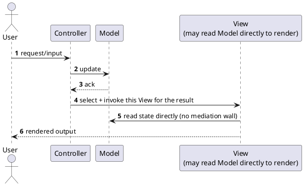

[← Pattern index](README.md)

# MVC (Model-View-Controller)

## The pattern

The original three-way split all of MVP and MVVM descend from: a
**Controller** receives input, updates the **Model**, and selects a
**View** to render the result; the View, unlike MVP/MVVM, is
conventionally allowed to read the Model directly to render itself
(there's no interface wall or binding engine mediating that read) —
appropriate for MVC's original request/response shape, where a View is
rendered once per request rather than kept alive and updated repeatedly.
**Source:** Trygve Reenskaug (Xerox PARC, 1979), designed for
Smalltalk-80's UI framework — the common ancestor MVP (1996) and MVVM
(2005) both explicitly generalize from.

Server-rendered web frameworks are why this pattern is essentially
universal today: a fresh request, a Controller action, a View template
reading the resulting Model to render HTML, is exactly MVC's original
request/response shape, just over HTTP instead of a desktop event loop.

## When you'd reach for it

A screen (or, more commonly today, a whole application layer) that is
fundamentally request/response-shaped — a fresh request in, a rendered
result out, no persistent, richly-interactive client-side state to keep
synchronized in between. This is the natural fit for server-rendered
pages; it's a weaker fit the moment a screen needs to stay alive and
update itself repeatedly without a full round trip, which is exactly the
case MVP/MVVM's stricter mediation exists for.

## Cost

Weakest testability of the three real separations — because the View is
allowed to read the Model directly, there's no interface boundary forcing
display logic to go through a testable intermediary the way MVP's
Presenter or MVVM's ViewModel does. Fine for a page that's rendered once
and discarded; a real cost for a screen that's supposed to stay open and
reactive.

## How this application uses it

`ADR-039`'s client is MVVM-first, MVP as first fallback; MVC is the
**second fallback**, named explicitly in
[the UI architecture comparison](../comparisons/ui-architecture-patterns.md)
for the one case it's the *honest* choice rather than a step down: a
genuinely request/response-shaped, server-rendered screen (an admin
page, a simple form-post flow), if this design ever grows one — not a
default reached for ahead of MVP for anything closer to a persistent,
interactive client view.

**`ADR-073`'s WCAG 2.1 AA requirement applies here too**, same reasoning
as MVP's own note: accessibility conformance doesn't relax just because
a screen fell back two tiers down this design's stated priority order.
