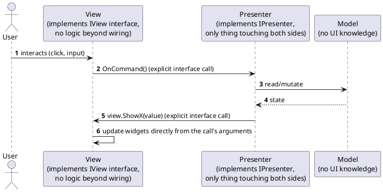

[← Pattern index](README.md)

# MVP (Model-View-Presenter)

## The pattern

Split a UI into three roles, same motivation as MVC but with a stricter
mediation rule: the **View** exposes a narrow interface (`ShowX(value)`,
`OnSubmitClicked` event/callback) and contains no logic beyond wiring
that interface to its widgets; the **Presenter** is the only thing that
talks to both the View and the Model — it reads Model state, decides what
the View should display, and receives every user action the View raises;
the **Model** knows nothing about either. Unlike MVVM, there is no
data-binding engine assumed underneath — every value shown and every
command wired is an explicit method call across an interface, which is
exactly what makes MVP usable on a UI technology with no reactive-binding
substrate at all. **Source:** Mike Potel (Taligent, 1996),
["MVP: Model-View-Presenter, The Taligent Programming Model for C++ and
Java"](https://www.wildcrest.com/Potel/Portfolio/mvp.pdf) — explicitly
built as a generalization of Smalltalk's MVC; adopted into .NET's own UI
guidance from 2006 onward, specifically for UI technologies (WinForms-era
.NET, early Android) that lacked a binding framework comparable to WPF's.

The key structural difference from MVC: the View **never** reads the
Model directly, even for display — every value the View shows arrived
via an explicit Presenter call. This is what MVVM's data binding later
automated; MVP does the same job with hand-written interface calls
instead of a binding engine.

## When you'd reach for it

A UI technology that can't support MVVM-style two-way data binding well
— no reactive property system, no `ICommand`-equivalent — but where the
same strict View/Model separation MVVM provides is still worth the
interface-call boilerplate. The natural fallback the moment a target
platform can't do MVVM properly, rather than dropping all the way to
MVC's looser discipline or code-behind's none at all.

## Cost

Every bindable value and every command needs an explicit method on the
View/Presenter interface pair — more boilerplate than MVVM's binding for
a screen with many fields, and each new field means touching both
interfaces plus the implementation, not just adding a binding expression
in a template.

## How this application uses it

This design's `ADR-039` client is MVVM-first; MVP is the stated **first
fallback** below it in
[the UI architecture comparison](../comparisons/ui-architecture-patterns.md)
— for any future screen on a UI technology that can't support MVVM's
binding substrate well. Even there, the stated command-binding-over-
inline principle still applies: a Presenter's `OnCommand()`-style methods
are still commands the View delegates to, not logic embedded directly
inside a widget's click-handler body — MVP is one notch of ceremony below
MVVM's binding, not a step back toward code-behind.

**`ADR-073`'s WCAG 2.1 AA requirement applies here unchanged** if a
screen ever does fall back to MVP — accessibility is a property of the
rendered UI, not of which mediation pattern produced it, so a Presenter-
mediated screen owes the same conformance bar an MVVM one does, with no
separate standard for this tier.
