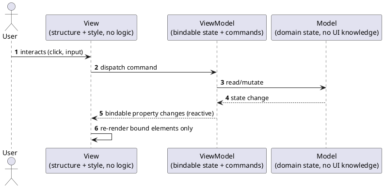
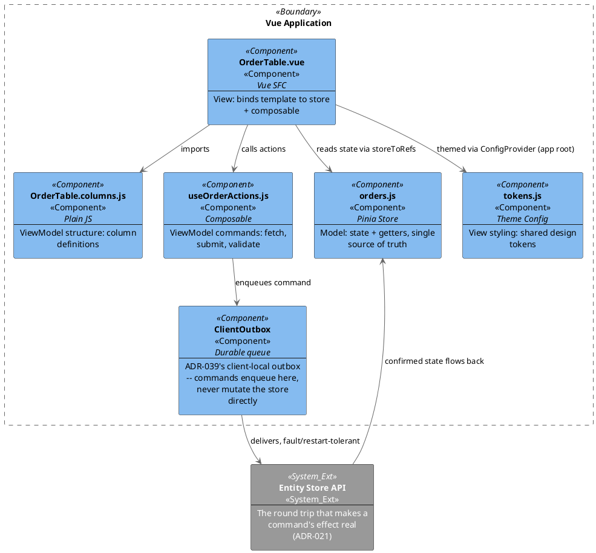
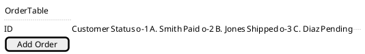

[← Pattern index](README.md)

# MVVM (Model-View-ViewModel)

## The pattern

Separate a UI into three roles: **Model** (application/domain state, no UI
knowledge at all), **View** (structure/styling, binds to the ViewModel,
contains no business logic), and **ViewModel** (bindable state + commands
that mediate between the two — the View never mutates the Model directly,
it dispatches a command and observes state changes). **Source:** John
Gossman (Microsoft), ["Introduction to Model/View/ViewModel pattern for
building WPF apps"](https://learn.microsoft.com/en-us/archive/blogs/johngossman/introduction-to-modelviewviewmodel-pattern-for-building-wpf-apps)
(2005) — introduced for WPF/XAML's data-binding model, since adopted far
beyond it (WinUI, MAUI, Blazor, and — via each framework's own reactivity
system rather than XAML binding — Angular, Vue, Knockout).



The View never calls into the Model, and the Model never knows a View
exists — every interaction flows through the ViewModel's commands and
bindable state, which is what makes the ViewModel unit-testable without
mounting any UI at all.

## When you'd reach for it

Any UI substantial enough that "logic tangled into the template" becomes
a real maintenance cost — once a component's template is doing
non-trivial fetching, validation, or multi-step orchestration inline,
that logic has outgrown the View layer and belongs in something
independently testable.

## Cost

An extra layer (and extra files) for UIs simple enough that the
indirection wouldn't otherwise earn its keep — a single static display
component with no commands doesn't need a ViewModel. The pattern pays for
itself once a component's behavior, not just its markup, has to be
reasoned about or tested on its own.

## How this application uses it

`ADR-039` is this pattern, with two application-specific commitments
beyond the classic shape:

- **Commands are dispatched through a durable local outbox, never applied
  to local state as truth.** A ViewModel's command doesn't mutate its own
  bindable state directly — it enqueues into the same
  fault/abend/restart-tolerant outbox/inbox transport this design already
  uses server-side (`ADR-033`) and client-side (`ADR-039`); the "real"
  state change only lands once the round trip through the server's Entity
  Store (`ADR-021`) completes. A ViewModel's own optimistic write is never
  assumed to be truth.
- **Entity views are data, not code** — `ADR-039`'s `ViewDefinition`
  registry entries (HTML+JS, content-addressed and versioned exactly like
  `docs/data/schema-registry.md`'s schemas) are what a View layer actually
  renders, one implementation across desktop/mobile/web via an embedded
  web engine, instead of N native View implementations per entity type.

**Framework choice, checked against a real alternative**: Vue vs.
Blazor (and React/Angular) is compared in full in
[the UI framework shootout](../comparisons/ui-framework.md) — Blazor is
a genuinely close call under `ADR-041`'s first-party preference, but
loses on `ADR-039`'s runtime-data `ViewDefinition` mechanism specifically.

### Concrete implementation: Vue 3 (data / actions / structure / presentation / styling)

Where this design's client is a **web** client (browser, or the web
engine embedded per `ADR-039`), the concrete framework mapping this
project uses is Vue 3's Composition API, split into five files per
concern rather than one monolithic component — the same MVVM roles above,
named for what a Vue codebase actually calls them:

| Layer | MVVM role | Lives in | Technology |
|---|---|---|---|
| **Data** | Model | `src/stores/*.js` | Pinia |
| **Actions** | ViewModel — commands | `src/composables/use*.js` | Composition API composables |
| **Structure** | ViewModel — static shape (columns, fields, menu items) | `src/components/**/*.config.js` | Plain JS objects |
| **Presentation** | View | `src/components/**/*.vue` | `<script setup>` + `<template>` |
| **Styling** | View, cross-cutting | `src/theme/tokens.js` | Component-library theme provider (e.g. Naive UI `themeOverrides`) |

A `.vue` file should contain almost no logic — a `<script setup>` block
that fetches, transforms, or validates is doing ViewModel work in the
View layer, and that logic belongs in a composable instead.



#### Folder structure

```
src/
├── stores/
│   └── orders.js              # DATA (Model)
├── composables/
│   └── useOrderActions.js     # ACTIONS (ViewModel commands)
├── api/
│   └── orderApiClient.js      # transport, isolated from composables
├── components/
│   └── orders/
│       ├── OrderTable.vue         # PRESENTATION (View)
│       ├── OrderTable.columns.js  # STRUCTURE (ViewModel shape)
│       ├── OrderForm.vue
│       └── OrderForm.fields.js
├── theme/
│   └── tokens.js               # STYLING (View, shared/global)
└── App.vue
```

Conventions: one folder per feature/domain under `components/`; a
component's structure config sits next to its `.vue` file and shares its
name (`OrderTable.vue` + `OrderTable.columns.js`); composables are named
`use<Domain><Verb>.js` and grouped by domain, not by component; API
clients live in `src/api/`, called only from composables, never from a
`.vue` file directly — this keeps the transport swappable/mockable and
keeps `fetch`/HTTP concerns out of the View entirely.

#### Layer rules

- **Data (Pinia store)** — owns state and derived state (`getters`) only;
  no API calls, no side effects beyond simple mutations; never mutated
  directly by a View — always read via `storeToRefs`, written via a
  composable's command.
- **Actions (composables)** — all async logic, API orchestration, and
  multi-step business rules; usable without mounting a component (plain
  function calls), so they're unit-testable in isolation; the only layer
  that enqueues onto `ADR-039`'s client outbox.
- **Structure (config files)** — column/field/menu definitions, anything
  describing *shape* rather than *behavior*; swappable independently of
  the template (e.g. different column sets for admin vs. customer views
  of the same table component).
- **Presentation (`.vue` files)** — `<script setup>` only calls
  composables, destructures store refs, and wires lifecycle hooks;
  `<template>` binds to what's exposed, no inline business logic, no
  inline API calls; `<style scoped>` is layout-only (spacing, grid/flex
  structure) — never colors/typography/tokens, which belong in the shared
  theme.
- **Styling (shared theme)** — one theme config, provided once at the app
  root via the component library's theme provider; no component overrides
  its own colors/spacing/radii locally — a value that needs to change
  changes in `theme/tokens.js` and propagates everywhere.

#### Guardrails

1. No `fetch`/API calls inside `.vue` files — put them in `src/api/*.js`,
   called from a composable.
2. No derived/computed business state duplicated in a component if it
   belongs in a store getter — reuse the getter.
3. No inline column/field/menu definitions in a template — extract to a
   sibling `.config.js`/`.columns.js`/`.fields.js` file.
4. No per-component color/spacing/typography overrides — update
   `theme/tokens.js`, or flag that the shared theme needs a new token.
5. Composables stay framework-agnostic where possible (no direct DOM
   access, no `this`) so they're unit-testable without mounting a
   component.
6. New features follow the folder-per-domain convention under
   `components/<domain>/`, mirroring `stores/<domain>.js` and
   `composables/use<Domain>Actions.js`.

#### Salt (UI mockup) — `OrderTable.vue`



`OrderTable.columns.js` supplies the three columns shown; `orders.js`
(Pinia) supplies the three rows via `storeToRefs`; `[ Add Order ]` is a
bound command (`useOrderActions().submitOrder`), not an inline handler —
this is what "data and command binding" looks like concretely for this
project's web client, and the same three-way split (bound data, bound
commands, structure-as-config) is exactly what carries over unchanged
when a native (WebView2/WKWebView/CEF) host renders an `ADR-039`
`ViewDefinition` instead of a plain browser rendering a `.vue` file.

**MVVM is the top of a stated fallback priority, not the only option in
this design's toolbox.** Where a future UI technology can't support
MVVM's binding substrate well, [the UI architecture
comparison](../comparisons/ui-architecture-patterns.md) gives the
explicit fallback order (MVP, then MVC, then code-behind as a genuine
last resort) — command/data binding over inline logic stays the
constant preference across every step of that list except the last.

**One caution stated plainly**: this Vue-specific mapping is the concrete
implementation for this project's **web** client. `ADR-039`'s
HTML+JS `ViewDefinition` entity views are deliberately framework-agnostic
at the entity-rendering layer (a small injected binding runtime, not a
full Vue app per entity) — Vue is this project's choice for the
**application shell** around those entity views (navigation, layout,
non-entity screens), not a claim that every rendered entity view itself
is a Vue component.
