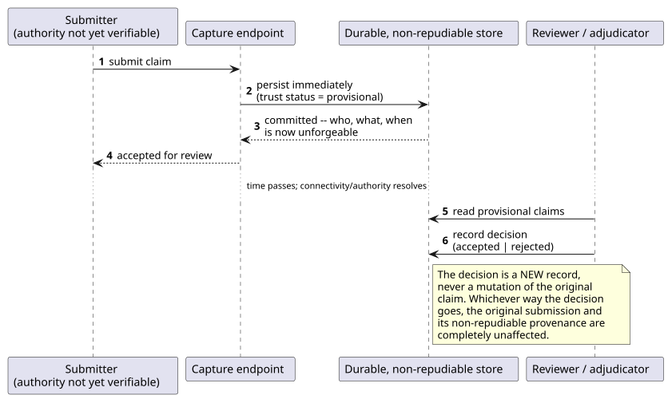
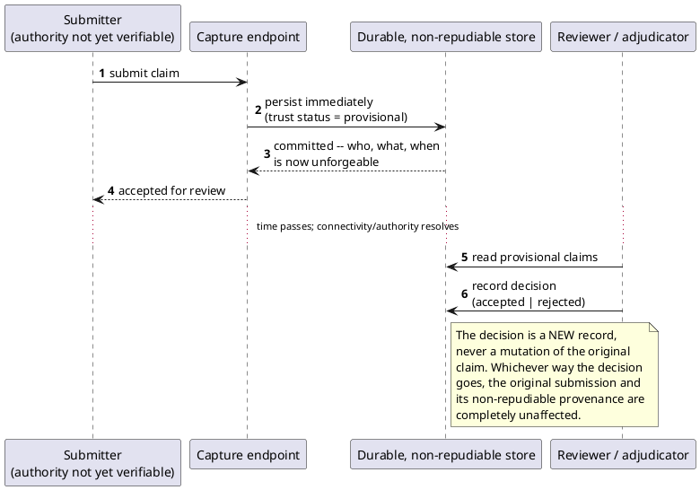

[← Pattern index](README.md)

# Non-Authoritative Capture (Reservation/Provisional Capture + Non-Repudiation Logging)

## The pattern

Accept a claim — a reading, a report, a submitted record — even though
the system cannot yet verify the submitter actually has the authority to
make it, rather than blocking ingestion until that verification
completes. The claim is captured immediately, in a clearly labeled
provisional trust state, and a separate adjudication step later decides
whether it becomes authoritative — without ever losing, mutating, or
silently dropping the original submission, whichever way adjudication
goes.

This combines two independently real, independently named ideas:

- **The Reservation pattern** — a service accepts a request it cannot
  yet fully commit to, holding it in a provisional state pending
  confirmation or expiry, instead of forcing the caller to wait
  synchronously for a guarantee the system can't yet give. **Source:**
  Arnon Rotem-Gal-Oz, *SOA Patterns* (Manning, 2012) — the Reservation
  pattern, written specifically for loosely-coupled service transactions
  where a Saga-style compensation can't work because a downstream
  service already let other consumers observe the uncommitted change.
- **Non-repudiation** — the record of who submitted the claim and what
  they submitted must itself be strong enough that neither the submitter
  nor the system can later credibly deny it happened, so whoever
  adjudicates the claim has something trustworthy to adjudicate against.
  **Source:** NIST's standard security-property definition — "protection
  against an individual falsely denying having performed a particular
  action" ([NIST Computer Security Resource Center glossary, term
  "non-repudiation"](https://csrc.nist.gov/glossary/term/non_repudiation),
  drawn from NIST SP 800-59/CNSSI 4009).

## Also known as

**Tentative Operation / Try-Confirm-Cancel** (Gregor Hohpe's [Conversation
Patterns](https://www.enterpriseintegrationpatterns.com/patterns/conversation/TryConfirmCancel.html))
is a close relative worth disambiguating: it also holds an operation in
a reserved state pending confirmation, but it's built around one
specific transaction with an explicit confirm/cancel step and typically
a timeout-driven implicit cancellation. Non-authoritative capture, as
used here, has no timeout and no "cancel" in that sense — a provisional
claim stays provisional indefinitely until a human reviewer acts, and
"rejected" is a permanent adjudication outcome, not a lapsed reservation
being released back to a pool.

## When you'd reach for it

Any time a real, useful claim arrives from a submitter whose authority
the system cannot check *synchronously* at the moment of submission — a
field actor working offline, a device with no verified operator
identity yet, an interchange feed from an external system whose
authenticity is checked out-of-band and later. If the alternative is
"reject it and make the submitter retry once we can verify," and that
retry risks losing time-sensitive data (a device reading captured
during a disconnected window, an adverse-event report that needs to
exist the moment someone reports it) — that's exactly the gap this
pattern closes.

## Cost

A provisional claim that nobody ever reviews sits in an ambiguous state
forever — this pattern trades "reject unverifiable data outright" for
"every consumer of the data must remember to check its trust status,"
and a reviewing backlog that never gets worked through means stale,
unadjudicated data accumulates indefinitely rather than being cleanly
resolved one way or the other. Unlike the classical Reservation
pattern's timeout-bound expiry, there's no automatic cleanup — an
unreviewed claim doesn't age out on its own, by design (data is never
silently discarded), which means the adjudication workflow itself has to
be operationally reliable, not just architecturally correct.

## How this application uses it

`ADR-035` names this trust axis `AuthorityStatus`, kept deliberately
independent of `SchemaStatus` (shape correctness) — an event can be
well-formed and still `unattested`. The lifecycle is `unattested →
pending_review → accepted | rejected`; accept/reject decisions are new
`authorityDecision` events, never mutations of the original claim, the
same "corrections are additive" discipline this design applies
everywhere else. `ADR-042` narrows when a provisional event actually
becomes part of the authoritative Entity Store (only once `accepted`),
and a later reversal to `rejected` triggers a targeted single-entity
re-fold (`RouterWorker.RebuildEntityFromAcceptedEventsAsync`,
`docs/comparisons/authority-rejection-behavior.md`) rather than a
compensating patch — the rejected event's payload itself is never
touched, only excluded from that entity's derived, materialized view.

This is the default trust posture for two real capture paths: **client-
captured device readings** (`ADR-070`) — a raw instrument reading taken
possibly while offline, with no verified operator identity attached,
defaults to `pending_review` rather than a bare, unclaimed `accepted`
— and **EMR-sourced interchange-adapter data** (`ADR-072`) — HL7v2/FHIR
data arriving through an interface engine inherits the same
persist-everything, non-authoritative capture rather than being
rejected for lacking a verifiable submitter.

The non-repudiation half is `ADR-019`'s hash-chained Event Log itself:
`AttestedActorId`/`AttestedClaims` travel with the stored event
(`docs/data/event-log.md`), and the chain makes the captured claim's own
provenance tamper-evident from the moment it's written — exactly the
property a later reviewer needs before trusting what they're
adjudicating.
