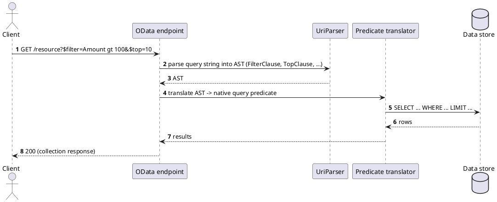

[← Pattern index](README.md)

# OData Query Protocol

## The pattern

A standardized set of URL query-string conventions for filtering,
sorting, paging, and expanding related data over a resource collection —
`$filter`, `$top`, `$skip`, `$orderby`, `$expand`, `$select` — parsed
into a formal AST by a standard library rather than each API inventing
its own filter grammar. **Source:**
[OASIS OData v4.01 — URL Conventions](https://docs.oasis-open.org/odata/odata/v4.01/odata-v4.01-part2-url-conventions.html).
Widely adopted in enterprise/.NET-ecosystem APIs (Microsoft Graph, SAP,
Dynamics) specifically because the grammar is standardized and its
parsing/translation is a solved problem with mature library support
(`Microsoft.OData.UriParser` for .NET), not something every API team
re-derives.

## When you'd reach for it

A flat-to-moderately-relational (via `$expand`) resource collection API
where clients need genuine ad-hoc filtering/sorting/paging, and where a
standardized, already-tooled grammar is worth more than the flexibility
of a general query language — especially valuable in ecosystems (like
.NET) with mature first-party parser support, so adopting it doesn't mean
writing a filter-grammar parser from scratch.

## Cost

Conventionally a `GET`-with-query-string protocol — filter content sits
in the URL by default, which is a real problem the moment filter
arguments can carry sensitive data (query strings land in access logs,
browser history, `Referer` headers, proxy caches). No native concept of
a live subscription/streaming result — real-time has to be bolted on
separately. `$expand`-based relationship traversal works but doesn't
generalize as cleanly to arbitrary-depth graph traversal as a query
language built around recursive field selection would.

## How this application uses it

This project **used** this pattern for its first several ADRs
(`ADR-003`, `ADR-004`, `ADR-012`), then **removed it entirely** in favor
of GraphQL (`ADR-037`) — recorded here for its teaching value as much as
its history in this specific project:

- **`ADR-003`**: only fields pre-declared as `FilterableField` at schema
  registration could be filtered — referencing an undeclared field was
  rejected before touching the database, rather than silently falling
  back to a full table scan.
- **`ADR-012`**: moved `$filter`/`$top`/`$skip` off `GET`'s query string
  and onto the HTTP `QUERY` method's request body — the exact "filter
  content shouldn't sit in a URL" cost named above, addressed the same
  way `ADR-037`'s GraphQL successor later addresses it too.
- **`ADR-037`**: swapped OData out entirely. The per-provider JSON
  pushdown *mechanism* underneath it (`IJsonPathTranslator`, translating
  a filter predicate to native `json_extract`/`->>`/`JSON_VALUE`)
  survived unchanged — what changed is that a GraphQL resolver's field
  arguments drive it now, not `Microsoft.OData.UriParser`'s AST. See
  [the API query layer comparison](../comparisons/api-query-layer.md)
  for the full reasoning against the rest of the field, and
  `04-odata-filter-pushdown.md` for the surviving pushdown mechanism in
  depth.
