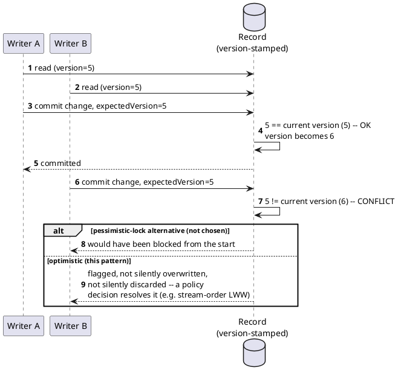

[← Pattern index](README.md)

# Optimistic Concurrency (Optimistic Offline Lock)

## The pattern

Rather than locking a record for the duration of an edit (pessimistic
locking — safe, but blocks other writers the whole time), let multiple
sessions read and edit freely, and check for a conflict only at commit
time: does the record's current version still match the version this
edit was based on? If yes, commit; if no, someone else changed it first
— reject or reconcile. **Source:**
[Martin Fowler — Optimistic Offline Lock](https://martinfowler.com/eaaCatalog/optimisticOfflineLock.html)
(*Patterns of Enterprise Application Architecture*): "validating that the
changes about to be committed by one session don't conflict with the
changes of another session," checked and applied within a single
transaction.

This trades a small chance of a rejected/flagged write for never blocking
a reader or another writer while an edit is in progress — the right
trade whenever conflicts are rare relative to the read/write volume,
which is the common case for most business data.

A closely related question, once conflicts are *detected* rather than
prevented: what happens to two genuinely concurrent writes with no true
causal order between them? Any resolution (last-write-wins, priority,
manual reconciliation) is a **policy choice**, not a fact being
discovered — worth stating explicitly rather than pretending there's a
correct answer hiding somewhere.

## When you'd reach for it

Any record with concurrent readers/writers where conflicts are rare
relative to read/write volume — the common case for most business data —
and where never blocking a reader or another writer while an edit is in
progress matters more than preventing every conflict from ever
happening.

## Cost

A conflict is only caught at commit time, not prevented — a losing writer
finds out after doing the work, not before. Someone (a policy, or a
human) still has to decide what happens to a detected conflict; the
pattern tells you a conflict happened, not what the "right" resolution
is.

## Also known as

**Optimistic Offline Lock** is Fowler's specific name (used above);
more casually this is just called **optimistic locking** or **optimistic
concurrency control (OCC)**. The low-level, single-value version of the
same idea is **Compare-And-Swap (CAS)** — the same "check it hasn't
changed, then commit" logic, at the granularity of one memory word/
register instead of one business record.

## How this application uses it

`ADR-024` is this pattern, applied at the property level rather than the
whole-record level a classic Optimistic Offline Lock implementation
usually checks: `ExpectedVersion` (`ADR-021`) states which Entity Store
version a patch was based on; the fold step compares it against the
Entity Store's actual version *at fold time* and sets `ConflictFlag` if
another patch touching the *same property* landed first — narrower than
"any concurrent write to the record," because `ADR-022`'s property-level
patches mean most concurrent edits (different fields) aren't real
conflicts at all.

The policy choice this design makes explicitly: **stream-order
last-write-wins**, with the conflict *flagged*, never silently resolved
and never blocking either writer. Both concurrent values stay inspectable
via entity change history (also `ADR-024`) — a real audit trail for "this
was a genuine concurrent edit, not a bug," rather than one value winning
with no trace the other ever existed.

**Escalation only where a specific field needs it**: `ADR-024` explicitly
reserves richer per-field conflict policies (e.g. summing deltas instead
of overwriting a balance — the territory CRDTs occupy) for fields that
are *specifically* contentious, not as a system-wide default. Plain
stream-order LWW is the default precisely because most fields don't need
anything more sophisticated.

**Same mechanism, reused for a different trigger**: `ADR-024` notes that
this is the *identical* conflict-detection mechanism `ADR-033`
(multi-origin replication) reuses for cross-server divergence — a
sync-delivered event that conflicts with a local one is detected exactly
the same way a same-server concurrent write is. No second resolution
system needed for the distributed case.
