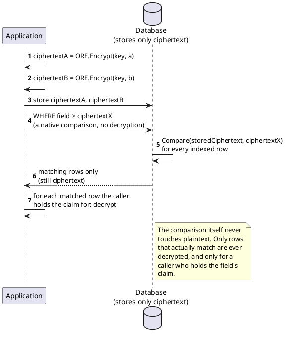

[← Pattern index](README.md)

# Order-Revealing Encryption (Property-Preserving Range Comparison)

## The pattern

A cryptographic construction whose ciphertexts a public compare function
can order directly — `Compare(Encrypt(a), Encrypt(b))` returns whether
`a < b`, `a == b`, or `a > b` — without ever decrypting either value.
This lets a database evaluate `WHERE field > x`-shaped range predicates
natively over an indexed ciphertext column, the same way it would over
plaintext, with **zero decryption needed to evaluate the predicate at
all**; only rows that actually match ever get decrypted, and only for a
caller who separately holds the right to see them. This is the strongest
possible fit for "push the query fully into the database" — stronger than
a decrypt-and-compare-after-narrowing approach, because the comparison
itself, not just a coarse pre-filter, runs entirely on ciphertext.

Order-Revealing Encryption (ORE) is the more careful successor to plain
Order-Preserving Encryption (OPE, [Boldyreva, Chenette, Lee, O'Neill,
"Order-Preserving Symmetric Encryption," Eurocrypt
2009](https://faculty.cc.gatech.edu/~aboldyre/papers/bclo.pdf)), which
bakes full order directly into ciphertext byte-ordering. ORE instead only
reveals a comparison result through an explicit public compare function,
which leaks strictly less per query than OPE's byte-order encoding for
the same range-query capability.

**Source:** [Chenette, Lewi, Weis, Wu — "Practical Order-Revealing
Encryption with Limited Leakage," FSE
2016](https://eprint.iacr.org/2016/661) and [Lewi, Wu —
"Order-Revealing Encryption: New Constructions, Applications, and Lower
Bounds," CCS 2016](https://eprint.iacr.org/2016/612.pdf) — together the
CLWW/Lewi-Wu left/right-ciphertext scheme, the specific, named
construction this pattern's real-world implementations are built from.

## When you'd reach for it

When a genuine range query (`>`, `>=`, `<`, `<=`) needs to run against an
encrypted field, entirely inside the database, and a coarser
bucketed-index approach's own "narrow candidates, then decrypt-and-
compare" step is judged too much of a compromise against "run as much in
the database as possible" — and, critically, only when the field's
cardinality and sensitivity together make the leakage this buys
acceptable (see Cost). It is deliberately not a drop-in replacement for
ordinary encrypted equality lookups, which a cheaper, better-understood
[blind index](searchable-encryption-blind-index.md) already serves with
far less leakage.

## Cost

This is a real, published, and serious leakage risk — not a theoretical
footnote. [Naveed, Kamara, Wright — "Inference Attacks on
Property-Preserving Encrypted Databases," CCS
2015](https://www.microsoft.com/en-us/research/publication/inference-attacks-property-preserving-encrypted-databases/)
demonstrated **exact plaintext recovery** — not a fuzzy guess — against
low-cardinality property-preserving-encrypted columns (a birthdate, a ZIP
code, a diagnosis code) via frequency-plus-order analysis against public
auxiliary distributions. ORE specifically, not just OPE, has its own
dedicated break: [Grubbs, Sekniqi, Bindschaedler, Naveed, Ristenpart —
"Leakage-Abuse Attacks against Order-Revealing Encryption," IEEE S&P
2017 (originally IACR ePrint 2016/895)](https://eprint.iacr.org/2016/895)
recovered 99% of first names, 97% of last names, and 90% of birthdates
in a case-study customer database protected this way. High-cardinality
fields (a synthetic numeric key, a long free-text value, a real
measurement with no small closed value space) are meaningfully more
resistant, since the attack's power comes from frequency/order analysis
against a small, guessable domain — but the risk on a genuinely
low-cardinality or regulated field is not a matter of degree, it's a
practical break. On top of the cryptographic risk: no vetted, audited
library implements either the CLWW/Lewi-Wu or the plain-OPE construction
for a mainstream stack, so adopting this pattern for real generally means
building and independently reviewing a bespoke cryptographic primitive —
its own, separate cost from the leakage trade-off itself.

## How this application uses it

`ADR-097` adopts this as a genuinely riskier, **opt-in** sibling to
`ADR-096`'s safer bucketed-index default (see `docs/comparisons/
searchable-encryption-for-crypto-shredded-fields.md` for the full
Options A–E comparison this ADR decides between), selectable per field
via `x-masking-searchable`'s `"indexKind": "OrderRevealing"`. Because the
leakage risk above is real and not merely theoretical, `ADR-097` applies
a **stricter, override-free guardrail** than `ADR-096`'s own
cardinality-gated-but-overridable rule: registration refuses (`400`)
`OrderRevealing` outright on any field also carrying
`x-masking.regulatoryClassification`, with no `acknowledgeLeakageRisk`-
style escape hatch at all — a deliberate difference, since a full
ciphertext-order comparison leaks strictly more per query than a
bucket-membership check does. An unclassified, high-cardinality field
remains free to use it.

The construction itself
(`src/EventStore.Erasure/OrderRevealingEncryption.cs`) is explicit in its
own header that it is **not** a verified, byte-for-byte implementation of
either paper's formal construction — a from-scratch, testable realization
of the same high-level idea (per-prefix-keyed, block-level order-
preserving encryption), correctness-tested for order-preservation across
many `Number`/`DateTimeOffset` pairs
(`EventStore.UnitTests.OrderRevealingEncryptionTests`) and for the
no-override guardrail (`SearchableEncryptionSqliteTests`), but explicitly
gated behind a **required dedicated security review that has not yet
happened**. This is a live, currently-unresolved caution, not a settled
detail: `ADR-097` itself states the bespoke implementation needs its own
correctness/security review before it ships in `08-build-plan.md`'s
matching item, and that item is built but deliberately **not** marked
Done for exactly that reason — the same standing caveat `ADR-055`
(Testing Strategy) already applies generally ("built, pending required
security review, not Done"). One further, named scope limit found while
building the query side: the default app-tier evaluator
(`GraphQlFilterPredicateBuilder.ResolveOrderRevealingMatchesAsync`)
currently compares ciphertext in application memory across a field's own
indexed rows, not via a native SQL comparison operator, since no
provider's query engine understands the custom `Compare` byte-array
function natively — a real win over the bucketed approach (only small
ciphertext tokens are read, never `Payload`, nothing is ever decrypted to
filter) but not yet "the database evaluates the predicate" in the full
sense this pattern's own mechanism describes; that requires `ADR-098`'s
native evaluator seam, not yet built for any provider.
