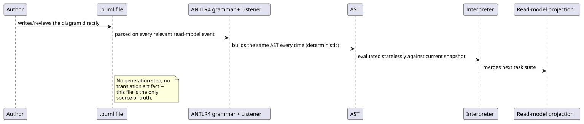
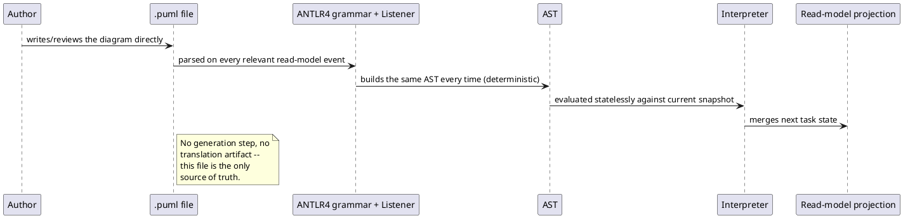

[← Pattern index](README.md)

# PlantUML-Native Executable Flow Diagram

## The pattern

Let a diagram file be its own executable specification, rather than a
picture describing code that lives somewhere else. A constrained subset
of a diagramming notation is parsed into a real AST and interpreted
directly — the diagram, the reviewed source, and the running artifact
are one and the same file, with no separate generation or translation
step to keep in sync by hand.

**Source:** [PlantUML](https://plantuml.com/) itself (the Activity
Diagram notation this pattern constrains); the closest well-known
precedent for "the diagram IS the executable thing" specifically is
**executable BPMN** (Business Process Model and Notation, OMG spec,
executed directly by engines such as Camunda/Zeebe) — same idea, a
different diagram grammar and a heavier, generation-oriented runtime
than this pattern uses.

## When you'd reach for it

When a process/flow needs to be genuinely readable by a non-developer
reviewer (a business analyst, an auditor) *and* genuinely correct-by-
construction — not a diagram someone has to remember to keep in sync
with a separate implementation. It fits best when the flow is
stateless-per-evaluation (recomputed fresh from a read-model snapshot on
each relevant event) rather than needing its own durable, addressable
workflow-instance state — see Cost below for exactly where that stops
being true.

## Also known as

Not a standard, formally-named pattern on its own — the closest adjacent
concept is a **domain-specific language with a diagrammatic (visual)
concrete syntax** rather than a textual one, of which executable BPMN is
the most recognizable industry instance.

## Cost

A hand-authored grammar subset is deliberately narrower than the full
diagramming notation it constrains — new control-flow shapes (parallel
forks, loops, sub-flows) each need their own grammar/AST/interpreter
work, unlike a general-purpose workflow engine that already has them.
Because there's no separate durable workflow-instance store, this
pattern only fits a process that can be fully re-derived by re-evaluating
the diagram against current state on every relevant event — a process
needing its own persisted mid-flow instance data (a saga with
side-effecting compensations, a multi-day timer) is a different, heavier
problem this pattern doesn't solve.

## How this application uses it

`ADR-101` adopts this after `docs/comparisons/user-flow-dsl.md` weighed
eight real options (including Temporal, Zeebe/BPMN, Elsa Workflows, and
a hand-rolled interpreter) against this repo's own stated notation
preference (PlantUML-consistent, diff-friendly, non-developer-readable
at the source level) — and, unusually, **actually built and ran two of
the eight as a real head-to-head shootout** (`spikes/user-flow-dsl/`)
rather than deciding on paper alone: the PlantUML-native interpreter
worked with one small, obvious bug, while Elsa needed real debugging
across five separate issues, including a docs page that had gone stale
against the actually-installed package.

The built mechanism, `EventStore.Flows/` (confirmed in code, not
assumed): a **real ANTLR4 grammar and generated Listener**
(`Antlr4BuildTasks` NuGet package — verified as Terence Parr's ANTLR4
project's own official MSBuild integration), not a hand-rolled parser —
`ActivityAstBuilderListener.cs` builds `ActivityAst.cs`'s tree from a
constrained `@startuml`/`start`/`stop`/`:action;`/`if (cond) then
(yes) ... else (no) ... endif`/`@enduml` subset, `FlowInterpreter.cs`
evaluates it statelessly, and `FlowProjection.cs` runs it as one more
`IProjection<PendingTask>` consumer of the same `ProjectionHost`
mechanism every other read model already uses (`ADR-015`/`ADR-016`) —
confirmed by reading `RouterWorker.cs`: the write-path fold loop and its
existing fixed reactors (`AuthorityDecisionResolver`, `ExpectedResponseWatcher`)
are untouched, making this a purely additive read-side feature.

**A real, checked finding this decision rests on**: the comparison found
there is no procedural flow *code* anywhere in the existing Vitals/
Meridian workflows to convert — every branch/gate was already
declarative schema registration (`RequiredClaims`/`RequiredSignature`/
`ChangeKind`/`ExpectedResponse`), resolved by shared mechanisms this
engine doesn't replace, only sits alongside as a task-visibility layer.
