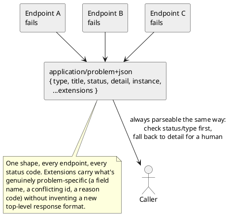

[← Pattern index](README.md)

# Problem Details (canonical error shape)

## The pattern

Left to grow organically, every endpoint in an HTTP API tends to invent
its own error response shape — one team's `{ "error": "..." }`, another's
`{ "message": "...", "code": "..." }`, a third's something else again —
so a caller ends up needing per-endpoint knowledge just to parse a
failure. Problem Details standardizes this: one JSON (or XML) object
shape for every error response, with a small set of registered members —
`type` (a URI identifying the general problem category), `title` (a
short, stable summary of that category), `status` (the HTTP status
code, repeated in the body so it survives a proxy that only forwards the
body), `detail` (occurrence-specific human-readable text), and `instance`
(a URI identifying this specific occurrence, typically the request path)
— plus an open `Extensions` mechanism for whatever problem-specific data
a given error genuinely needs to add. A caller can always inspect
`status`/`type` first and fall back to `detail` for a human, without
needing a bespoke schema per endpoint per status code.

**Source:** [RFC 9457, "Problem Details for HTTP
APIs"](https://datatracker.ietf.org/doc/html/rfc9457) (IETF) — states its
own purpose directly: to "carry machine-readable details of errors in
HTTP response content to avoid the need to define new error response
formats for HTTP APIs." **RFC 9457 explicitly obsoletes its predecessor,
[RFC 7807](https://www.rfc-editor.org/info/rfc7807/)** (the original 2016
Problem Details spec, same core member set) — the two are not
independent specs to choose between; 9457 is the current, superseding
text.

## When you'd reach for it

Any HTTP API with more than a handful of endpoints and more than one
kind of failure — the moment two different error responses in the same
API risk having two different shapes, standardizing on one now is cheaper
than reconciling N ad hoc ones later. Especially valuable when the
framework already has built-in support (ASP.NET Core's
`AddProblemDetails()`/`Results.Problem(...)`), since adopting it costs
nothing beyond agreeing on the `type` slug and `Extensions` for each
error case.

## Cost

The `type` member is meant to ideally resolve to real human-readable
documentation of that problem category (RFC 9457 says so explicitly),
which means a team either has to actually stand up and maintain that
documentation, or accept the fallback of every `type` defaulting to
`about:blank` (ASP.NET Core's built-in default) — a real, if minor, gap
between the spec's intent and what most adopters (including this one)
actually do. The shape is also only as informative as the `status`/
`type` pair a caller checks; a client that only looks at the HTTP status
code and ignores `type`/`Extensions` gets no benefit from adopting the
richer shape at all, and nothing about the pattern forces a caller to do
the right thing with it.

## How this application uses it

`ADR-013` adopts RFC 9457 directly via ASP.NET Core's built-in support —
no custom error DTO, confirmed in
[`src/EventStore.Host.Core/HostCoreExtensions.cs`](../../src/EventStore.Host.Core/HostCoreExtensions.cs):
`builder.Services.AddProblemDetails();`, registering `IProblemDetailsService`
for the whole host. `ADR-013`'s own table maps each real failure case
(a missing Bearer token, an invalid DPoP proof (`ADR-017`), a forbidden
scope/claim, an `eventId` conflict, a malformed masking/change-kind
registration) to a `status` + `type` slug + `Extensions` payload.
Two of that table's original rows were later struck through, not
because Problem Details itself changed, but because the underlying
failure stopped being an error at all: `ADR-023`'s persist-everything
posture turned a schema-invalid publish from a `400` into a `202` with an
advisory `SchemaStatus`, and `ADR-037`'s GraphQL-only query layer removed
the undeclared-`$filter`-field `400` entirely (the request that used to
trigger it can no longer even be constructed). Every other row —
authentication, scope/claim, idempotency-conflict, and the two
registration-validation errors — is unaffected by either change and
still returns the same RFC 9457 shape as originally decided.
