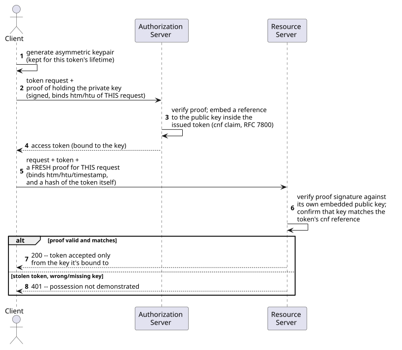
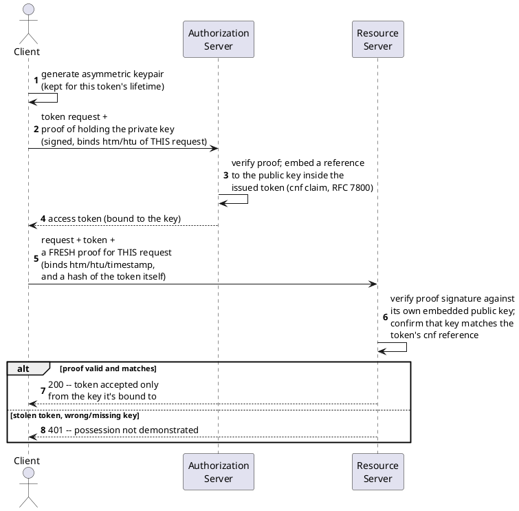

[← Pattern index](README.md)

# Proof of Possession (vs. bearer tokens)

## The pattern

A plain bearer token (RFC 6750) is usable by *whoever holds it*, full
stop — the token itself carries no proof of who's presenting it, only
that they have a copy of the string. If it leaks (a log line, a
compromised proxy, an SSRF-style relay), the leak alone is enough for an
attacker to impersonate the legitimate client until the token expires,
indistinguishable to the server from the real caller. A proof-of-possession
(PoP) token closes that gap by cryptographically binding the token to a
key the legitimate holder controls: the issuer records a reference to
the holder's public key inside the token (a "confirmation," `cnf`, claim
— RFC 7800 defines the generic JWT semantics for this), and every
presentation of the token must be accompanied by fresh proof that the
presenter still holds the matching private key. Copying the token string
alone is no longer sufficient to use it.

**Source:** [RFC 9449, "OAuth 2.0 Demonstrating Proof of Possession
(DPoP)"](https://datatracker.ietf.org/doc/html/rfc9449) (IETF, September
2023) — the specific, concrete PoP mechanism this project adopts: an
application-layer proof (no TLS-layer dependency), sent as a self-signed
JWT alongside the token on every request.

## Also known as

**Sender-constrained tokens** is the general umbrella term covering every
mechanism that ties a token to its legitimate sender rather than trusting
bare possession. Two other real, distinct mechanisms sit under that same
umbrella and are worth not confusing with DPoP: **OAuth 2.0 Mutual-TLS
Client Certificate-Bound Access Tokens** ([RFC
8705](https://www.rfc-editor.org/info/rfc8705/)) binds a token to a TLS
client certificate instead of an application-layer proof — a genuinely
different, transport-layer mechanism, not a synonym; and **Token Binding**
([RFC 8471](https://datatracker.ietf.org/doc/html/rfc8471)) was an earlier
TLS-layer attempt at the same goal that failed to reach real browser
adoption, which DPoP and mTLS both effectively superseded in practice.
None of these three are interchangeable names for one idea — each is a
real, separately-specified mechanism.

## When you'd reach for it

Whenever a bearer token's usual threat model — "anyone who gets a copy
can use it" — is a real, not merely theoretical, risk for your deployment:
tokens that pass through logs, intermediary proxies, or any component
that could plausibly leak one, and where the cost of an attacker replaying
a stolen token unmodified is high enough to justify the extra client-side
key management. It's a defense-in-depth measure on top of already-issued
OAuth2 tokens, not a replacement for authentication itself.

## Cost

Every client now manages an asymmetric keypair, not just an opaque
secret/token — more moving parts (key generation, storage, rotation) than
a bearer-only model, and a new class of failure (a lost or unavailable
private key) that a plain bearer token never had. It also introduces a
new, real operational dependency the project didn't have before: proof
freshness checking (`iat`) requires client/server clock agreement, so
clock skew becomes something that can legitimately break authentication
where it previously couldn't.

## How this application uses it

`ADR-017` DPoP-binds every access token `EventStore.DevIdp` issues to its
four OAuth2 clients (`publisher-client`, `follower-client`,
`operator-client`, `projections-client`), building the concrete pieces
RFC 9449 specifies: `EventStore.Dpop/DpopKeyPair.cs` (per-client keypair),
`JwkThumbprint.cs` (the `cnf.jkt` value embedded at issuance),
`SelfSignedJwtVerifier.cs` and `DpopProofValidator.cs` (verifying a fresh
proof's signature, `htm`/`htu`, `ath`, and thumbprint match on every
request), wired into request validation by
`src/EventStore.Host.Core/DpopValidationMiddleware.cs`. `ADR-017`
deliberately scopes out RFC 9449 §8's server-chosen nonce challenge for
this dev/POC deployment's small, fixed client set — the replay defense
that matters for a public, browser-facing token-acquisition surface,
not needed here.
