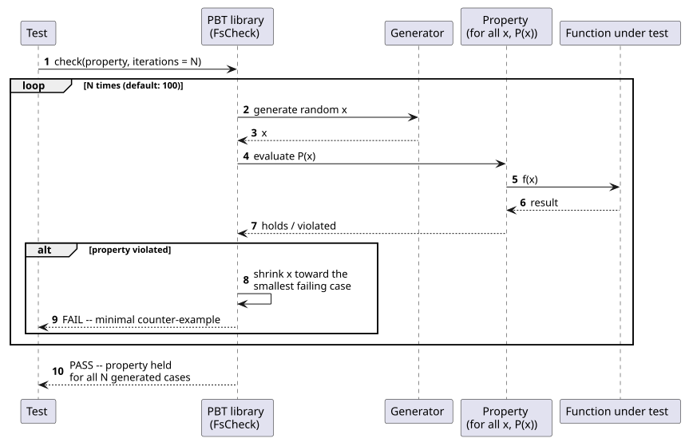
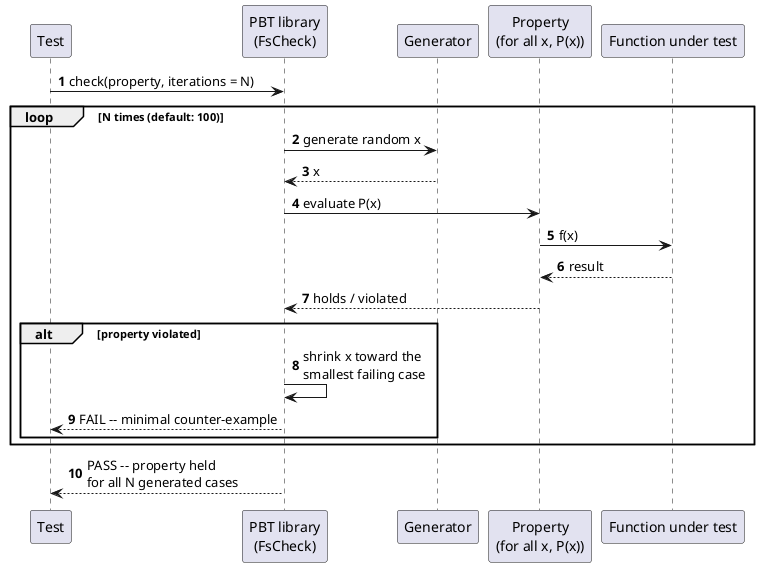

[← Pattern index](README.md)

# Property-Based Testing

## The pattern

Instead of writing individual example-based test cases ("given this
specific input, expect this specific output"), state a general
*property* the code under test must hold for every valid input —
"for all `x`, `f(x)` satisfies `P`" — and let the testing library
generate a large number of random inputs itself, checking the property
against each one. When a generated case fails, the library doesn't
just report the raw random input it happened to find; it *shrinks* it,
searching for the smallest, simplest input that still fails the same
property, so a human debugging the failure sees a minimal counter-
example rather than an arbitrary large random blob. The technique
trades the example-writer's own imagination (which inputs did they
think to try?) for a generator's systematic, wide coverage of the
input space, including edge cases no one thought to write down.

**Source:** [QuickCheck](https://en.wikipedia.org/wiki/QuickCheck),
introduced by Koen Claessen and John Hughes in ["QuickCheck: A
Lightweight Tool for Random Testing of Haskell Programs"](https://www.cs.tufts.edu/~nr/cs257/archive/john-hughes/quick.pdf)
(ICFP 2000) — the paper that named the technique and popularized it
well beyond Haskell, since ported to roughly 40 other languages.
[`FsCheck`](https://fscheck.github.io/FsCheck/), created by Kurt
Schelfthout, is the real, verified .NET port used here — an F#/C#/VB
library providing the same generator/property/shrinking combinators
QuickCheck itself defined.

## When you'd reach for it

When a correctness claim is naturally stated as an invariant over an
entire input space rather than a finite set of examples — "merging two
non-conflicting patches in either order produces the same result,"
"a hash chain with any single byte altered fails verification," "encode
then decode is always the identity" — and a handful of hand-picked
examples would only ever cover the cases the test's author happened to
think of. It's a strong complement (not a replacement) for example-
based tests: examples are still the clearest way to document *specific*
expected behavior for a reader, while a property is the tool for
claiming something holds *universally*.

## Cost

A property is only as strong as the generator behind it — a generator
that never produces the edge case that would actually break the code
gives false confidence indistinguishable from a passing test suite.
Writing a genuinely useful property is also a different, often harder
skill than writing an example: it requires stating what must always be
true in a way precise enough to check mechanically, which for some
behaviors (anything defined mainly by a long list of specific business
rules, rather than a mathematical invariant) is awkward or not
worthwhile. And a randomized run is nondeterministic by default unless
the library's own seed is pinned and logged on failure — reproducing a
one-in-a-thousand-generated-cases failure later requires that seed, not
just the property's source code.

## How this application uses it

`ADR-063` adopts `FsCheck` for `ADR-019`'s hash-chain tamper-detection
claim and the pure-logic half of `ADR-024`'s conflict-resolution
policy — stream-order last-write-wins correctness, checked in-memory
against the fold function's own merge primitive directly, not through
the full EF-Core-dependent pipeline (that integration-level behavior is
already covered separately by `EventStore.IntegrationTests`). This is
named as the cheapest, highest-confidence tier of `ADR-063`'s staged
distributed-correctness testing plan, requiring no new infrastructure
beyond `ADR-055`'s existing MSTest-based suite. The tests live in
`tests/EventStore.UnitTests/HashChainTamperDetectionTests.cs` and
`tests/EventStore.UnitTests/ConflictResolutionPropertyTests.cs`, using
`FsCheck.Fluent`'s `Prop.ForAll`/`Arb.From`/`QuickCheckThrowOnFailure`
directly against custom generators (`DisjointPatchPairGenerator`,
`OverlappingPatchPairGenerator`) built around `EntityDataMerger.
MergePatch`.

This is deliberately the other half of a two-part staged plan, not
overlapping territory: [Fault Injection / Chaos Engineering](fault-injection-chaos-engineering.md)
(also `ADR-063`) checks that surrounding *resilience* code (retries,
idempotency, crash recovery) survives one specific injected failure at
a specific point; property-based testing here checks that the
*pure-logic* invariants (the hash chain, the conflict-resolution merge)
hold across a wide, randomly generated space of otherwise-normal
inputs. Neither technique substitutes for the other — a fault injector
proves nothing about universal correctness, and a property check
proves nothing about surviving an unexpected failure mid-operation.
