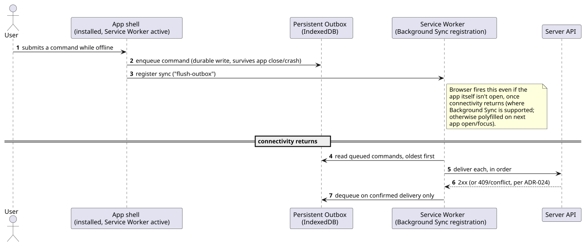
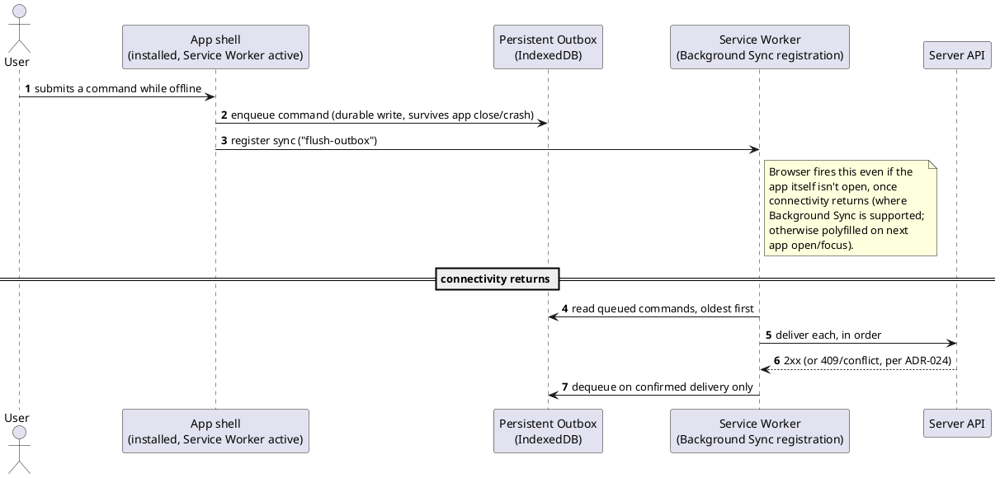

[← Pattern index](README.md)

# Installable, Offline-Capable Web App with a Persistent Outbox

## The pattern

A web application registered with a **Service Worker** — a browser-managed
JavaScript proxy sitting in front of every network request, running
independently of any open tab — can serve its own shell and cached data
with no network at all, and (via a **Web App Manifest**) be installed
onto a device's home screen/app list, launching in its own window with no
browser UI, indistinguishable at a glance from a natively-installed app.
**Sources:** [W3C Service Workers](https://www.w3.org/TR/service-workers/),
[W3C Web App Manifest](https://www.w3.org/TR/appmanifest/). Commands made
while offline are queued in **persistent client-side storage** rather than
failing outright, and flushed once connectivity returns — the **Background
Sync API** is the standard mechanism for the "flush when connectivity
returns" half specifically, letting the Service Worker register a sync
request that the browser fires (even if the app itself isn't open)
once the device is back online. **Source:**
[WICG Background Synchronization](https://wicg.github.io/background-sync/spec/)
— a Working Draft, not yet a full W3C Recommendation, and **not supported
in Safari/WebKit as of this writing**; a polyfill (retry-on-visibility/
retry-on-focus, rather than a true OS-level wakeup) is required for that
engine, stated here rather than glossed over.

## Also known as

**Progressive Web App (PWA)** is the umbrella term covering
installability + offline + background sync together, rather than any one
piece alone. The offline-queue half on its own is the same **Outbox**
shape this project's server side and `ADR-039`'s native client outbox
already use — a client-local instance of
[Idempotent Receiver & Inbox/Outbox](idempotent-receiver-and-inbox.md),
not a fourth, unrelated mechanism.

## When you'd reach for it

Any client where connectivity genuinely can't be assumed continuous —
field use, intermittent networks, or simply "the user closed their
laptop lid mid-edit" — and where losing a queued action outright (rather
than delivering it once connectivity resumes) is unacceptable.

## Cost

Service Worker lifecycle/caching-strategy bugs are a well-known source of
"why is my user seeing stale content" support tickets — cache invalidation
needs an explicit versioning strategy, not an afterthought. Background
Sync's real-world support is uneven (no Safari/WebKit as of this writing),
so a working offline story can't assume it fires and needs a same-outcome
fallback (flush on next app open/focus) regardless of that API's
availability.

## How this application uses it

This is `ADR-039`'s client-local outbox (already durable, fault/abend/
restart-tolerant, per `CLAUDE.md`'s standing requirement) with the web
client specifically made **installable and offline-first** rather than
just "an outbox that happens to run in a browser tab": a Web App
Manifest makes the [MVVM client](mvvm-client-architecture.md) installable
to a device's home screen/app list; a Service Worker serves the app shell
and cached `ViewDefinition`/entity data (`ADR-039`) with no network
present at all — consistent with `ADR-039`'s own stated principle that
"offline is the default assumption, not an edge case"; the outbox itself
persists in IndexedDB (survives a tab close, a browser crash, or the
device restarting) rather than in-memory state that a closed tab would
lose; and Background Sync is used where the browser engine supports it,
with "flush on next open/focus" as the same-outcome fallback everywhere
else — the queued command is never lost either way, only the *timing* of
delivery differs.

**Multiple independent instances, each scoped to a different entity
stream.** The same installed app can be launched as more than one
independent window/instance simultaneously — each configured (at launch,
e.g. via a URL parameter identifying an `EntityType`/`AppId`/GraphQL
subscription target) to follow a *different* entity stream, the same way
a monitoring console might open one window per dashboard. Instances don't
coordinate with each other and don't share a single outbox: each keeps
its own outbox entries and its own subscription state, scoped to what
that instance is following, so one instance's backlog or connectivity
state never blocks or corrupts another's. All instances of the same
installed app share the same underlying Service Worker registration and
cache (same origin), but IndexedDB records are namespaced per instance
configuration so their queued commands never collide.

**Scoped to active data, and erasure-aware, for any deployment handling
classified data (`ADR-065`).** The cached entity data described above
isn't a full history mirror — a local/edge instance subscribes with an
explicit scope filter (whatever "active" means for the consuming
domain, e.g. "assigned to this device and still open") and evicts a
cached entity the moment it falls out of that scope. If `ADR-057`'s
crypto-shredding erases an entity this instance has cached, the erasure
event arrives through the same subscription as any other update, and
the instance purges its local copy on receipt — mandatory, not
optional. A device that's offline when erasure fires won't purge until
it reconnects, the same limitation `ADR-060` already states for an
already-delivered webhook payload.

**Feeds the same outbox for locally-captured device readings, too
(`ADR-070`).** A `WebUsbInputSource`/`WebHidInputSource`/
`WebSerialInputSource`/`WebBluetoothInputSource`/`NativeBridgeInputSource`
adapter (one per hardware interface, chosen by the physical device, not
a deployment-wide pick) reads directly from USB/HID/serial/BLE hardware
into an open app window, then writes into this same durable outbox
unchanged — no second local-storage mechanism. The Service Worker's job
stays exactly what it already is here: flush whatever's queued, with no
awareness of whether an item came from a user action or a hardware
reading.

**Flush triggers beyond opportunistic connectivity (`ADR-069`).** The
Background Sync trigger and open/focus fallback described above assume
connectivity returns on its own before long. For genuinely isolated data
capture, `ADR-069` adds a scheduled "phone home" trigger (the Web
Periodic Background Sync API where available — Chromium-only,
experimental — or an OS/device-level scheduled task otherwise) and an
explicit/manual trigger, including a fully offline transfer for a
device with no network path at all, reusing `ADR-068`'s portable bundle
format. The outbox's `Flush` operation itself is unchanged either way —
these are additional ways to invoke the same idempotent operation, not
a new outbox.

**A manual "force offline/online" override, layered on top of real
connectivity, not a replacement for it.** `useConnectivityStore`
(`mvvm-client`) holds one `forcedOffline` flag; the reference app's
"Go Offline"/"Go Online" buttons toggle it, purely so a demo or test can
exercise the offline path deterministically without touching real
network state. `useEntityViewActions.dispatchCommand`/
`captureDeviceReading` gate their immediate-flush attempt on
`isEffectivelyOnline()` — the real `navigator.onLine` value ANDed with
`!forcedOffline`, re-read fresh on every call rather than cached, since
the real signal is a plain, non-reactive global a Vue `computed` would
otherwise capture stale. `docs/playbooks/core/user/go-offline-and-
resync.md` (`OfflineOutboxSyncPlaybookTests.cs`) proves both the real,
automatic detection path (Playwright's `BrowserContext.
SetOfflineAsync`) and the manual override converge on the same
enqueue/flush cycle, live in a real browser.
