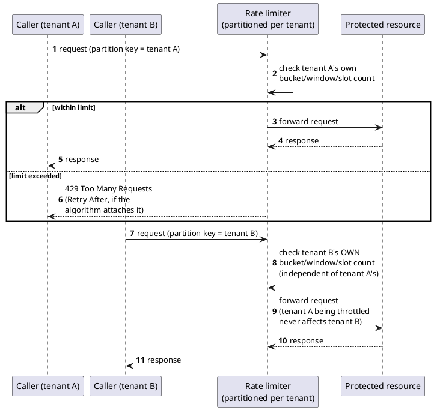

[← Pattern index](README.md)

# Rate Limiting (Token Bucket / Sliding Window / Concurrency Limiter)

## The pattern

Bound how much of a shared resource one caller can consume — request
volume over time, or concurrently-open connections/work items — so a
single caller (accidentally or maliciously) can never starve every
other caller sharing the same service. The bound is enforced per
partition (typically per tenant/caller identity), and a request that
would exceed it is rejected (commonly HTTP `429`, ideally with a
`Retry-After` hint) or queued, rather than silently degrading service
for everyone. Different algorithms trade off differently between
smoothness, burst tolerance, and memory cost, and the right choice
depends on which resource is actually being bounded:

- **Token Bucket** — a bucket refills with tokens at a fixed rate up to
  a cap; each request spends a token. Naturally allows a burst (spend
  whatever's accumulated) while still bounding sustained average rate —
  the standard fit when occasional bursts are legitimate and only
  sustained overload is the actual danger.
- **Sliding Window** — counts requests within a continuously moving
  time window rather than a fixed calendar bucket, avoiding the
  edge-of-bucket burst problem a naive Fixed Window has (two bursts,
  one at the end of one window and one at the start of the next, can
  double up right at the boundary). A **sliding window log** keeps
  exact timestamps (precise, memory-heavier); a **sliding window
  counter** approximates using weighted adjacent fixed windows
  (cheaper, slightly approximate).
- **Concurrency Limiter** — bounds *simultaneously active* work
  (open connections, in-flight requests) rather than a rate over time —
  the right fit when the scarce resource is a connection slot or a
  worker thread, not a request budget.

**Source:** Token Bucket was first described in the networking
literature by Jonathan S. Turner (1986) as a traffic-shaping mechanism
for high-speed/ATM networks, and later became one of the standard,
widely-implemented rate-limiting/traffic-policing algorithms across
networking and API design generally. Sliding Window (both the log and
counter variants) and Concurrency Limiter are likewise standard,
widely-documented rate-limiting techniques, not bespoke inventions.
The concrete, verified realization this project actually depends on is
.NET's own first-party [`System.Threading.RateLimiting`/
`Microsoft.AspNetCore.RateLimiting`](https://learn.microsoft.com/en-us/aspnet/core/performance/rate-limit)
middleware (shipped since .NET 7), which implements exactly these four
algorithms — Fixed Window, Sliding Window, Token Bucket, Concurrency
Limiter — as partitionable, keyed limiters with built-in `429`
rejection.

## When you'd reach for it

Any multi-tenant or multi-caller shared service where the operating
posture is "accept everything, always respond quickly" rather than
"reject aggressively at the front door" — exactly the situation where,
absent an explicit bound, one caller's volume (legitimate or not) can
silently degrade service for every other caller sharing the same
deployment. It's the right tool specifically for bounding *sustained
volume* or *concurrent resource usage*; it is not a substitute for
bounding the *shape/cost* of one individual request (a deeply nested
query, an expensive join), which is a different, complementary concern.

## Cost

Every limiter needs real configuration (limits, window sizes, queue
depths) tuned to genuine traffic patterns — set too low and legitimate
bursty callers get throttled; set too high and the limiter never
actually protects anything. A sliding window log's precision costs
real memory per partition; a token bucket's burst tolerance means a
caller that has been quiet can still legitimately spike briefly, which
is a deliberate tradeoff but still a real spike a downstream resource
must be able to absorb. Partitioning also has to be based on a key the
enforcement point can actually and correctly resolve — if the
partition key resolution itself is unreliable (an unauthenticated or
only-partially-trustworthy signal), the fairness guarantee the whole
mechanism promises quietly weakens to whatever that resolution can
actually support.

## How this application uses it

`ADR-058` adopts ASP.NET Core's built-in `Microsoft.AspNetCore.
RateLimiting` middleware directly — no third-party library, per
`ADR-041`'s first-party preference — partitioning every limiter by
`AppId` (`ADR-030`'s existing tenant-scoping key). It picks a different
algorithm per resource being bounded: **Token Bucket** for publish
(`Inbox`) traffic, since the danger there is sustained volume while a
legitimate burst after a brief outage should still be allowed;
**Concurrency Limiter** for GraphQL Subscriptions and Follow-style
long-lived connections, bounding open connection slots rather than
request rate; and **Sliding Window** for ordinary GraphQL queries and
OpenAPI publish bursts at the Gateway, the standard general-purpose
choice absent a more specific reason. Enforcement sits at the API
Gateway (`ADR-049`, YARP) first, since YARP is itself an ASP.NET Core
app the middleware attaches to the same way it would any pipeline — one
enforcement point in front of every backend service. The concrete code
is `src/EventStore.Gateway/RateLimiterPolicies.cs`.

Two real findings from actually building and testing this, not just
designing it (`ADR-058`'s own Consequences section): first, only
`TokenBucketRateLimiter` ever attaches `Retry-After` metadata in the
library version this project depends on — `ConcurrencyLimiter` and
`SlidingWindowRateLimiter` never do, confirmed directly with a
throwaway probe against `System.Threading.RateLimiting` outside ASP.NET
Core, correcting the ADR's own original framing (its production code
was already defensively guarded with `TryGetMetadata`, so nothing
needed to change there). Second, `TenantPartitionKey.Resolve`
(`src/EventStore.Gateway/TenantPartitionKey.cs`) cannot resolve the
caller's `AppId` from `HttpContext.User` the way the rest of this
design does, because `ADR-049`'s own Gateway design forwards the
`Authorization` header unvalidated and never populates `HttpContext.
User` itself — real validation happens only at the Host behind it. The
actual partition-key resolution is a tiered fallback (a buffered
request-body peek, then an explicitly-commented unvalidated JWT-payload
peek for traffic-bucketing purposes only, then a fixed `"anonymous"`
bucket) — a concrete instance of this pattern's own cost section: the
fairness guarantee is only as strong as the partition key the
enforcement point can actually resolve.
