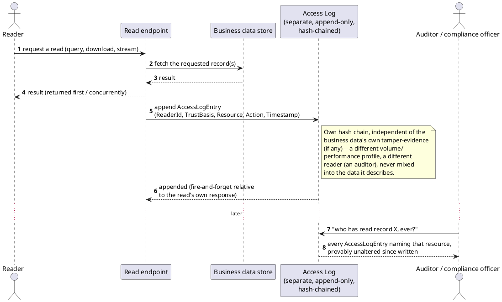

[← Pattern index](README.md)

# Read Access Audit Logging

## The pattern

Log every read against the identity of whoever performed it — who
looked at what, when, and (where relevant) under what authority —
in a tamper-evident record kept separate from the business data being
read. The point is not merely "we could reconstruct this from server
logs someday" but a durable, purpose-built trail: a compliance
investigator (or a patient exercising an accounting-of-disclosures
right) can answer "who has looked at this specific record" directly,
without reassembling the answer from access logs, database query
logs, and application logs that were never designed to answer that
question together.

This is a real, regulator-driven requirement, not a design invention:
[45 CFR §164.312(b), "Audit controls"](https://www.ecfr.gov/current/title-45/subtitle-A/subchapter-C/part-164/subpart-C/section-164.312)
(a **required**, not addressable, HIPAA Security Rule Technical
Safeguard) states it in exactly four words of obligation: "Implement
hardware, software, and/or procedural mechanisms that record and
examine activity in information systems that contain or use
electronic protected health information." Two things about that text
matter for how the pattern is usually built: it requires the
mechanism to both **record** and **examine** activity (a write-only
log that nobody can query back out doesn't satisfy it), and its
companion retention standard, §164.316(b)(2)(i), sets a **six-year**
minimum for the records documenting these safeguards. HIPAA is the
best-known driver of this pattern (most vendor write-ups of "audit
logging" as a named control cite it directly), but the same shape —
log the reader's identity, not just the writer's — recurs anywhere a
regulator or a data subject needs "who has seen this" answered
authoritatively: SOC 2's logging criteria, GDPR's accountability
principle, and financial recordkeeping rules all lean on the same
underlying mechanism even where they don't name it "audit controls"
specifically.

## When you'd reach for it

Any system holding data a regulator, a data subject, or an internal
compliance function might later need "who accessed this and when"
answered for — health records, financial records, biometric/identity
data, anything under a legal duty to produce an access history on
demand. It's specifically the *read* side of a fuller audit story;
most systems already log writes (an audit trail of changes is a much
older, more familiar habit) but skip logging reads, since a read
doesn't change anything and so doesn't "feel" like it needs a durable
record — until a breach investigation or a subject-access request
needs exactly that history and it doesn't exist.

## Cost

A genuinely new write path on the *read* side, in a system where
reads usually vastly outnumber writes — this is real, not
theoretical, added write volume and latency risk on every read, not
just an extra `SELECT`. It also creates a second thing that needs
retention/rotation/backup discipline, separate from the business
data's own. And it invites (without answering) a recursive question:
who audits reads *of* the audit log itself? Most real implementations
(this one included) deliberately stop that recursion rather than
building a second audit trail to audit the first.

## How this application uses it

`ADR-045` is this application's decision: a dedicated `AccessLog`
store (never merged into the Event Log), one `AccessLogEntry` per read
through any surface (GraphQL query, attachment download, streaming
playback, ticket-authenticated access), each entry recording
`ReaderActorId`, `ReaderTrustBasis` (`"Authoritative"` vs.
`"Attested"` — the same trust-axis idea `ADR-035`/`ADR-042` already
apply to *data*, applied here to the *reader*), `ViewAccessed`,
`ResourceRef`, `Action`, and its own `ChainHash` — a second,
independent hash chain reusing `ADR-019`'s primitive, never coupled to
the Event Log's own chain. Retention is "never deleted by default,"
already exceeding HIPAA's six-year floor. `ADR-064`'s `ActorId` on
every `StoredEvent` is named directly in the ADR as this pattern's
write-side equivalent — together the two mean every read *and* every
write is attributable to a verified actor.

The mechanism is implemented in
[`src/EventStore.Domain/AccessLog/AccessLogEntry.cs`](../../src/EventStore.Domain/AccessLog/AccessLogEntry.cs)
(the record shape) and
[`src/EventStore.Persistence/AccessLogAppender.cs`](../../src/EventStore.Persistence/AccessLogAppender.cs)
(the append-and-chain logic, explicitly called from each read
endpoint per `ADR-041`'s composition-root discipline — never an
auto-injected aspect). `AccessLogAppender.AppendAsync` mirrors the
Event Log's own `EventAppender`: read the prior `ChainHash`, insert
the new row to obtain its identity-generated `SequenceNumber`, then
compute and save `ChainHash` in a second `SaveChanges` within the same
serializable transaction — with a fallback to `AccessLogChainCheckpoint`
once `ADR-089`'s archival has moved the live tail's own prior entries
out of reach. `ADR-009`'s `revealOnDemand` field-level reveal action
reuses this unchanged, writing an `Action: "reveal"` entry naming the
specific field path — sharper audit granularity than a bulk query
alone provides.
