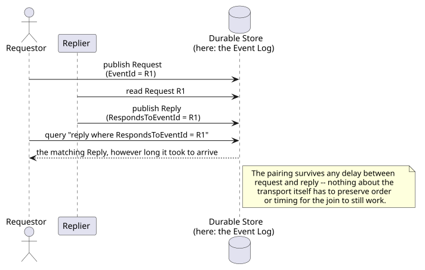
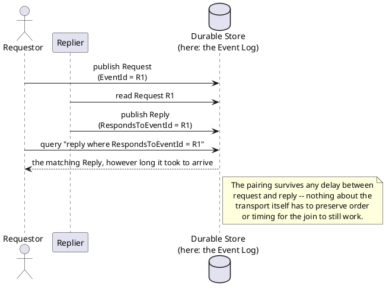

[← Pattern index](README.md)

# Request-Reply & Correlation Identifier

## The pattern

**Request-Reply** — a Requestor sends a request and needs a matching
reply back from a Replier, over a transport (async messaging, here an
ordinary published event) that doesn't inherently pair the two up the
way a synchronous call's own return value would.
**Correlation Identifier** — the mechanism that makes the pairing
possible: the reply carries a unique identifier naming which request it
answers, so a Requestor (or anything else watching) can join a reply
back to its request without relying on transport-level ordering or
timing.
**Source:** [Hohpe & Woolf — Enterprise Integration Patterns: Correlation Identifier](https://www.enterpriseintegrationpatterns.com/patterns/messaging/CorrelationIdentifier.html)
("Each reply message should contain a Correlation Identifier, a unique
identifier that indicates which request message this reply is for.");
the paired Request-Reply pattern is documented alongside it in the same
catalog.

## When you'd reach for it

Any time a request and its eventual reply travel independently — over
async messaging, an event log, or anything else where the reply doesn't
arrive as a direct return value — and something downstream needs to join
the two back together, whether that's the original Requestor or a third
party watching for the pairing to complete (or fail to).

## Cost

The Correlation Identifier only records *that* a reply answers a given
request — it says nothing about *whether* one arrives in time, or ever.
A system that needs to know "no reply showed up within a deadline" has
to add its own watcher/timeout logic on top; the identifier alone gives
you the join, not the SLA.

## Also known as

Request-Reply is sometimes called **Request/Response messaging**, though
that term more often implies a synchronous call — Hohpe & Woolf's own
naming keeps "Request-Reply" for the asynchronous-messaging case
specifically, which is the sense used here. Correlation Identifier is
occasionally conflated with a transport-level **Message ID**, but they
answer different questions: a Message ID names *this* message; a
Correlation Identifier names *which other* message this one is about —
the same "answers a different question, don't conflate" caution this
project's own envelope-metadata fields already apply to each other
(`CLAUDE.md`).

## How this application uses it

`ADR-094`'s `RespondsToEventId` envelope field is a direct, unmodified
adoption of Correlation Identifier — the reply (any event) carries the
`EventId` of the request (any prior event) it answers, with no existence
validation required at publish time (a correlation to an as-yet-unseen
or never-arriving request is a legitimate state, not an error). This
design layers exactly one thing on top of the bare pattern:
`EventTypeDefinition.ExpectedResponse` (`docs/data/schema-registry.md`)
lets a *request* event type opt in to a tracked deadline, and
`ExpectedResponseWatcher` (`ADR-094`) is the "SLA on top of the join"
this pattern's own Cost section says the bare identifier doesn't give
you for free — publishing a reserved `ExpectedResponseMissing` event,
itself also carrying `RespondsToEventId`, if nothing satisfies the
expectation in time. The identifier is generic and framework-level; which
event types participate, what window applies, and what happens on a miss
are all domain/application choices layered on top, never baked into the
field itself — the same framework/domain split this project already
holds to for `ADR-031`'s telemetry detectors ("the framework recognizes
the mechanism, the domain supplies the meaning").
