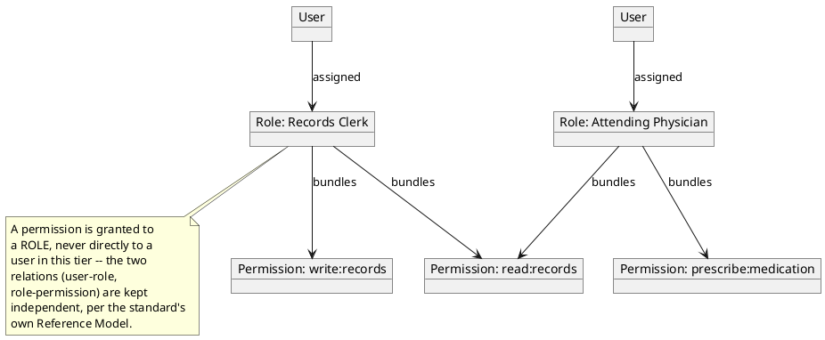

[← Pattern index](README.md)

# Role-Based Access Control (RBAC, base/flat tier)

## The pattern

Instead of granting permissions directly to individual users one at a
time, grant permissions to **roles**, and assign roles to users. A
user's effective permissions become the union of whatever their
assigned role(s) carry. This one layer of indirection is what lets a
real organization manage access at the scale of "job functions" (10s)
rather than "individual users × individual permissions" (a much larger
number that grows without bound as staff turn over) — onboarding a new
"Records Clerk" is "assign one role," not "re-derive and grant a dozen
permissions from scratch."

RBAC was formalized by David Ferraiolo and Rick Kuhn, first published
as "Role-Based Access Controls" at the 15th National Computer Security
Conference in 1992, unified into a single reference model by Sandhu,
Ferraiolo, and Kuhn in "The NIST Model for Role-Based Access Control"
(ACM RBAC Workshop, 2000), and standardized by ANSI as
**[ANSI/INCITS 359-2004](https://blog.ansi.org/ansi/role-based-access-control-rbac-incits-359/)**
(revised 2012). **Source:** ANSI/INCITS 359-2004 (NIST RBAC). The
standard's own Reference Model defines four cumulative levels — Flat,
Hierarchical, Constrained, and Symmetric RBAC — of which this pattern
doc, and the ADR it documents, covers only the base **Flat** tier: a
role is a named, unstructured bundle of permissions, roles don't
inherit from other roles, and there is no separation-of-duty
constraint machinery.

## When you'd reach for it

Once direct, per-user permission assignment stops scaling — every
real identity system with more than a handful of users and more than
a handful of distinct permissions eventually needs this indirection,
because the alternative (grant/revoke individual claims per person,
forever) turns every staffing change into a manual permission
reconciliation exercise. RBAC's flat tier specifically is the right
starting point when job functions are genuinely distinct bundles of
permissions and nothing yet requires roles to inherit from each other
or to mutually exclude each other.

## Cost

The base/flat tier buys simplicity by declining two things the fuller
standard offers: a **role hierarchy** (a "Senior Clerk" role
automatically inheriting everything "Clerk" grants, rather than
re-listing every permission) and **separation-of-duty constraints**
(preventing one user from holding two roles that should never combine
— e.g. "preparer" and "approver" on the same transaction). Skipping
both is a real, felt cost the moment an organization's real job
structure has either kind of relationship — those need to be
re-modeled as flat, independent roles, which can mean real duplication
across similar roles, or a workaround permission that should have
been a constraint the model doesn't have.

## How this application uses it

`ADR-046` adopts RBAC's base tier: a new, `AppId`-scoped `Role { AppId,
RoleName, Permissions: [claim/scope strings] }` registry concept,
expanded to a flattened claim set **at token issuance** — not
re-evaluated on every request — so no existing claim check anywhere in
the system (`ADR-008`'s `HasClaim`, `ADR-043`'s entity-scoped check,
`ADR-044`'s UCAN validation) needed to change; each is unaware whether
a claim arrived via direct assignment or via a role. A directly-
assigned per-user permission (`UserPermission`) also exists alongside
roles, and the two are combined by **union only** — additive-only,
never restrictive, so there is no allow/deny precedence question to
resolve, by deliberate design, not oversight.

`ADR-046` names its scope limits explicitly, as decisions rather than
gaps: **no role hierarchy** ("Hierarchical RBAC" is the standard's own
next tier, not adopted here — nothing has yet needed one), **no
explicit-deny** (a permission is revoked by not granting it, never by
adding a negative entry that would have to out-rank some other grant),
and **no static/dynamic separation-of-duty constraints** (also part of
the fuller standard, likewise not adopted). `ADR-067` later supersedes
one piece of `ADR-046`'s original text — role/permission *grants* were
originally identity-provider-only state; `ADR-067` folds `Role` and
`UserPermission` from reserved, hash-chained `RoleGranted`/
`RoleRevoked`/`PermissionGranted` events in the core Event Log itself,
the same write/read split `EntityStoreRow` already has for business
events.

Read access audit logging
([`read-access-audit-logging.md`](read-access-audit-logging.md),
`ADR-045`) is a natural, named-but-not-required extension point here —
recording *which* role a reader's claims came from is flagged in
`ADR-046` as a low-cost future enrichment, not a required change.

Implementation: [`src/EventStore.DevIdp/Role.cs`](../../src/EventStore.DevIdp/Role.cs)
(`Role`, `RoleAssignment`, `UserPermission` — plain CRUD-backed tables,
per `08-build-plan.md`'s "build the simple way first" note, ahead of
`ADR-067`'s later reserved-event fold),
[`src/EventStore.DevIdp/RoleService.cs`](../../src/EventStore.DevIdp/RoleService.cs),
[`src/EventStore.Rbac/RbacEndpoints.cs`](../../src/EventStore.Rbac/RbacEndpoints.cs)
(the scope-gated grant/revoke API publishing the reserved events), and
[`src/EventStore.Rbac/RoleGrantedEventType.cs`](../../src/EventStore.Rbac/RoleGrantedEventType.cs)/
[`PermissionGrantedEventType.cs`](../../src/EventStore.Rbac/PermissionGrantedEventType.cs)
(the reserved event types, keyed by the synthetic composite key
`ADR-067` corrected to — `actorId:roleName`/`actorId:permission` —
once the literal `{appId}:role:{roleId}` `EntityId` shape turned out
not to fit a many-actors-per-role relationship).
