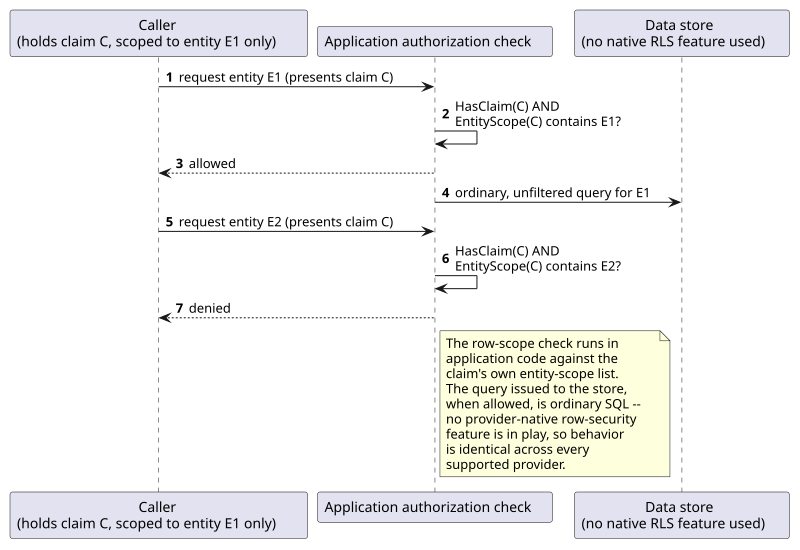
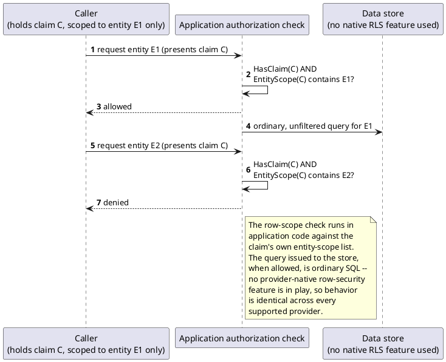

[← Pattern index](README.md)

# Row-Level Security (Application-Layer, Portable Across Providers)

## The pattern

**Row-Level Security (RLS)** restricts which specific *rows* of a table
a caller may see or affect — finer-grained than "can this caller call
this endpoint" or "can this caller touch this entity type at all."
Native database implementations of RLS exist and are real, adopted
standards in their own right:

- **PostgreSQL** — `CREATE POLICY` attaches a `USING`/`WITH CHECK`
  predicate to a table after `ALTER TABLE ... ENABLE ROW LEVEL
  SECURITY`; the database itself filters rows per caller at query time.
  **Source:** [PostgreSQL documentation, Row Security
  Policies](https://www.postgresql.org/docs/current/ddl-rowsecurity.html).
- **SQL Server** — `CREATE SECURITY POLICY` binds an inline
  table-valued predicate function to a table; a *filter predicate*
  silently restricts which rows a read returns, a *block predicate*
  rejects writes that would violate it. **Source:** [Microsoft Learn,
  Row-Level Security (SQL
  Server)](https://learn.microsoft.com/en-us/sql/relational-databases/security/row-level-security).

Both push the filtering predicate down into the database engine itself,
so no application query can accidentally bypass it. The pattern this
project's own name generalizes from is exactly that idea — "restrict by
row, not just by table" — reimplemented one layer up, in application
code, instead of via either engine's native feature.

## When you'd reach for it

Access needs to be restricted per specific record — "this claim, but
only for entity E," not "this claim, for every entity of this type" —
and the system must run identically across multiple database providers,
at least one of which has no native RLS feature to fall back on.

## Cost

Reimplementing at the application layer means every code path that
reads or writes the protected data must remember to call the check —
there's no database-enforced backstop the way a native
`CREATE POLICY`/`CREATE SECURITY POLICY` guarantees ("there is no way to
bypass security" is Oracle's own claim for its native equivalent,
Virtual Private Database, specifically because the predicate is bound
to the table itself, not to any one caller's query). A native
implementation also lets the query planner push the row filter into the
query plan itself; an application-layer check that runs *before*
issuing an otherwise-unfiltered query gets none of that — it's a gate,
not a filter baked into every possible access path to the table.

## How this application uses it

`ADR-043` names the real reason this project didn't just adopt a
provider's native feature: `ADR-001` supports three database providers
(SQLite, PostgreSQL, SQL Server), and SQLite has no native
row-level-security feature at all — the same "portable, not
provider-native" instinct `ADR-004` already applies to JSON storage.
The check happens instead at the application/claims layer:
`RequiredClaimEvaluator.HasClaimForEntity`
(`src/EventStore.Domain/SchemaRegistry/RequiredClaimEvaluator.cs`) first
confirms the caller holds the underlying claim at all
(`RequiredClaimEvaluator.HasClaim`), then reads a companion claim of
type `"{requiredClaim}:entityScope"` off the `ClaimsPrincipal` — one
value per `EntityId` the holder's grant is restricted to. No companion
claim present at all means unscoped, `ADR-043`'s own default,
unaffected case: the claim applies wherever it ordinarily would. A
concrete caller is `EventStore.GraphQL.RevealFieldMutation`
(`src/EventStore.GraphQL/RevealFieldMutation.cs`), which calls
`HasClaimForEntity` before allowing a masked field to be revealed for
one specific entity, and throws a `Forbidden` `GraphQLException`
otherwise.

This is the same generalized dimension [Delegated, capped, time-boxed
access grants](delegated-capped-time-boxed-access-grants.md) relies on
to cap a delegated grant to one specific patient/entity rather than a
whole clearance — the entity-scope check is one mechanism serving both
an ordinary direct claim and a UCAN-delegated one identically.
