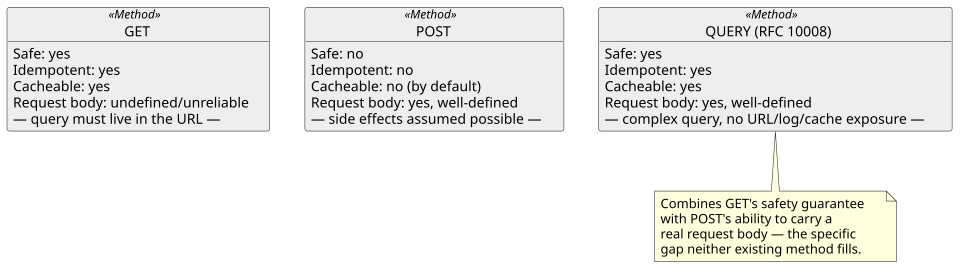
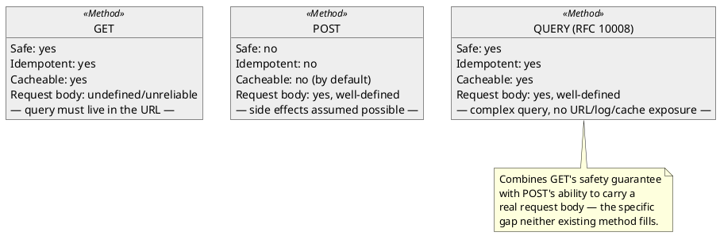

[← Pattern index](README.md)

# Safe method with a request body

## The pattern

HTTP has long had a gap between its two most common methods for reading
data. `GET` is safe (no side effects) and cacheable, but has no
well-defined semantics for a request body — any filter/query content has
to be squeezed into the URL's query string, which runs into URL length
limits, leaks that content into server access logs and intermediary
proxy caches by its very nature, and can't cleanly express anything
structurally complex. `POST` has a body, but gives up safety and
cacheability entirely — a client (or an intermediary) can never assume a
`POST` is free to retry or reuse without side effects, because nothing
about the method promises that. A safe method with a request body closes
that gap: a single method that keeps `GET`'s safe/idempotent/cacheable
guarantees while accepting an arbitrarily complex query in the body
instead of the URL.

**Source:** [RFC 10008, "The HTTP QUERY
Method"](https://datatracker.ietf.org/doc/html/rfc10008) (IETF) — defines
exactly this: a new `QUERY` method, safe and idempotent like `GET`
("QUERY requests are safe with regard to the target resource" and "QUERY
requests are idempotent; they can be retried or repeated when needed"),
cacheable like `GET`, but carrying the query itself as request content
rather than URI query parameters.

## When you'd reach for it

Any read/query operation whose filter expression is either too large or
too sensitive to put in a URL: a query complex enough to risk hitting URL
length limits, or one that could carry personally identifiable/sensitive
content a caller does not want sitting in a server access log, a browser
history entry, or an intermediary proxy's cache key — while the operation
itself is still genuinely a read, with no side effects, and something a
client or cache is free to retry or reuse.

## Cost

`QUERY` is a very new HTTP method (RFC 10008), which brings real,
concrete adoption friction rather than a theoretical one: it breaks any
client mechanism that hardcodes `GET` with no override — most visibly,
the browser-native `EventSource` API, which can only ever issue `GET` and
has no way to attach a body or switch methods, forcing a fallback to
`fetch()` with manual response-stream handling. Being a "non-simple"
method for CORS purposes, every browser-originated call also now triggers
a CORS preflight (`OPTIONS`) it wouldn't have needed as a simple `GET`.
And because the method is so new, some HTTP-adjacent tooling (API
documentation generators, some AsyncAPI bindings) may not yet recognize
it as a valid value at all — a real, not-yet-fully-resolved ecosystem gap
rather than a pure implementation cost.

## How this application uses it

`ADR-012` moved every genuinely filterable/pageable read endpoint from
`GET` to `QUERY` — `Follow`'s `$filter`, and pagination for Lineage
traversal and the registry listing — routed via ASP.NET Core's
`MapMethods(pattern, ["QUERY"], handler)` (confirmed directly in
[`src/EventStore.GraphQL/GraphQlEndpoints.cs`](../../src/EventStore.GraphQL/GraphQlEndpoints.cs):
`app.MapMethods("/graphql", ["QUERY"], ...)`, and similarly in
`EventStore.Follow.Api/FollowEndpoints.cs`,
`EventStore.Lineage.Api/LineageEndpoints.cs`, and
`EventStore.SchemaRegistry/SchemaRegistryEndpoints.cs`). `ADR-037`
retargeted the same method to carry GraphQL query documents instead of
OData `$filter` expressions once GraphQL replaced OData as the query
layer — the specific, stated reason for keeping `QUERY` rather than
following GraphQL's usual `POST`-only convention: a query document's
arguments can carry PII/PHI, and `QUERY`'s safe, still-cacheable,
body-carrying semantics keep that content out of URLs, access logs, and
proxy caches the way `GET` never could. Mutations stay `POST` — they have
side effects regardless of PII concerns, so `QUERY`'s safety guarantee
doesn't apply to them.
