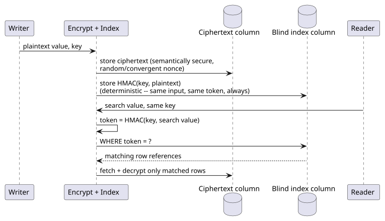
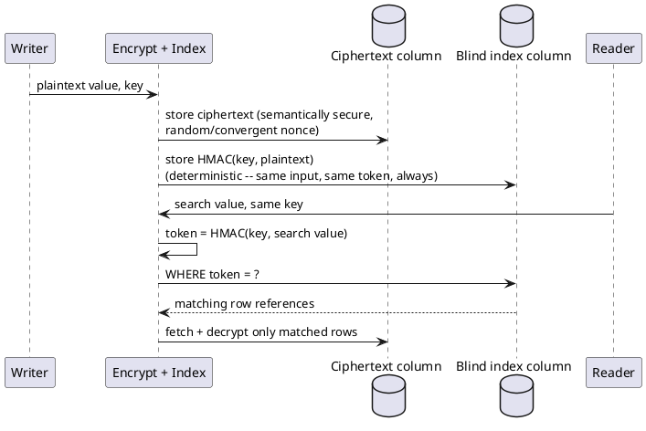

[← Pattern catalog](README.md)

# Blind Indexing (Searchable Encryption)

A **blind index** lets you query encrypted data for equality (and, via
bucketing, approximate range) without decrypting it to search — a
deterministic, keyed one-way token is computed alongside the ciphertext
and indexed like an ordinary column; a query recomputes the same token
from the search value and compares tokens, never plaintext. The
canonical modern write-up of this exact technique is
[CipherSweet](https://ciphersweet.paragonie.com/internals/blind-index)
(Paragon Initiative Enterprises), which also names the two real
extensions this pattern needs beyond bare equality: a "fuzzy"/bucketed
index for range-like queries, and per-index keys so compromising one
searchable field doesn't compromise every other field's searchability.
[CryptDB](https://dl.acm.org/doi/10.1145/2043556.2043566) (Popa et al.,
SOSP 2011) is the earlier, more general precedent — a full SQL-query
engine over a layered stack of encryption schemes, of which deterministic
encryption (this pattern's core primitive) is one layer.

## The core mechanism

The blind index column is never decrypted to answer a query — it's
compared as an opaque token. Only the rows that actually match are ever
decrypted, and only after the match is already known.

## What it gives you, and what it costs

- **Equality is exact and cheap** — an ordinary indexed column, no
  cryptographic novelty beyond a keyed hash (HMAC, or a slower
  key-stretched hash like PBKDF2 when the input space is small enough to
  brute-force offline, which CipherSweet calls "slow mode").
- **Range needs a second idea layered on top** — a bare blind index only
  answers "equal or not." CipherSweet's "fuzzy indexing" computes several
  tokens at different precisions (e.g. a date's year, year+month, and
  exact day, each as its own token) so a range query can narrow via the
  coarsest useful precision, then fall back to an exact decrypt-and-compare
  step over the (small) narrowed set. This is a real, accepted
  approximation, not a true ordered index — it trades index precision for
  never leaking real ordering information into the ciphertext or the
  index itself.
- **The token itself is a controlled leak** — a blind index reveals which
  rows share a value (frequency/equality pattern), by design. This is
  the entire point (it's what makes the index useful), but it means a
  blind index is not "as safe as" fully randomized, non-searchable
  encryption — a schema author is trading a specific, bounded amount of
  leakage for query capability, and should know exactly what that trade
  is (see `ADR-096`'s cardinality-aware guardrail for where this project
  draws that line).
- **A separate key per searchable field** limits blast radius — one
  compromised or rotated index key never affects any other field's
  searchability or security, the same "don't conflate distinct concerns
  behind one shared key" reasoning `ADR-057`'s per-entity DEK already
  applies to encryption itself.

## Applied in this design

`ADR-096` (equality — `IndexKind: Equality`, one HMAC token per field —
and bucketed range — `IndexKind: Range`, one HMAC token per configured
bucket granularity) reuses `ADR-009`'s already-adopted `HmacRedactor`
(`Microsoft.Extensions.Compliance.Redaction`) as the keyed-hash
primitive, so this pattern shares its actual cryptographic building
block with the existing `Hash` masking strategy rather than introducing
a second one. `ADR-096` also generalizes CipherSweet's per-field key
further than CipherSweet itself does: a `keyScope` choice between one
shared key per `(AppId, EventTypeName, FieldJsonPath)` (cross-entity
search) and a key derived per-entity from `ADR-057`'s own DEK (true
crypto-shredding, single-entity lookups only) — a project-specific
extension driven by this design's existing per-entity erasure model,
which CipherSweet (not built for crypto-shredding specifically) has no
equivalent of.

See `docs/comparisons/searchable-encryption-for-crypto-shredded-fields.md`
for how this pattern was weighed against real Order-Revealing Encryption
(`ADR-097`) and why the blind index is the safe default rather than the
only option.
