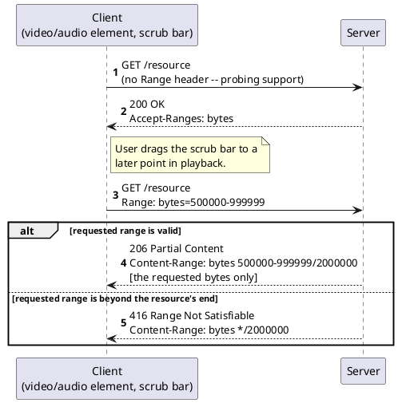

[← Pattern index](README.md)

# Seekable Playback via Byte-Range Requests

## The pattern

Let a client fetch an arbitrary *sub-range* of a resource's bytes,
instead of always fetching the whole thing. A plain `GET` returns the
entire representation; **HTTP Range Requests** (originally specified
in RFC 2616, then split out into its own specification, RFC 7233 —
now itself obsoleted by RFC 9110, which folded conditional/range
semantics back into the core HTTP specification) define a `Range`
request header (`Range: bytes=0-499`) a client sends to ask for only
bytes 0–499 of a resource. A server that supports this responds `206
Partial Content` with a `Content-Range` header naming exactly which
bytes it sent and the resource's total size (`Content-Range: bytes
0-499/10000`); a server advertises the capability up front via
`Accept-Ranges: bytes`; an unsatisfiable range (past the end of the
resource) gets `416 Range Not Satisfiable` rather than a silently
wrong response. This is the exact mechanism behind a video or audio
player's scrub bar: dragging the seek head issues a new `Range`
request for the bytes at that offset, rather than downloading
everything before it first.

**Source:** [RFC 7233, *Hypertext Transfer Protocol (HTTP/1.1): Range Requests*](https://www.rfc-editor.org/rfc/rfc7233) (June 2014; now folded into [RFC 9110](https://www.rfc-editor.org/rfc/rfc9110), *HTTP Semantics*) — verified directly against the published RFC text.

## When you'd reach for it

Any time a client needs random access into a large resource without
downloading it all first — seeking within audio/video playback,
resuming an interrupted download from where it left off, or a client
that already has most of a file and only needs a missing chunk. It is
the standard answer to "how does seeking work" for HTTP-served media,
and most web/media server frameworks (including ASP.NET Core's own
`Results.Bytes(..., enableRangeProcessing: true)`) implement the
request-parsing and response-shaping mechanics for you — reaching for
it is usually a matter of enabling existing framework support, not
hand-rolling `Range`/`Content-Range` parsing.

## Cost

Range support adds real surface area a naive static-file handler
doesn't have to get right: multipart range responses (a single
request naming several disjoint ranges get a `multipart/byteranges`
response, not just one `Content-Range`), correct interaction with
caching and conditional requests (`If-Range`, validators), and
correctly rejecting a range against a resource whose length isn't
actually known or stable. A resource that changes between the probing
request and the ranged request can also produce inconsistent partial
content if the server doesn't validate the range against a stable
representation — real failure modes a naive implementation can get
wrong, not automatic just because the `Range` header is honored at
all.

## How this application uses it

`ADR-031` (streaming channel playback) and `ADR-032` (binary
attachment retrieval) both adopt RFC 7233 Range Requests, rather than
inventing a bespoke seeking or chunked-download protocol, and both do
it via the same framework primitive:
`src/EventStore.Streaming/StreamingEndpoints.cs`'s
`/telemetry/{channelId}/samples` endpoint switches to
`ServeByteRangeAsync` whenever the request carries a `Range` header
(the same route otherwise serves `ADR-010`'s live tail/replay JSON
stream — one resource, dual-mode by content-negotiation on that
header), and `src/EventStore.Attachments/AttachmentEndpoints.cs`
serves an attachment's bytes the same way. Both ultimately call
`Results.Bytes(bytes, mimeType, enableRangeProcessing: true)` —
ASP.NET Core's own built-in RFC 7233 implementation — rather than this
project parsing `Range`/emitting `Content-Range`/`206` by hand. This
is also `ADR-040`'s named "Streaming Channel playback" target for a
header-incapable client (a bare `<video src>` element can't set an
`Authorization` header at all): the same byte-range endpoint is gated
by both the ordinary Bearer scheme and `ADR-040`'s ticket-exchange
scheme simultaneously, so a `<video>` tag using a signed ticket URL
and a normally-authenticated caller both reach the identical
Range-aware code path.
