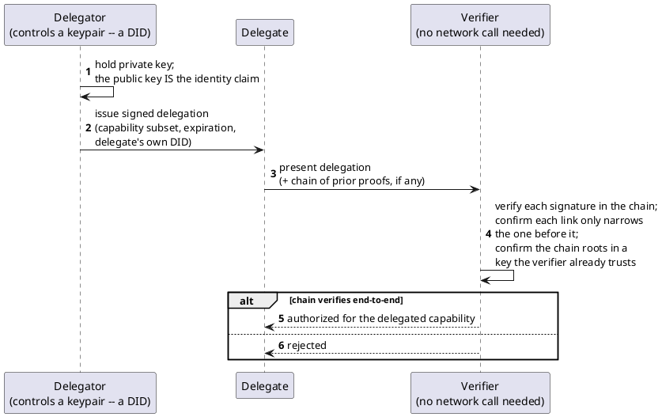

[← Pattern index](README.md)

# Self-Attested, Offline-Verifiable Delegation (DID/UCAN)

## The pattern

Prove a chain of delegated capability without needing to reach a
central authority — an identity provider, a directory service, anything
requiring network connectivity — at the moment someone verifies it. Two
real, currently-maintained specs compose to make this possible:

- **DID (Decentralized Identifier)** proves cryptographic control of an
  identifier, and nothing more — "the holder of this private key says
  they are `did:key:...`." It is deliberately *not* proof that the
  identifier maps to a real-world vetted role; it's a claim of identity,
  self-issued, verifiable by anyone who can check a signature, with no
  registry lookup required. **Source:** W3C, *Decentralized Identifiers
  (DIDs) v1.1*, W3C Candidate Recommendation, 2026
  ([w3.org/TR/did-1.1](https://www.w3.org/TR/did-1.1/)) — layered on the
  *Controlled Identifiers v1.0* specification, superseding DIDs v1.0
  (2022).
- **UCAN (User Controlled Authorization Network)** proves a *chain* of
  delegated capability rooted in some key, entirely offline-verifiable —
  each link in the chain is a signature that can be checked without
  calling out to anything, and every delegation must be an equal or
  narrower subset of what the delegator itself holds ("attenuation").
  **Source:** the UCAN specification, ucan-wg
  ([ucan.xyz/specification](https://ucan.xyz/specification/)).

A verifier holding nothing but the presented delegation chain and a
known (or independently trusted) root key can check the whole thing
locally: every signature in the chain verifies, every step only narrows
what came before it, and the chain terminates at a root the verifier
already trusts. No round trip to an issuing authority is needed at
verification time — the proof is self-contained.

## Also known as

**Verifiable Credentials (VC)**, a separate W3C specification, is
commonly mentioned in the same breath as DID and is worth disambiguating
explicitly: a VC is an issuer's signed *attestation about a subject*
("this DID is licensed to practice medicine"), not a delegated
*capability chain* — DIDs and VCs are independent specs that are often
used together, but VC answers "what is true about this identity,"
while UCAN answers "what is this identity allowed to authorize someone
else to do." This project uses DID+UCAN specifically for the latter
question, not the former.

## When you'd reach for it

Any actor — a field device, a disconnected client, an edge node — that
needs to prove it (or something it delegated to) is authorized to act,
in an environment where reaching a central identity provider at the
moment of verification can't be guaranteed. If connectivity is assumed
available at verification time, an ordinary bearer token from a
reachable IdP is simpler and doesn't need this pattern at all.

## Cost

Self-verification means there's no live revocation check unless the
verifier deliberately builds one in — a delegation is valid until its
own `exp` claim says otherwise, full stop, unless something else (an
online check against a revocation list, a short enough expiry) is
layered on top. The root-of-trust question — *which* key a verifier
should treat as authoritative in the first place — is explicitly left
out of both specs (DID proves identity control; UCAN proves attenuation
once a root is known) and has to be resolved by the adopting system
itself; see [Application-defined permission namespaces via per-tenant
trust roots](app-defined-permission-namespaces-trust-roots.md) for how
this project answers that specific gap.

## How this application uses it

`ADR-036` adopted DID+UCAN, un-rejecting both (along with RFC 8693
Token Exchange) from `references.md` once `ADR-035`'s non-authoritative
capture created a real need for offline, authority-free attestation.

**What's actually built differs from that ADR's own original scenario,
and its own 2026-08-12 correction note says so plainly**: the
originally-decided mechanism — a disconnected client submits a raw UCAN
alongside a captured event, and a server-side `/oauth/token` exchange
step later validates it and mints an ordinary bearer JWT — was never
implemented (confirmed: no such exchange endpoint or
`delegation_chain_ref` handling exists in `EventStore.Router`/
`EventStore.Inbox`). What IS built (`src/EventStore.Ucan/`) is a
different, real mechanism serving `ADR-043`/`ADR-044` instead:
`UcanDelegation.Create` produces a self-contained, self-signed
`ucan+jwt`, signed by the granter's own DPoP keypair (`ADR-017`) as an
explicitly honest stand-in for a real W3C `did:key` — a genuine keypair
the client already controls, not full DID-document resolution.
`UcanValidator.ValidateAsync` verifies the delegation's own signature
(`SelfSignedJwtVerifier`), then checks exactly one of two things: if the
delegation carries a `prf` (proof — the granter's own currently-valid
access token, narrowed to a single hop rather than an arbitrary-depth
chain), every requested capability must already be present in that
proof's claims; if there's no proof at all, the delegation's own issuer
key must itself be a registered `AppTrustRoot` (`ADR-044`) for the
target `AppId`. Either way, verification never calls out to anything —
consistent with this pattern's own offline-verifiability property.

This is also the mechanism behind **true-offline break-glass access**
(`ADR-043`'s amendment): since neither DID key generation nor UCAN chain
verification requires the delegator to be online at issuance time — only
that the chain verify later — a device pre-provisioned with its own DID
keypair (`ADR-017`'s existing key-generation mechanism, reused rather
than inventing a second one) can self-issue a capped, time-boxed
emergency delegation to a local operator with zero upstream contact,
reviewed retroactively once connectivity resumes via the ordinary
`AuthorityStatus` workflow (`ADR-035`/`ADR-042`).
