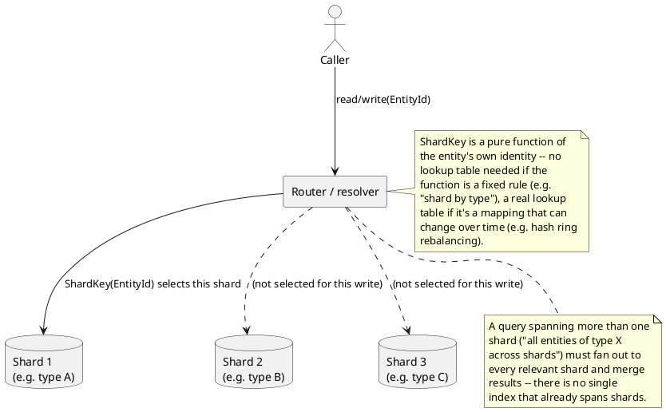

[← Pattern index](README.md)

# Sharding (Application-Level Partitioning)

## The pattern

Split one logical data store into several independent physical
partitions ("shards"), each holding a disjoint subset of the data, so no
single partition need hold — or serve the read/write load for — the
whole dataset. The defining property is *horizontal* partitioning: the
same schema is replicated across shards, and any given row lives on
exactly one of them, chosen by a **shard key** computed from the row's
own identity. This is distinct from a database's own automatic
partitioning (a single logical database silently sharded by its own
storage engine) — application-level sharding means the application (or
a routing layer immediately in front of the data) decides and knows the
placement rule itself, in code or configuration a person can read.

**Source:** [Microsoft Learn — Sharding pattern (Azure Architecture
Center)](https://learn.microsoft.com/en-us/azure/architecture/patterns/sharding)
— the general pattern, its three placement strategies (lookup, range,
hash), and their tradeoffs; this project's own comparison doc
(`docs/comparisons/sharding-strategy.md`) is explicit that its "lookup"
strategy (partition by a well-known attribute, here entity type) is one
of the same three named there.

## When you'd reach for it

A single store's write or read volume — or its total data size — has
grown (or is expected to grow) past what one physical instance can serve
acceptably, and the data has a natural, stable dimension to split along
(a tenant ID, an entity type, a hash of a primary key) that most queries
already filter or group by. It's the standard answer to horizontal
scaling once vertical scaling (a bigger box) stops being viable or
economical.

## Cost

Every query that doesn't already know its shard key up front becomes a
fan-out-and-merge across every shard instead of a single lookup —
exactly the cost this project's own sharding-strategy comparison names
for cross-`EntityType` queries. The specific placement rule chosen
trades off unevenly: a rule simple enough to explain by hand (shard by a
coarse attribute like type or tenant) can let one especially hot value
of that attribute dominate its shard with no way to split it further,
while a rule that spreads load evenly (hash-based consistent hashing)
requires understanding ring topology just to answer "where does this
row live" — the exact fork this project's own comparison weighs.
Rebalancing — changing shard count or reassigning keys later — is a real
operational migration, not a config toggle, for any placement rule.

## How this application uses it

`ADR-034` decides `ShardKey = EntityType` as the only v1 mechanism — the
**lookup** strategy in the Azure pattern's own terminology, chosen over
hash-based consistent hashing specifically because a reader can predict
"where's this entity" from its type alone, without understanding a ring
topology (`docs/comparisons/sharding-strategy.md` — this project's
stated purpose as a worked teaching example is the deciding factor).
Concretely,
[`RouterWorker.cs`](../../src/EventStore.Router/RouterWorker.cs) computes
`ShardKey = entityType` when materializing an `EntityStoreRow`
(`docs/data/entity-store.md`'s `ShardKey` column). Cross-shard fan-out is
explicitly a GraphQL resolver's job (`ADR-037`), not a bare-SQL one — a
query spanning entity types on different shards issues one query per
shard and merges results, per `ADR-034`'s own Consequences.

The log itself is **not** sharded by this mechanism — `ADR-034`
deliberately distinguishes event-log partitioning (which may remain a
single append log, or be partitioned per stream independently) from
Entity Store sharding, since the log's `SequenceNumber` ordering is
global and total while the read-side store's sharding doesn't need to
preserve that. `ADR-034` also notes that under `ADR-075`'s silo
deployment model, most single-tenant deployments likely won't need
sharding at all — it remains available as the opt-in answer for the
exceptional tenant whose own volume outgrows one shard, not a mechanism
every deployment is assumed to need.
