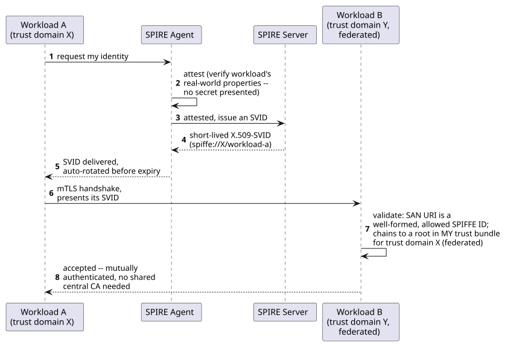
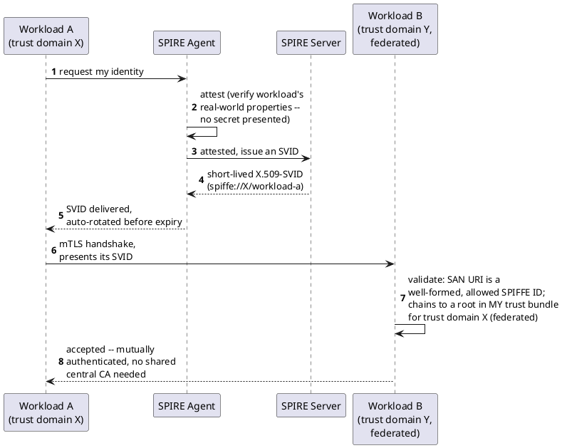

[← Pattern index](README.md)

# SPIFFE/SPIRE Workload Identity

## The pattern

Give every running service (a "workload") a cryptographically
verifiable identity that it earns by proving *what it is* to a local
attestor — rather than by holding a long-lived secret someone
distributed to it. **SPIFFE** (Secure Production Identity Framework
For Everyone) is the open specification defining that identity: a
`spiffe://<trust-domain>/<path>` URI naming a workload, plus the
document formats that carry it — an X.509-SVID (the identity embedded
as a SAN URI in a short-lived certificate) or a JWT-SVID. **SPIRE**
(the SPIFFE Runtime Environment) is the reference implementation: a
Server plus a per-node Agent that **attests** a workload (verifies
properties like "this process is running as this Kubernetes service
account" or "this process was started by this systemd unit") before
issuing it a short-lived SVID — automatically rotated, never a secret
a human copies into a config file. Two workloads presenting SVIDs from
**different trust domains** can still mutually authenticate by
**federating**: each side adds the other's trust domain root to its
own trust bundle, with no shared central certificate authority
required. **Source:** [spiffe.io](https://spiffe.io/) — SPIFFE and
SPIRE are both graduated projects of the Cloud Native Computing
Foundation (CNCF).

## When you'd reach for it

Once a system has more than a handful of internal services calling
each other, and especially once independent processes under
**different administrative control** need to authenticate one another
directly — two sites run by different organizations, a cross-cluster
service mesh, or any topology where a single, centrally-issued
credential (an OAuth2 `client_secret` every party trusts the same
issuer for) doesn't naturally reach across the trust boundary. It
answers a *workload* identity question ("which service is calling"),
not a user/external-client identity question — it's the wrong tool for
authenticating an end user or an external API caller, which stays an
OAuth2/OIDC concern.

## Cost

Real, new operational infrastructure: a SPIRE Server and an Agent per
node, workload/node attestation configuration to set up and keep
correct, and explicit trust-bundle exchange for every cross-site
federation relationship. None of this is free the way a statically-
seeded OAuth2 client is — a "handful of clients, one shared IdP"
topology is genuinely simpler to operate at small scale, and standing
up SPIRE ahead of an actual need for cross-trust-domain workload
authentication is speculative infrastructure, not a default worth
reaching for on every project.

## How this application uses it

`ADR-048` adopts SPIFFE/SPIRE for internal service-to-service and
peer-sync identity, **reversing** an earlier rejection in
`references.md` ("no multi-workload mesh needing cross-platform
workload attestation... a handful of statically-seeded OAuth2 clients
already covers the actual service-to-service auth surface at this
project's scale") once `06-solution-structure.md`'s real multi-service
topology and `ADR-033`'s genuinely independent, potentially
cross-organization peer servers made that premise stop holding — the
same "un-reject once a real need appears" move `references.md` already
made once for content-addressable storage. The full options weighed
first are in
[`docs/comparisons/service-identity.md`](../comparisons/service-identity.md)
(SPIFFE/SPIRE vs. static OAuth2 client credentials vs. hand-rolled
mTLS) — this pattern doc explains SPIFFE/SPIRE itself, portably, not
that comparison again.

**Two things worth being precise about, because `ADR-048`'s own text
is precise about them**: SPIFFE/SPIRE is explicitly *additive* to,
never a replacement for, `ADR-006`'s OAuth2/OIDC — an external
caller's request is still bearer-JWT-plus-DPoP-authenticated; SPIFFE
identity governs calls *between* this framework's own services once a
request is already inside. And the ADR itself records a real,
found-by-audit correction rather than an aspirational claim: the
Gateway↔internal-service half (an `EventStore.Gateway`-issued SPIFFE
SVID authenticating its outbound calls) is genuinely built as
designed, but `ADR-033`'s peer-sync authentication — the specific
cross-organization scenario that motivated adopting SPIFFE/SPIRE in
the first place — was found, on a later independent design-compliance
audit, to still authenticate via `grant_type=client_credentials`
against a shared `DevIdp` and a `RequireAuthorization("peer:sync")`
bearer-scope check, not mTLS/SPIFFE-identity verification. That gap is
recorded in the ADR itself, not silently corrected in this doc — two
independent sites still cannot authenticate as peers without both
trusting one shared `DevIdp`, unchanged as of this writing (confirmed
directly: `src/EventStore.Replication/PeerSyncClient.cs` still posts
`client_credentials`, and `src/EventStore.Replication/
PeerSyncEndpoints.cs` still gates on `RequireAuthorization("peer:
sync")`).

Implementation of the genuinely-built half:
[`src/EventStore.Spiffe/SpiffeId.cs`](../../src/EventStore.Spiffe/SpiffeId.cs)
(parses/constructs `spiffe://<trust-domain>/<path>` per the SPIFFE-ID
standard, no partially-valid instance ever constructed),
[`src/EventStore.Spiffe/SpiffeCertificateValidator.cs`](../../src/EventStore.Spiffe/SpiffeCertificateValidator.cs)
(validates a presented leaf certificate's SAN URI against an
allow-list and chains it to a trusted root for that SPIFFE ID's own
trust domain — one rejection, no partial credit, and revocation
checking is deliberately off since short-lived SVID rotation is the
mechanism, not revocation), and
[`src/EventStore.Host.Core/SpiffePeerIdentity.cs`](../../src/EventStore.Host.Core/SpiffePeerIdentity.cs)
(the composition-root piece standing in for a real SPIRE Agent in this
codebase's own Aspire-orchestrated local dev story: each Host
generates a throwaway trust-domain CA, self-issues its own SVID at
startup, and builds a trust bundle from whichever peer trust domains
its configuration names — federation as literally "the other side's
root is now in my bundle," nothing more).
