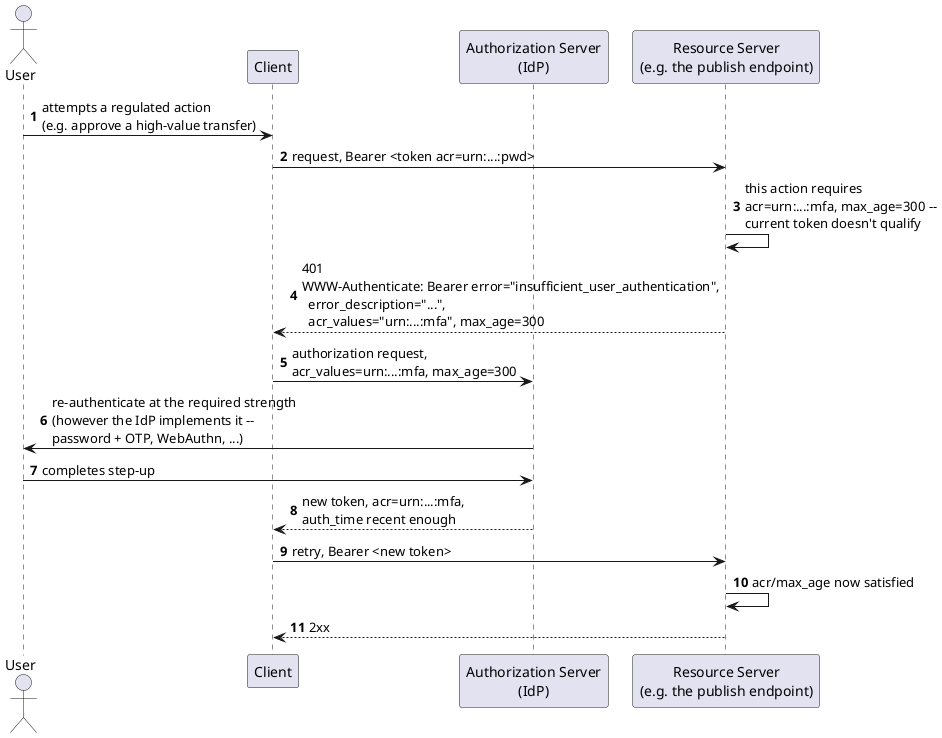

[← Pattern index](README.md)

# Step-Up Authentication (OAuth 2.0 Step Up Authentication Challenge)

## The pattern

A resource server that decides a caller's *current* authentication isn't
strong or recent enough for the specific operation being attempted
challenges the caller to re-authenticate at a higher level — rather than
either accepting a weak session for a high-value action, or forcing every
caller into the strongest possible authentication for every action up
front. **Source:**
[RFC 9470 — OAuth 2.0 Step Up Authentication Challenge Protocol](https://www.rfc-editor.org/rfc/rfc9470.html)
(September 2023). The resource server responds with a `401` carrying a
`WWW-Authenticate` challenge naming an `acr_values` (Authentication
Context Class Reference — *how* the caller must authenticate) and/or a
`max_age` (how *recently* it must have happened) requirement, plus a new
`insufficient_user_authentication` error code identifying why the
existing token was rejected. The client takes the caller back through the
authorization server to satisfy that specific requirement, then retries
with a token that does.

**RFC 9470 deliberately does not define *how* re-authentication itself
happens** — password re-entry, a one-time code, WebAuthn, or any
combination is entirely the authorization server's own concern; the RFC
only standardizes the *signaling* (what's required) and the *challenge/
retry shape* (how a client discovers and satisfies it), the same
separation of concerns [OAuth 2.0](https://www.rfc-editor.org/rfc/rfc6749)
already draws between "who you are" (the IdP's job) and "what you're
allowed to do" (the resource server's job).

## When you'd reach for it

Any system where **most** actions are fine under a caller's ordinary,
already-established session, but a **specific**, named subset of actions
(a large funds transfer, a permission grant, a regulated sign-off) needs
either a strictly stronger authentication factor or unambiguously *recent*
proof of the caller's presence — and where forcing that stronger bar onto
every action, all the time, would be a real usability cost for no
matching benefit on the actions that don't need it.

## Cost

An extra round trip (challenge, then re-authenticate, then retry) exactly
when a caller is already trying to get something done — real added
friction, deliberately traded for a narrower, better-justified
authentication requirement than "require the strongest factor for
everything, always." Requires the authorization server to actually
support issuing tokens with a meaningful, checkable `acr` claim and
tracking `auth_time` — a step-up challenge is only as good as the IdP's
own ability to satisfy it. And, per RFC 9470 itself, the protocol says
nothing about *what* re-authentication should look like, so a client
still needs to know how to drive whatever flow its IdP actually requires.

## Also known as

Sometimes called **re-authentication** or **authentication elevation** in
casual usage — the same idea RFC 9470 formalizes as a resource-server-
initiated *challenge*, not merely "ask the user to log in again."
Conceptually the runtime mechanism for moving a session from a lower to a
higher **AAL (Authenticator Assurance Level)** in
[NIST SP 800-63-3](https://pages.nist.gov/800-63-3/sp800-63-3.html)'s
terms — see [Multi-Axis Authority/Assurance](multi-axis-authority-assurance.md)
for that axis generally. Distinct from **Proof of Possession**/DPoP
(`ADR-017`) — DPoP proves a *token* wasn't stolen from its holder; step-up
authentication proves the *user* recently authenticated strongly enough
for a specific action. A caller can hold a perfectly valid, un-stolen,
DPoP-bound token that still fails a step-up challenge because its `acr`/
`auth_time` simply aren't strong/recent enough — the two mechanisms
answer different questions and compose rather than substitute for each
other.

## How this application uses it

`ADR-066` adopts RFC 9470 directly, unmodified, for **digital sign-off on
regulated actions**: an `EventTypeDefinition` gains an optional
`RequiredSignature` (`{ AcrValues: [...], MaxAge: ... }`, registered the
same way a `RequiredClaims` entry already is, `ADR-050`). A publish targeting a
signature-required event type, from a caller whose current token doesn't
satisfy the configured `AcrValues`/`MaxAge`, gets RFC 9470's challenge
back instead of being accepted — the client redirects through
`ADR-006`'s existing IdP to step up (however that IdP implements it), and
retries. The framework never implements the re-authentication step
itself, consistent with `ADR-006`'s existing division of labor between
"verifying identity" (the IdP) and "deciding what a verified identity may
do" (this framework's claims/RBAC layers).

**This is the one new case, alongside `ADR-023`'s existing "envelope
itself is unparseable" exception, where a publish can be legitimately
turned away before it's stored** — stated explicitly in `ADR-066` so it
isn't misread as quietly reintroducing reject-on-invalid: only
*insufficient authentication strength* for a signature-required type
short-circuits before storage, the same way an ordinary scope check
already does (`ADR-006`); the event's own data is never rejected for
shape/content reasons.

A successful step-up produces `ADR-066`'s envelope `Signature` object
(`SignerId`/`SignedAt`/`Meaning`/`Acr`) — `Acr` is the concrete record of
*which* authentication context the sign-off was actually performed under,
letting a later audit confirm the step-up genuinely happened rather than
trusting the publish alone. Which `acr_values` taxonomy a deployment uses
(NIST AAL-style levels, or an IdP-specific scheme) is deployment
configuration, not something this pattern or `ADR-066` standardizes —
RFC 9470 itself leaves that vocabulary to the authorization server.
