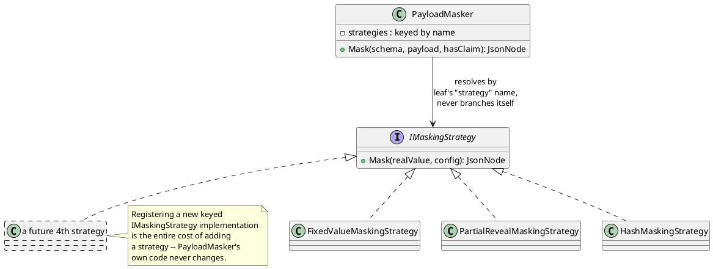

[← Pattern index](README.md)

# Strategy Pattern (Extensible Masking/Redaction Content)

## The pattern

Define a family of interchangeable algorithms behind one common interface,
each in its own class, and select which one runs at runtime rather than
branching on a type code inside the algorithm's caller. **Source:**
[Gamma, Helm, Johnson, Vlissides — *Design Patterns: Elements of Reusable
Object-Oriented Software*](https://en.wikipedia.org/wiki/Design_Patterns)
(Addison-Wesley, 1994), the Strategy pattern: "Define a family of
algorithms, encapsulate each one, and make them interchangeable. Strategy
lets the algorithm vary independently from clients that use it."

The test for whether Strategy is the right pattern, versus just an `if`/
`switch` that's fine as-is: does the *set of algorithms* need to grow
without touching the code that picks between them? If a new case means
editing one function's branches, that's an acceptable `switch`. If a new
case should be addable as a new class with zero changes to existing code
— the Open/Closed half of SOLID — that's Strategy.

## When you'd reach for it

Any place a small, named set of interchangeable behaviors is selected by
a runtime discriminator (a string, an enum, a config value) that's
expected to grow — a new value added later without touching the code that
already handles the existing ones. The discriminator itself usually lives
in data (here: `x-masking.strategy`, sitting in a registered `JsonSchema`
document), not in code, which is exactly what makes a hardcoded `switch`
feel wrong: the set of *known* values is a config-time/data-time fact,
not something the algorithm's caller should need recompiling to extend.

## Cost

One interface plus one small class per algorithm, instead of one function
with several branches — more files, more indirection for a reader tracing
"what actually happens for `FixedValue`." Worth it exactly when the
branch count is expected to grow independently of the dispatcher; not
worth it for a fixed, small, stable set that will never gain a case (that
case is a plain `switch`, not this pattern).

## Also known as

Sometimes implemented via a policy object, a functional-style delegate
table, or (in .NET specifically) a keyed-DI-resolved family of
implementations, as this project does — the shape (encapsulated,
interchangeable, runtime-selected algorithms) is the same regardless of
which mechanical flavor implements it.

## How this application uses it

`ADR-009` explicitly adopts this, per direct request, so that
`x-masking`'s masking/redaction content strategies (`FixedValue`,
`PartialReveal`, keyed `Hash` — all three now decided and built) are
genuinely extensible: `IMaskingStrategy` is the interface, one concrete
class per strategy, each registered under its `strategy` string as a
**.NET keyed DI service**
(`services.AddKeyedSingleton<IMaskingStrategy, FixedValueMaskingStrategy>
("FixedValue")` — [Microsoft Learn — keyed
services](https://learn.microsoft.com/en-us/dotnet/core/extensions/dependency-injection#keyed-services),
introduced .NET 8), each line an explicit composition-root registration
per `ADR-041` (no reflection-based auto-discovery). `IPayloadMasker`'s
recursive schema walk (`06-solution-structure.md`) resolves the matching
`IMaskingStrategy` per masked leaf via
`IServiceProvider.GetRequiredKeyedService<IMaskingStrategy>(strategyName)`
and calls it — it never branches on the strategy name itself.

**The one deliberate exception to `ADR-041`'s "no service-locator
lookups" rule, named explicitly rather than silently contradicted:**
which `IMaskingStrategy` applies is a runtime fact carried in registered
schema data (the `strategy` string), not something a compile-time
constructor parameter can express — exactly the scenario .NET's
keyed-service API exists for. Every other dependency in this design still
follows plain constructor injection; only this runtime-keyed selection
uses `IServiceProvider` directly, and only inside `PayloadMasker` itself.

**Reused, not duplicated, by `ADR-052`**: streaming-channel redaction's
`RedactedRange.Strategy` field resolves through a sibling
`IStreamRedactionStrategy` interface, keyed-registered the identical way
— a parallel implementation of the same pattern, not literally the same
interface, since a `JsonNode` payload value and a raw sample/frame byte
buffer are genuinely different shapes to redact. Its `"PartialReveal"`
key calls straight into `ADR-009`'s own `PartialRevealMaskingStrategy`
reveal computation for channels whose content is structured/string-shaped
enough to support it.

**Reused a third time, with one real correction, by `ADR-057`**:
`IErasureKeyStore` (crypto-shredding's key-management backend) follows
the identical keyed-DI shape — but was originally framed as "one
implementation per whole deployment," which `ADR-057`'s own amendment
corrects to match this pattern's actual intent more closely: **multiple
`IErasureKeyStore` backends can be registered and active simultaneously**
(a cloud KMS for one tenant, a self-hosted `HashiCorp Vault` for
another, in the same running deployment), selected per `AppId` rather
than picked once for the whole process — the same "new case is a new
class plus one registration line" payoff this pattern already gives
`IMaskingStrategy`/`IStreamRedactionStrategy`, just keyed by tenant
instead of by a schema-carried strategy name.

Adding a fourth masking strategy later (generalization/bucketing is the
one currently named as undecided, not unfit — see
`docs/comparisons/masking-strategies.md`) is a new `IMaskingStrategy`
class plus one registration line, with zero changes to `IPayloadMasker`
or to any existing strategy's code — the actual payoff this pattern is
adopted for.
