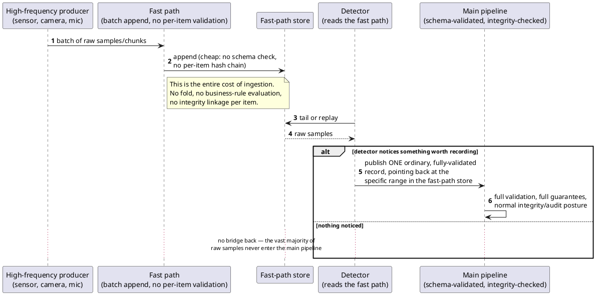

[← Pattern index](README.md)

# Streaming Ingestion as a Separate Fast Path

## The pattern

Route high-frequency, high-volume data (sensor telemetry, audio/video
chunks, log lines) through a lightweight, purpose-built fast path
instead of a system's main, richer processing pipeline — and only pull
a specific moment back into that richer pipeline when something
downstream decides it actually matters. The general shape: the
expensive machinery a system builds for its discrete, meaningful
records (schema validation, integrity checks, indexing, business-rule
evaluation) is the *wrong* cost to pay per sample when samples arrive
hundreds or thousands of times a second — so a second, cheaper path
exists specifically to absorb that volume, and the two paths are
bridged narrowly rather than merged.

The clearest named articulation of "split by latency/cost need,
converge later" is Nathan Marz's **Lambda Architecture**: a **speed
layer** (**hot path**) trades accuracy for low latency, a **batch
layer** (**cold path**) reprocesses the same raw data thoroughly, and
the two converge at a serving layer. Microsoft's own Azure IoT
reference architecture uses the identical hot-path/cold-path
vocabulary for telemetry specifically, and names the concrete thing a
hot path is *for*: "analyze the eventstream in near real time to
detect anomalies... or trigger alerts when a specific condition
occurs in the stream" — cold storage absorbs the volume, hot-path
analytics watches it, and an alert is how the two worlds meet.

**Source:** Nathan Marz & James Warren, *Big Data: Principles and
Best Practices of Scalable Realtime Data Systems* (Manning, 2015) —
the book that names and popularizes the Lambda Architecture's
speed-layer/batch-layer split; see also
[Microsoft Learn, "Big Data Architectures — Lambda architecture" and its IoT hot-path/cold-path section](https://learn.microsoft.com/en-us/azure/architecture/databases/guide/big-data-architectures)
for the telemetry-specific framing this pattern doc borrows most
directly.

## When you'd reach for it

Whenever a source produces data at a rate or volume where the main
pipeline's per-item guarantees (schema validation, tamper-evident
chaining, full indexing) would themselves become the bottleneck —
sensor telemetry, audio/video capture, high-volume log/metrics
ingestion, clickstream capture. The tell is a mismatch of *scale*: the
main pipeline is built and costed for meaningful, discrete records
arriving at human/business speed, and the new source arrives at
machine speed, in volume, with most of it never individually
mattering.

## Cost

**This is a real, honest reduction in guarantee, not a free
optimization — say so plainly.** The fast path deliberately does not
get the main pipeline's schema validation, per-item tamper-evident
hash chaining, or persist-everything status envelope. A crash mid-batch
can lose that batch's data outright, with no compensating mechanism —
the fast path's durability is "as good as possible," explicitly not
held to the main pipeline's bar. Nothing in the fast path is
individually tamper-evident by default. If a genuine need for
tamper-evidence over the raw fast-path data itself ever arises (a
regulated capture requiring chain-of-custody over the *signal*, not
just the events derived from it), that is a new decision layered on
top, not something inherited for free from the main pipeline's own
integrity mechanism. Choosing this pattern means accepting that the
overwhelming majority of what flows through the fast path is *never*
individually verified, checked, or made recoverable to the same
standard as everything else in the system — a deliberate, bounded
exception to a "never lose data" posture, not a loophole to pretend
doesn't exist.

## How this application uses it

`ADR-031` is this pattern applied directly: `TelemetryChannel` +
`TelemetrySample` (`src/EventStore.Domain/Streaming/TelemetryChannel.cs`,
`TelemetrySample.cs`) is a second storage/ingestion path, entirely
separate from `StoredEvent` — no JSON Schema check, no per-sample hash
chain, no Entity Store fold. Batch ingestion is handled by
`src/EventStore.Streaming/TelemetrySampleWriter.cs`; tail/replay reuses
`ADR-010`'s read shape via `TelemetryTailReader.cs`. The bridge back to
the fully-validated world is exactly the pattern's "detector" role: an
application-level detector reads a channel and, when it notices
something, publishes an ordinary domain event through the completely
normal publish path (`ADR-020`/`ADR-023`), carrying a `TelemetryPointer`
envelope field that names the exact point/range in the channel it
noticed. `Derived` channels (resampled/filtered/transcoded via
`ChannelDerivationWorker.cs`) are always recoverable by re-deriving
from their still-durable origin — only an *origin* channel is where
`ADR-031`'s accepted, real data-loss gap can actually occur, exactly as
this pattern doc's Cost section states.
